# 2022 年 10 月

# 子页面目录
# 第一周

> 10 月 1 日-10 月 9 日

# 周计划

# 10-1

略

# 10-2

略

# 10-3

- 隐式表达和显示表达(计算机图形学)

  - [计算机图形学入门（九）-几何（基本表示方法：隐式和显式）](https://zhuanlan.zhihu.com/p/441384374)
  - 距离函数：distance functions
- <strong>什么是占用网格？</strong>

  - [占据栅格地图（Occupancy Grid Map）](https://zhuanlan.zhihu.com/p/21738718)
  - 论文：Occupancy Networks: Learning 3D Reconstruction in Function Space

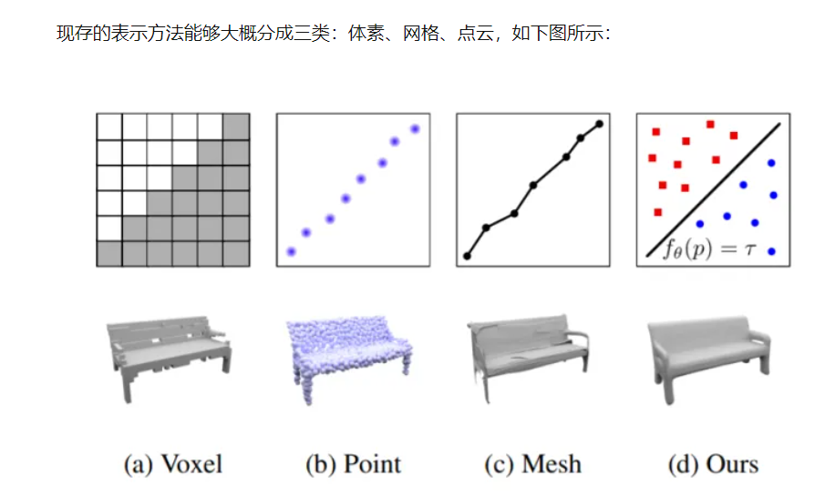


- implicit differentiation：隐式微分法

  - [implicit differentiation 是什么意思?跟导数有什么联系，怎么求? - 知乎](https://www.zhihu.com/question/20804193)
  - [https://www.zhihu.com/question/364770565](https://www.zhihu.com/question/364770565)
  - [隐函数为什么可以两边同时求导？如何理解？- 一文讲透微积分（二）之 implicit differentiation](https://zhuanlan.zhihu.com/p/464411271)
- <del>考虑购买《数学之美》</del>
- <del>recurrent neural network：循环神经网络</del>
- <strong>complicated and high-resolution</strong><del> geometry：复杂、高分辨率</del>
- <del>higher-resolution </del><strong>geometry and appearance：形状和外观</strong>
- <del>novel views of complex scenes：复杂场景的新颖(新角度)视图</del>
- <strong>灵感：</strong><del>将即时记录与整理记录分离的多端同步笔记本</del>
- <del>state-of-the-art：最先进的成果</del>
- <strong>Recent work has investigated</strong><del> the im- plicit representation of：研究</del>
- <del>为什么英文文献中的引文序号很乱？</del>

  - <del>因为它们的写作顺序是：边看参考文献，然后将重要文献(大概率会参考的文献)收集整理好(这时已经开始编号)，在正式写作时，写到需要参考文献的地方就把相关文献的序号引进正文。</del>
- <del>Subsequent work ： 随后的研究、接下来的工作</del>
- <del>formulate functions：构造函数</del>
- <strong>3D occupancy fields：占用场</strong>

# 10-4

- <del>视图合成：View synthesis</del>
- <del>稠密：dense</del>
- <del>sparser：稀疏</del>
- <del>内插法：interpolation</del>
- <strong>computer vision and graphics communities </strong><del>have </del><strong>made significant progress</strong><del> by doing sth</del>

  - <del>机器视觉和图形学领域</del>
  - <del>取得显著进展</del>
- <del>下载电影</del>
- <del>One popular class of approaches：一类流行的(主流的)方法</del>
- <del>Another class of methods：另一类方法</del>
- <del>diffus、dis- cretization：离散、离散化</del>
- <del>gradient descent：梯度下降法</del>
- <del>Differentiable rasterizers：</del>
- <del>pathtracers：路径跟踪器(光线追踪器，光追)</del>

  - <del>路径追踪器</del>
- <del>reprojection：重投影</del>
- <del>Furthermore：此外</del>
- <del>Another class of methods uses volumetric representations</del><strong> to address the task</strong><del> of high-quality photorealistic view synthesis from a set of input RGB images</del>

  - <del>致力于达到、来解决</del>
- <del>voxel grids：体素网格</del>
- <del>alpha-compositing：阿尔法混合，图像透明度混合</del>
- <del>learned compositing：</del>
- <del>combination of convolutional networks (convolutional neural network,CNNs)：卷积神经网络</del>
- <del>compensate：补偿</del>
- <del>artifacts：伪影</del>
- <del>While these volumetric techniques </del><strong>have achieved impressive results</strong><del> for novel view synthe- sis 有趣的表达</del>

  - <del>取得了令人印象深刻的结果</del>
- <del>PDF 翻译器</del>

  - <del>有道文档翻译：得花钱，每篇文档 5 元</del>
  - <del>Zotero</del>

    - <del>blog.csdn.net</del>
    - <del>[Zotero 修改版]终于可以原生支持同时生成“et al”和“等”了</del><del>：</del>
- <del>暂时不需要自己写 PDF 翻译器</del>
- <del>ipad+zotero</del>
- <del>轻度清洁市场容量、市场前景判断</del>

  - <del>市场容量分析方法</del>
- 下载，并调研《创业指导手册》

# 10-5

- <del>遗传模型：从粗到精（黑屋子里上厕所）</del>

  - <del>先估算</del>
  - <del>后基于反馈的调整</del>
- <del>nerf 中文释义：</del><del>[NeRF]NeRFの 入门教程（原理向）</del>
- <del>将即时记录本改成周计划形式，并考虑使用多维表格管理任务</del>
- <del>In practice：实践中、实际情况中</del>
- <del>Cartesian：笛卡尔坐标系</del>
- <del>approximate：逼近</del>
- <del>feeding those locations into an MLP to produce a color and volume density</del>

  - <del>将这些位置输入 MLP 以产生颜色和体积密度</del>
- <del>To accomplish this：要做到这一点</del>
- <del>什么是 ReLU</del>

  - <del>ReLU 函数</del><del>：</del><strong>线性整流函数</strong><del>（Linear rectification function），又称</del><strong>修正线性单元，</strong><del>是一种</del><del>人工神经网络</del><del>中常用的激活函数（activation function），通常指代以</del><del>斜坡函数</del><del>及其变种为代表的</del><del>非线性函数</del><del>。</del>
- <del>人工神经网络中的激活函数是什么？</del>

  - <del>神经元中的非线性单元</del>
  - <del>为什么要有激活函数：增加非线性因素，解决线性模型表达能力不足的缺陷。</del>
- <del>feature vector：特征向量</del>
- <del>non-Lambertian effects：非朗伯效应</del>

  - <del>什么是朗伯效应</del>
- <del>As shown in Fig.4：如图 4 所示</del>
- <del>整理 markdown 基本语法</del>

  - <del>Markdown 基本语法 | Markdown 官方教程</del>
- <del>梳理文献整理规则</del>

  - <del>记录、问题、整理</del>
- <del>near and far bounds：近界和远界</del>
- <del>numerically estimate：数值估计</del>
- <del>continuous integral：连续积分</del>
- <del>quadrature：求积、正交</del>
- <del>sample uniformly：均匀采样</del>
- <del>bin：统计堆栈</del>
- <del>integral：积分</del>
- <del>其中：where</del>
- <del>Ground Truth：真实数据、真值</del>
- <del>specular reflection：镜面反射</del>
- <del>oversmoothed：过度平滑</del>
- <del>MVS 和 SFM</del>

  - <del>MVS：multi view system；从多视图的密集重建</del>
  - <del>SFM：得到稀疏三维点云</del>

## <del>人体(从动漫插画)三维重建理论及方法</del>

- <del>三维人体重建_Fighter Fong 的博客-CSDN 博客_人体 3d 重建</del>

### <del>SMPL 模型</del>

- <del>现有 3D 人体模型的缺点</del>

  - <del>没有骨骼蒙皮：得到人体 3D 模型之后还需要加 rig，太麻烦。而且还需要手工调整表面纹理贴图。 和现有商业软件不兼容。</del>
  - <del>不够真实，难以应对各种各样的姿态。</del>
- <del>SMPL 模型是一种</del><strong>参数化人体模型</strong><del>，是马普所提出的一种人体建模方法</del>
- <del>SMPL（Skinned Multi-Person Linear Model）是一种裸体的（skinned），基于顶点（vertex-based）的人体三维模型，能够精确地表示人体的不同形状（shape）和姿态（pose）。</del>
- <del>这种方法与传统的 LBS 的最大的不同在于其提出的人体姿态影像体表形貌的方法，这种方法可以模拟人的肌肉在</del><strong>肢体运动过程中的凸起和凹陷</strong><del>。因此可以避免人体在</del><strong>运动过程中的表面失真</strong><del>，可以</del><strong>精准的刻画人的肌肉拉伸</strong><del>以及收缩运动的形貌</del>
- <del>该方法中 β 和 θ 是其中的输入参数，其中</del><strong>β 代表是个人体高矮胖瘦、头身比等比例的 10 个参数</strong><del>，</del><strong>θ 是代表人体整体运动位姿和 24 个关节相对角度的 75 个参数</strong><del>。</del>

### <del>动画制作关键词</del>

- <del>顶点（mesh）：动画模型可以看成多个小三角形（四边形）组成，每个小三角形就可以看成一个顶点。顶点越多，动画模型越精细。</del>
- <del>骨骼点：人体的一些关节点，类似于人体姿态估计的关键点。每个骨骼点都由一个三元组作为参数去控制（可以查看欧拉角，四元数相关概念）</del>
- <del>()骨骼蒙皮（Rig）：建立骨骼点和顶点的关联关系。每个骨骼点会关联许多顶点，并且每一个顶点权重不一样。通过这种关联关系，就可以通过控制骨骼点的旋转向量来控制整个人运动。</del>
- <del>纹理贴图：动画人体模型的表面纹理，即衣服裤子这些。</del>
- <del>BlendShape：控制动画角色运动有两种，一种是上面说的利用 Rig，还有一种是利用 BlendShape。比如：生成一种笑脸和正常脸，那么通过 BlendShape 就可以自动生成二者过渡的动画。这种方式相比于利用 Rig，可以不定义骨骼点，比较方便。</del>
- <del>蒙皮：将模型从一个姿态转变为另一个姿态，使用的转换矩阵叫做蒙皮矩阵</del>

### <del>基于图像直接估计人体 meshes、姿态</del>

- <del>densePose：</del><del>DensePose 姿态转换模型，只需一张照片合成动画效果</del><del>。下载并收藏论文</del>

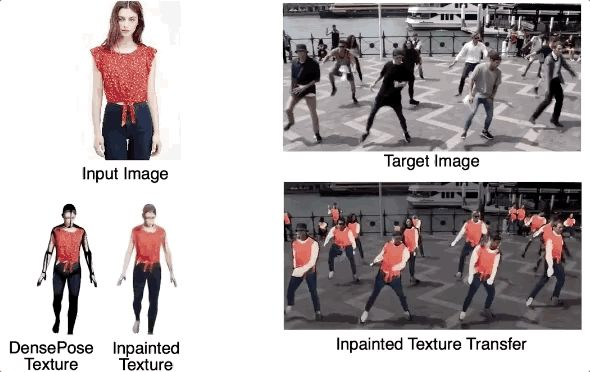

- <del>下载并收藏论文：End-to-end Recovery of Human Shape and Pose（弱监督）</del>
- <del>SkeletonNet:完整的人体三维位姿重建方法-电子发烧友网</del><del>。SkeletonNet，下载并收藏论文</del>
- <del>从 2D 关节预测 3D 关节，利用学习的 3D 骨架库，使用不同程度的先验。找到并下载相关论文</del>

  - <del>假定四肢长度，或比例</del>
  - <del>学习一个姿势先验，获得了与姿势独立的关节角度限制</del>

### <del>三维人脸重建</del>

- <del>PRNet：Joint 3D Face Reconstruction and Dense Alignment with Position Map Regression Network</del><del>，下载并收藏论文</del>
- <del>3D 人脸重建:《Joint 3D Face Reconstruction and Dense Alignment with Position Map Regression Network》_Godsw</del><del>，</del><del>下载并收藏论文</del>
- <strong>3D 人脸模型</strong>

<del>参考 3DDFA，3D 人脸可看做是</del><strong>形状和表情的和</strong><del>，其中 3D 形状模型可基于</del><strong>BFM 模型</strong><del>，通过 3DMM（3D Morphable Model）系数来构建，而 3D 表情模型可</del><strong>FW 模型构建</strong><del>。二者之和再通过 Pose(姿态角，平移，尺度)参数投影到摄像机坐标系下，即得到 3D 点云的图像坐标。需要注意的是，BFM 模型的点云数约为 53490, FW 表情模型的点云数约为 53215，因此二者不能直接相加，需首先对 BFM 模型的点云进行筛选，仅从中提取 53215 个点（貌似是去除了嘴巴内部的点），同时修正相应的网格(triangles)，这部分工作也是 3DDFA 团队的贡献。</del>

- <del>3DMM</del><del>3DMM(人脸 3D 形变统计模型)_philipwelia 的博客-CSDN 博客_3dmm</del>
- <strong>3D 点云的 UV 图表示</strong>

<del>通过 BFM 形状模型和表情模型，可以得到最终的 3D 点云的图像坐标(共 53215 个)，每个点有 x,y,z 3 个坐标，共有 53215x3 个值，这些点云中的 68 个点 x,y 坐标即为常用的 68 个人脸关键点，约 40k 个点的 x，y 坐标即为密集人脸关键点。因此，本文的目标就是从单张 2D 人脸 RGB 图像中直接预测这约 53k 的点的 3 维坐标值。一个简单且普遍的是用一个 1D 向量来表示，即将 3D 点信息用一个向量来表示，然后用网络预测；然而，这种方法丢失了空间信息。</del>

<del>相关研究中也有预测 3DMM 等模型的系数，然后</del><del>同坐</del><del>模型建模来得到 3D 点云，但这些方法太过依赖 3DMM 模型，并且流程复杂；最近的 VRN 用 Volumetric 来表示，成功摆脱了上述问题，但是其网络需要输出 192x192x200 的一个 Volume，计算量相当大，重建分辨率将会受到限制。</del>

<del>针对这些问题，作者非常巧妙地将 53215x3 个值用一个 3 通道 256x256 的图像来表示，即 UV position map 来表示，如下图</del>

# 10-6

## <del>工业相机</del>

### <del>研究进展</del>

#### <strong>结构光三维重建</strong>

- <del>相机投影仪标定及标定参数优化</del>
- <del>结构光系统编解码算法</del>
- <del>基于 FPGA 的硬件加速</del>

#### <strong>高反光表面的三维重建方法</strong>

- <del>高动态范围成像技术</del>
- <del>多曝光相移图像融合技术</del>

#### <strong>基于多径效应的多相机多投影结构光</strong>

- <del>投影仪 gamma 误差的补偿与消除方法</del>
- <del>多径效应编码方法：正交编码</del>
- <del>多径混叠信号分离与解调</del>

#### <strong>点云融合及后处理</strong>

- <del>ICP 点云配准</del>
- <del>基于梯度下降的鲁棒 ICP</del>

### <del>研究成果</del>

#### <del>产品</del>

<strong>扫描仪</strong>

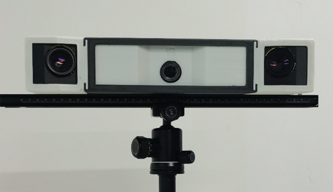

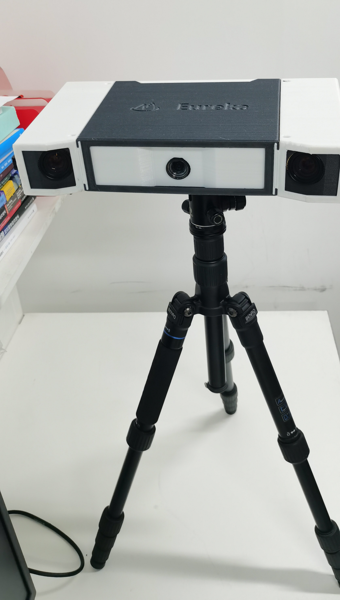

<strong>软件</strong>

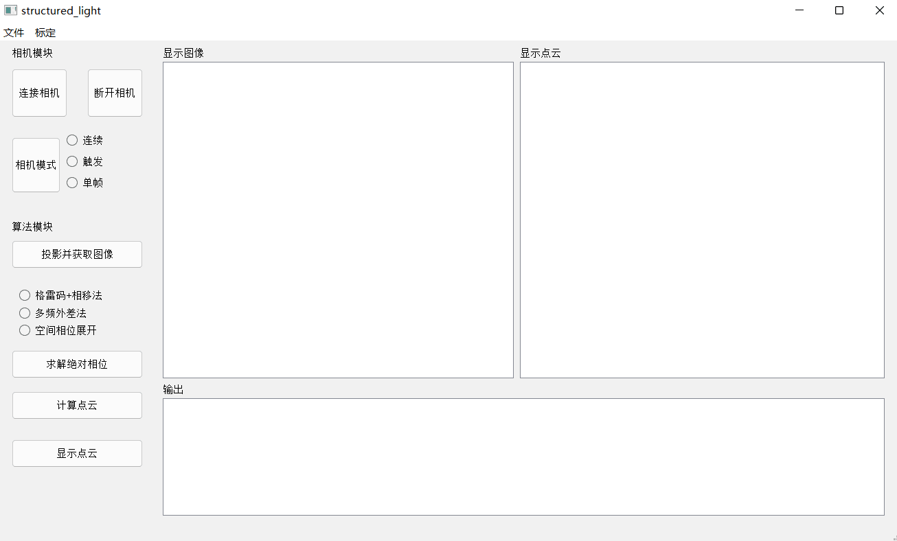

<strong>重建结果</strong>

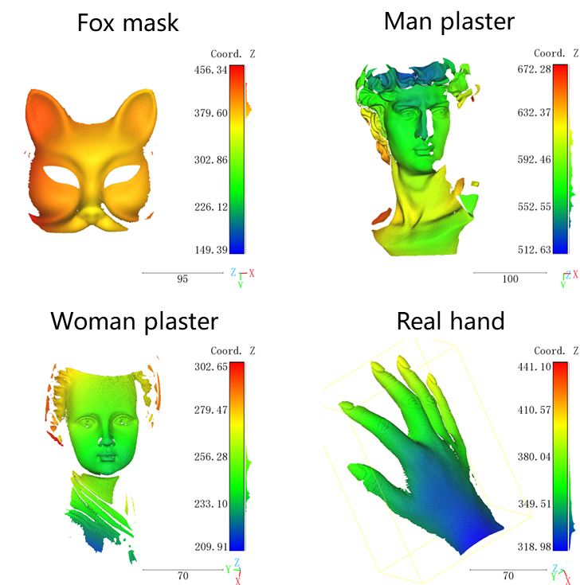

<strong>关键技术指标</strong>

- <del>设备尺寸：315*168*58mm</del>
- <del>相机分辨率：2160*2048 pixel（35*35mm）。3840*2160 pixel；3840*2880 pixel（45mm*45mm*45mm）</del>
- <del>投影仪分辨率：912*1140 pixel</del>
- <del>重建速度：1fps</del>
- <del>重复精度：0.1mm</del>

#### <del>基金</del>

- <del>基于</del><strong>多径效应</strong><del>的</del><strong>多相机多投影</strong><del>结构光快速三维测量技术研究，国家自然科学基金面上项目，2017</del>

<del>针对目前多相机多投影测量方法存在分时投影效率低或重叠图像难于分离的问题，本项目 提出</del><strong>多投影仪同时投影多相机同时成像</strong><del>而无需分离重叠图像的快速多相机-投影测量方法。本 方法基于无线通信领域的</del><strong>多径效应原理</strong><del>，分析多投影结构光系统重叠信号的特征，探讨混叠信 号与物体的深度之间的相关性，利用</del><strong>高动态范围成像技术提高成像质量</strong><del>，实现</del><strong>从混叠信号中直 接获取物体的三维信息</strong><del>，为物体的快速、准确全景三维测量提供一种高效的方法。在本项目研 究结果的基础上，开发一套适合</del><strong>静态及动态物体的准确三维测量系统</strong><del>。该系统可应用于</del><strong>工业检 测、三维建模、3D 打印、虚拟现实、文物数字化</strong><del>等众多领域，因此，本项目研究具有重要的理 论意义和重大实际应用价值。</del>

#### <del>专利</del>

1. <del>发明专利：一种基于最小二乘方向估计器的不连续相位分割方法 （CN202110925366）</del>
2. <del>发明专利：用于条纹投影轮廓测量的域映射简单伽马计算方法 （CN202110926745）</del>
3. <del>发明专利：一种基于多径效应的多相机多投影结构光快速三维测量方法（CN202110926756）</del>

#### <del>文献</del>

1. <del>Gaoxu Deng,Shiqian Wu,Lingyun Zou,Wei Cao, Hao Han. Robust gamma correction based on chord distribution coding considering projector defocusing. Applied Optics, vol. 61, no 10, pp. 2842-2849, 2022.</del>
2. <del>Gaoxu Deng,Shiqian Wu,Shiyang Zhou,Bin Chen,Yucheng Liao. A Robust Discontinuous Phase Unwrapping Based on Least-Squares Orientation Estimator. Electronics, vol. 10, no 22, pp. 2871, 2021.</del>
3. <del>Gaoxu Deng,Shiqian Wu,Lingyun Zou,Wei Cao,Zhonghua Wan. A gamma self‐correction method via chord distribution coding in fringe projection profilometry. Electronics Letters, vol. 58, no 8, pp. 315-317, 2022.</del>
4. <del>Gaoxu Deng,Shiqian Wu,Bin Chen,Yucheng Liao,Jie Li. Fast Three-dimensional Reconstruction Using Composite Three-frequency Heterodyne Method. 2021 4th International Conference on Intelligent Autonomous Systems (ICoIAS). IEEE. pp. 118-122, 2021.</del>
5. <del>Yucheng Liao,Shiqian Wu,Gaoxu Deng,Bin Chen,Jie Li. Gamma Correction Method Based on Phase-shifting Keying. 2021 International Conference on Computer Engineering and Application (ICCEA), pp. 157-161, 2021.</del>
6. <del>Jie Li,Bin Chen,Shiqian Wu. Stereo Refinement Based on Gradient Domain Guided Filtering. 2020 15th International Conference on Industrial Electronics and Applications (ICIEA). IEEE. pp. 522-526, 2020. </del>
7. <del>廖宇铖,伍世虔,邓高旭,陈彬.基于方向图变换的快速不连续相位展开[J].应用光学,2021,42(4):678.</del>
8. <del>李杰,陈彬,曾欣怡,等.基于条纹级次编码与调制的结构光相位展开算法[J].光学学报.2022,42(9):0912005.</del>
9. <del>曾欣怡,伍世虔,陈彬.基于混合编码结构光的相移轮廓测量法[J].激光与光电子学进展,2022,59(13):1312002.</del>

### <del>未来研究方向</del>

#### <del>多相机多投影仪标定技术</del>

<del>研究多相机多投影系统的相互标定，研究重点是如何提高多机标定的标定精度</del>

#### <del>相机自标定技术</del>

<del>研究相机自标定技术，研究重点是如何实现</del><strong>快速、简易、高精度</strong><del>的相机标定</del>

#### <del>实时结构光重建系统</del>

<del>研究可进行实时重建的结构光系统，研究重点是如何设计高效且鲁棒的编解码策略，以及如何设计高效的编解码程序</del>

#### <del>面向中场景的多源融合三维重建系统</del>

<del>研究结构光系统和双目立体视觉系统的结合，实现对中场景的实时三维重建</del>

<del>结构光</del>

<del>集成度：一体化、小型化</del>

<del>性能：实时、0.02mm-0.1mm</del>

<del>技术成熟度：稳定性不足</del>

## <del>卫鞋理轻度清洁市场调研</del>

### <del>想要的结果</del>

- <del>人们对轻度清洁的需求程度</del>
- <del>轻度清洁的市场规模（从侧面市场反映）</del>

### <del>调研方法</del>

<strong>人们对轻度清洁的需求程度</strong>

- <del>用户访谈</del>

<strong>轻度清洁的市场规模</strong>

- <del>直接市场规模</del>
- <del>洗鞋机市场规模</del>

### <del>调研记录</del>

- <del>现有擦鞋机多安置在酒店、办公楼等公共场所，家用擦鞋机很少，为什么很少？</del>

  - <del>擦鞋机多用于公务用鞋，特别是皮鞋，是办公场景下针对商务人士提供的便利性产品</del>
  - <del>在现有的家居观念中，可能并不存在对擦鞋的强烈需求</del>
  - <del>家居场景下，这样的擦鞋机太占地方了。现在有一种电动的擦鞋刷</del>
- <del>智能鞋底清洁机</del>

  - <del>解决换鞋套的痛点（痒点）</del>
- <del>洗鞋机很多</del>

  - <strong>我们能不能做一款不一样的洗鞋机，不去强调轻度或重度清洁，就是每日清洁（表面擦拭、全身水洗可选（智能建议功能））</strong>
  - <del>如果按这个思路，我们的市场规模就可以直接使用洗鞋机市场规模做预估</del>
  - <strong>彻底解决洗鞋、护鞋这件事</strong>
  - <del>产品形态</del>

    - <del>独立鞋凳</del>
    - <del>智能鞋柜</del>
- <del>洗鞋机行业现状</del>

  - <del>懒人经济悄然崛起：洗鞋机两个月线上零售 3000 万</del>
  - <del>我国相关部门已经在起草《</del><del>T/CAQI 236-2021 家用和类似用途电动洗鞋烘鞋机</del><del>》行业标准，在行业专家等人员的指导下对标准草案的洗净、烘干、磨损、除菌、除异味等内容进行讨论，就标准内容及总体框架已形成了基本共识和统一的意见。业内普遍认为，随着主流品牌的涌入，行业标准的出台，洗鞋机未来仍有广阔的市场前景，将逐步朝良性发展。</del>
  - <del>中国洗鞋机行业市场前景分析预测报告</del>
  - <del>消费需求倾斜，洗鞋机如何撬动千亿大市场？</del><del>：有公开数据显示，我国人口总数达到 14 亿 1200 万人。按照每人最低三双鞋的配置来看，如果消费者每年对鞋子进行 2 次清洗护养，每次消费 10 元钱，那么每年产生的消费金额将达到</del><strong>千亿元级别</strong><del>。可以预见，解决中国乃至全球几十亿人的洗鞋难题，其背后是一个非常巨大的蓝海市场</del>
- <strong>轻度清洁市场可以约等于洗鞋机市场，甚至会大于洗鞋市场</strong>

  - <del>因为只要我们的清洁能做到表面清洁 + 内部杀菌除臭，其实就基本上等于对鞋做了一次完整清洁</del>
  - <strong>为什么要洗鞋？：表面擦洗 + 内部杀菌避免细菌滋生</strong>
  - <strong>实现了洗鞋机能实现的功能</strong><del>；更具有：</del><strong>每日清洁、小巧便捷、节能低耗</strong><del>等核心优势</del>
- <del>洗鞋机市场规模预测</del>

<del>使用典型反推法预测市场规模：从京东 + 淘宝洗鞋机销售额预测洗鞋机</del>

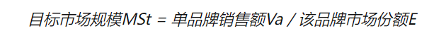

- <del>单品牌：奥克斯</del>
- <del>单月销售额：</del>

  - <del>京东：338*1384+708*695+338*366+278*86+698*38+438*33+699*23+408*19=117 万</del>
  - <del>淘宝：208*2000+208*900+208*600+188*300+208*300+208*200+188*100+198*80+208*71+308*100+538*52+208*200(其他店铺)=104 万</del>
- <del>奥克斯的市场份额：预估为 10%</del>

  - <del>曾是格力“眼中钉”，如今业绩大跌，“价格屠夫”奥克斯怎么了</del>
- <del>洗鞋机市场规模 = 250 万*12(月)/0.10 = 30000 万</del>

<del>其他方法预测市场规模</del>

- <del>懒人经济悄然崛起：洗鞋机两个月线上零售 3000 万</del>
- <del>洗鞋机市场规模 = 3000*6 = 18000 万</del>

<del>平均市场规模</del>

- <del>（30000 万 + 18000 万）/ 2 = 24000 万</del>
- <strong>鹭洋科技：一家专门做洗鞋机的企业</strong>

## <del>市场规模测算方法</del>

- <del>一文看懂市场规模（市场容量）测算</del>

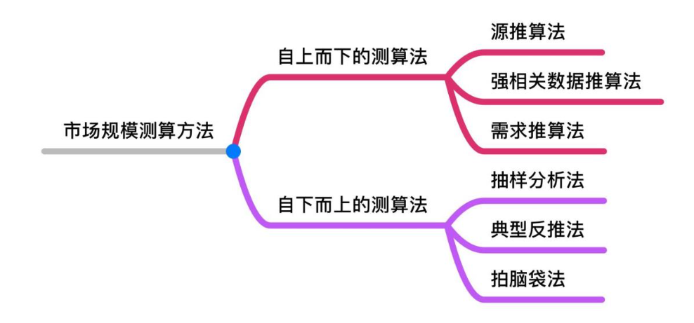

# 10-7

# 10-8

- <del>biased towards：偏向于</del>
- <del>We</del><strong> leverage these findings in the context of </strong><del>neural scene representations</del>

  - <del>我们在……领域充分利用这些发现</del>
- <del>mapping：映射</del>
- <del>In contrast：相比之下</del>
- <del>approximate：逼近、近似</del>

## <del>人体参数化模型：SMPL</del>

- <del>SMPL 论文解读和相关基础知识介绍</del>
- <strong>SMPL: a skinned multi-person linear model，</strong><strong>10.1145/2816795.2818013</strong>
- <del>SCAPE: Shape completion and animation of people</del>
- <del>Expressive body capture: 3d hands, face, and body from a singleimage</del>
- <del>SMPL：人体可以理解为是一个基础模型和在该模型基础上进行形变的总和</del>

  - <del>在形变基础上进行 PCA，得到刻画形状的低维参数——形状参数（shape）</del>
  - <del>使用运动树表示人体的姿势，即运动树每个关节点和父节点的旋转关系，该关系可以表示为三维向量，最终每个关节点的局部旋转向量构成了 smpl 模型的姿势参数(pose)</del>
- <del>Zotero 搭配 Sci-Hub，真香！</del><del>   </del>

# 10-9

- <del>win10 升级后蓝牙不见了，设备管理器里没有，多了个串行控制器里的未知 USB 设备? - 知乎</del>

## 智能家居机器人市场前景分析

- <del>得到 APP - 知识就是力量，知识就在得到</del><del>。</del><strong>人工智能未来 8 大趋势</strong>

  - <del>全体 IT 巨头将重兵布局</del><strong>AI 云服务</strong><del>，AI-a-a-S，意思是人工智能即服务，将成为未来趋势</del>
  - <del>新老人工智能企业将围绕智能入口展开白热化的争夺</del>
  - <del>人工智能将</del><strong>占领客厅</strong><del>，语音交互将成为主流电视应用</del>

    - <del>智能家居概念喊了很多年了，比尔·盖茨在 1995 年出版的《未来之路》里就做出了清晰的描述，</del><strong>但是这样的描述迄今（2017 年）都没有成为事实</strong><del>，</del><strong>核心原因就在于用户缺乏需求</strong>
  - <strong>智能玩具</strong><del>将成为 AI 最早成功的应用领域之一</del>
  - <strong>商用机器人</strong><del>将在特定的商业场景中发挥巨大潜力</del>

    - <del>2017 年，我们会在很多有一定特点的营业厅里，看到专业型机器人的身影。未来，热点会由专业型机器人向通用型机器人转变，通用型机器人将会迅速崛起。</del>
  - <strong>辅助驾驶</strong><del>会成为 AI 的第一个大规模应用</del>
  - <del>人工智能应用会在各个应用领域迅速普及，有</del><strong>大数据支持</strong><del>的</del><strong>应用创业公司</strong><del>会迎来最好的机遇</del>
  - <del>在</del><strong>智能芯片</strong><del>方面，</del><strong>GPU</strong><del>将进一步得到更广泛的应用</del>
- <del>得到 APP - 知识就是力量，知识就在得到</del><del>。家居环境消费趋势</del>

  - <strong>为设计付费：</strong><del>今天的居住者越来越认可设计的价值，愿意为设计服务，甚至产品的设计感付费</del>
  - <strong>消灭客用空间：</strong><del>第二个有意思的趋势是，居住者们开始在家里减少甚至消灭客用空间，重新表达居住主权</del>
  - <strong>追求整合与收纳：</strong><del>新居民们对收纳和空间整合的要求也在变高</del>

    - <del>通用型收纳机器人</del>
  - <strong>扩张清洁功能区：</strong><del>新一代的居家环境里，清洁功能区正在前所未有地扩张。</del>

    - <del>有的住户家在二三线城市，空间没有那么紧张，还会干脆围绕洗衣机来设计一个万能家务区，跟厨房一样，三四平米。在这个万能家务区里，住户可以一口气把洗、烘、晾、晒、叠衣服的工作都做完。前面说的清洁家政柜，也可以整合在这里。这两年扫地、拖地机器人不是很流行么，新一批装修房子的住户们，</del><strong>在装修的时候也开始专门给这类清洁机器人预留空间和电源，甚至预留上下水管道了（引领趋势：玄关预留插座）</strong>
- <del>得到 APP - 知识就是力量，知识就在得到</del><del>。机器人的场景革命</del>

  - <del>工业机器人的“四大家族”：瑞士的 ABB、德国的库卡、日本的发那科和安川电机一共四家</del>
  - <strong>服务机器人：</strong><del>两个维度“时间和空间”，</del><strong>最好选择中等空间和最长的时间</strong>

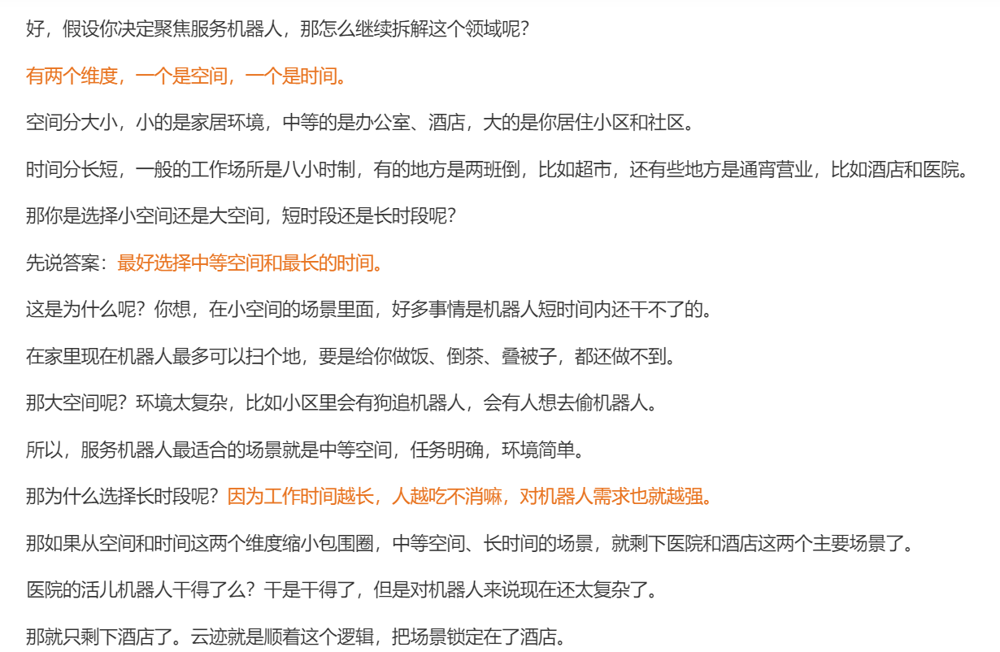

<del>PS：云迹是拿着技术找需求（场景）</del>

- <del>得到 APP - 知识就是力量，知识就在得到</del><del>。后疫情时代，家居市场新趋势，《</del><del>好好住 | 2022 家居消费趋势报告</del><del>》：</del>

  - <strong>健康主义</strong>
  - <strong>智慧居住</strong>
  - <strong>玩家思维</strong>
  - <strong>永续生活</strong>
- <del>得到 APP - 知识就是力量，知识就在得到</del><del>。为什么，小家电市场还要新品牌的机会？  </del>

  - <strong>科沃斯</strong><del>：科沃斯切的是</del><strong>“清洁小家电”</strong><del>，科沃斯的所有产品品类都叫，</del><strong>***机器人。</strong>

    - <del>其次呢，科沃斯在品牌内涵上也有一个巧思。它除了紧紧聚焦在清洁小家电，还多干一件事：给自己的品牌贴「智慧电器」的暗示标签。所以它开创赛道的时候，不叫扫地机、擦窗机，而是都叫「机器人」，扫地机器人、擦窗机器人、空气净化机器人、管家机器人。一听机器人几个字，显得就很智能。</del>
  - <del>小家电制造业，似乎正在</del><strong>吃掉一部分本来留给 C 端服务业的市场</strong>

    - <del>早餐机，吃掉的是包子铺的服务；美容仪，吃掉的是美容院的服务；扫地机器人，吃掉的是自己或者保洁阿姨提供的打扫卫生服务</del>
  - <del>中国供应链的制造能力提升得更快，消费者的这部分需求还没有来得及转化成大规模的</del><strong>服务业需求，甚至还没有主动诞生，就已经被制造业给开发出来、给抢走了</strong>

    - <del>收纳行业！！！，</del><strong>智能收纳行业</strong><del>，几乎是一片空白</del>
# 第二周

> 10 月 10 日-10 月 16 日

# 10-10

- <del>We draw inspiration from</del>

  - <del>从**中汲取灵感</del>
- <del>proportionally：比例</del>

## <del>10 月 10 日，会议，如何写论文</del>

### <del>论文和报告</del>

- <del>论文是论述</del>
- <del>报告是记叙</del>

### <del>论文结构</del>

- <strong>论文不能是方法的拼凑</strong>
- <strong>需要有自己的一套逻辑、思路，其他的只能是借鉴</strong>

  - <del>需要用到某个算法的时候在以引用的方法引入自己的体系 j</del>
  - <del>不需要对引入的思想做过多的解释</del>

### <del>论文引言 Introduction</del>

- <del>引言的作用</del>

  - <del>对现有研究的客观评述</del>

    - <del>如何客观？通过引用第三者文章评述</del>
- <del>内容</del>

  - <del>提出问题</del>
  - <del>这个问题重要么？</del>
  - <del>有人解决这个问题么？（综述）</del>
  - <del>GAP</del>
  - <del>我的方法</del>
- <del>结构</del>

  - <del>第一段：问题的意义和重要性，同时引出问题</del>

    - <del>问题从哪里引？：不能太底层，什么叫底层？</del>
    - <strong>论文是给相关领域的人看的，不需要解释太多</strong>
  - <del>第二段：综述</del>

    - <strong>把相关研究进行分类</strong>
    - <del>对相关论文的问题的指出，需要有个度，不能过分，适可而止</del>
    - <del>对相关论文的批评，可以借"别人的嘴"</del>
  - <del>第三段：指出 GAP</del>

### <del>用词</del>

- <del>efficient：fast</del>
- <del>effective：accurate</del>
- <del>句子与句子之间要有连词</del>
- <del>文章的学术味道：少用 We，多用连词</del>
- <del>解释方法为什么好的句子，应该放在实验结果出来后</del>

### <del>实验</del>

- <del>Ablation Study：消融实验</del>
- <del>需要引导读者如何看图、看表</del>
- <del>需要对每个实验结果做解释、评述</del>

### <del>其他</del>

- <del>定理的提出：为了证明某个问题的一个规律性解释</del>
- <del>一篇文章核心就是一个工作，解决一个问题</del>
- <del>文章标题</del>

  - <del>基于方法的特点，创造一个组合词</del>
  - <del>基于效果，这个形容词需要具象，生动、准确</del>

# 10-11

## <del>家政机器人桌面调研</del>

> [现在能进入普通家庭的家用机器人有哪些? - 知乎](https://www.zhihu.com/question/27900083)

<del>先聚焦到本题，我认为能够进入普通家庭的「家用机器人」必须满足以下 3 个条件</del>

- <del>价格适中，1000-5000 之间</del>
- <del>能够很</del><strong>明确的替代或者优化</strong><del>某一项</del><strong>重复性</strong><del>的”家务工作“</del>
- <del>能够提升家庭生活的安全、舒适、休闲的体验</del>

<del>所以基于以上选择条件和目前市面上的产品，我认为能进入普通家庭机器人无外乎以下：</del>

- <del>清洁机器人</del>

  - <del>扫地</del>
  - <del>擦窗</del>
  - <del>擦鞋？</del>
- <del>孩童教育机器人</del>
- <del>「智慧家庭」机器人</del>

  - <del>将智能家居设备看作一个机器人</del>

<strong>总结：</strong>

- <strong>目前来说，要想让机器人进入普通家庭，价格的限制一定得考虑，在价格的约束下，一款独立的机器人产品最多只能完成某一项重复性的工作，而做不到“全屋通用”（非结构化的应用场景），这一点决定了我们的 Foucs 的切入点和天花板</strong>

> [家用机器人市场现状及未来发展方向分析](https://zhuanlan.zhihu.com/p/51220401)

<del>美国的机器人更倾向于军事应用，日本和韩国的机器人追求趋于完美型的类人型机器人，我们中国目前发展较为成熟的主要是</del><del>工业机器人</del><del>和家用型机器人。</del>

> [家庭服务机器人行业发展前景及趋势分析（附报告目录）](https://www.163.com/dy/article/FRUNDP8N0518WMF4.html)

- <del>家庭服务机器人所涉及机器人产业一直是我国从“中国制造”转变为“中国智造”所需大力发展的产业，因此受到了国家政策的大力支持。</del>
- <del>目前市场上的家庭服务机器人产品主要是扫地机器人为代表的</del><strong>家务机器人</strong><del>，扫地机器人实现了地面清洁等</del><strong>特定功能</strong><del>的智能化，主要特征为“工具型”。随着家庭服务机器人在人工智能、物联网技术方向上取得突破，在人机交互、万物互联等方面的智能化程度将出现质的提升，充当</del><strong>“智能家居控制平台”</strong><del>、连接住户与各类家电的</del><strong>管家机器人</strong><del>也已经逐步走向市场。</del>
- <del>长期来看，具有协作功能的</del><strong>“管家型”机器人</strong><del>可能成为机器人技术的最大趋势，家庭服务机器人有可能成为连接住户与各类家电的智能家居的控制平台</del>

<strong>总结：</strong>

- <strong>管家型机器人是机器人技术的一大趋势</strong>

> [中国家用机器人行业现状深度调研与未来投资预测报告（2022-2029 年）_分析_投资_调研](https://www.sohu.com/a/575048185_121222943)

<del>家用机器人是为人类服务的特种机器人，主要从事家庭服务，维护、保养、修理、运输、清洗、监护等工作，种类可分为电器机器人、娱乐机器人、厨师机器人、搬运机器人、不动机器人、移动助理机器人和类人机器人</del>

> [2020 年中国服务机器人市场发展现状分析 家用市场快速增长【组图】_行业研究报告 - 前瞻网](https://www.qianzhan.com/analyst/detail/220/200121-d52d1925.html)

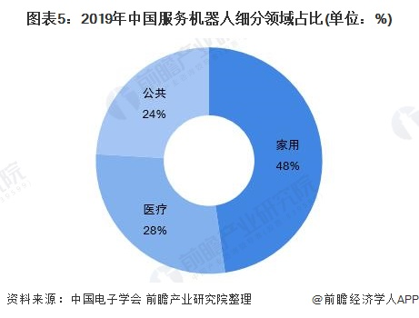

<strong>总结：</strong>

- <strong>家用服务机器人占比更大</strong>
- <strong>机器人行业的进入门槛高</strong>

> [家庭服务机器人 2021 行业报告，“云鲸智能”以技术创新突围](https://news.iresearch.cn/yx/2021/12/413361.shtml)

### <strong>大总结</strong>

- <strong>家用机器人具有广阔的发展前景</strong>
- <strong>目前国内的家用机器人大部分都是扫地机器人。因为该领域具有两个特征：1.解决一个特定的重复性家务工作；2.价格适中</strong>

# 10-12

- <del>Ablation Study：消融实验</del>
- <del>Normalizing：归一化</del>
- <del>PDF（probability density function）：概率密度函数</del>
- <del>regions：区域</del>
- <del>nonuniform discretization：非均匀离散化</del>
- <del>probabilistic estimate：概率估计</del>
- <del>separate：单独的</del>
- <del>dataset：数据集</del>
- <del>intrinsic parameters：内参</del>
- <del>Note that Sth</del>

  - <del>请注意</del>
- <del>Adam optimizer：亚当优化器</del>
- <del>GitHub - amusi/CVPR2022-Papers-with-Code: CVPR 2022 论文和开源项目合集</del>

# 10-13

# 10-14

- 安装 solid works2020

# 10-15

- <del>In our experiments：在我们的实验中</del>
- <del>We quantitatively (Tables 1) and qualitatively (Figs. 8 and 6) show that our method outperforms prior work</del>

  - <del>我们定量（表 1）和定性（图 8 和图 6）表明我们的方法优于以前的工作</del>
- <del>extensive：广泛的、大量的</del>
- <del>We urge the reader to view our supplementary video to better appreciate sth</del>

  - <del>我们希望读者观看我们的补充视频以更好的体验……</del>
- <del>Pip install opencv-contrib-python</del>

# 10-16

- <del>为什么我们需要自我发展，为什么人类需要进步？我们真的是主动的么，还是说我们至始至终都是处于被动的局面？</del>
- <del>基于统计学的语音识别或机器翻译算法取得了成功，但回过头想想我们学习语言的经历，母语是基于统计的，但新语言老师们就在试图通过规则，这种方式是不是从一开始就是错误的。那么问题就出来了，或者说我们产生了一个 HMW：我们如何使用统计的方法帮助人们学习新语言</del>
# 第三周

> 10 月 17 日-10 月 23 日

# 10-17

## <del>结构光讨论会 1017</del>

- <del>工业相机选择：</del><del>JAI monochrome industrial area scan cameras for machine vision</del>
- <del>标定球、定制的正反两面的浅色棋盘格标定板（圆形标定板）、精密数字移动台（带孔洞的平台）、卓立汉光 kxa200-11-x 平移台</del>
- <strong>一个产品设计思路：享受生活——模式可选：自动模式、半自动模式！！</strong>

# 10-18

## <del>OKR 学习记录</del>

### <del>疑问</del>

- <del>OKR 中的“长短期并重”，公司最大的 O 是不是就是愿景使命？</del>
- <del>OKR 中的“长短期并重”，那些需要很长时间才能达成的 O，是不是不在团队正在执行的 OKR 目标网络中？如果在的话，它是如何被记录、被团队所有成员知晓的？如果不在的话要以何种形式被记录？</del>
- <del>OKR 中的“长短期并重”，那些需要很长时间才能达成的 O 如何被拆解？是不是存在这样一个时间维度里的 OKR</del>

  - <del>O：一年内，拿到天使轮融资</del>
  - <del>KR1：9-10 月，完成产品定义；并提出完整解决方案</del>
  - <del>KR2：11-12 月，完成技术验证</del>
  - <del>KR3：1-2 月，……</del>
  - <del>KR4：……</del>

<del>如果不存在这样一个“时间维度下的 OKR”那么上面列的这些事情应该如何被记录呢？</del>

## <del>结构光系统性能提升</del>

### <del>目标</del>

- <del>精度：0.05</del>
- <del>速度：2fps</del>

### <del>方案</del>

#### <del>精度提升</del>

<strong>提升路线</strong>

1. <del>优化系统标定参数</del>

- <del>标准件：浅色棋盘格标定板、标准棋盘格标定板</del>
- <del>投影仪、相机放置数学模型</del>
- <del>基于传统方法的系统标定（需要浅色棋盘格标定板）</del>
- <del>基于编码的投影仪标定</del>
- <del>相位高度映射的方法</del>

1. <del>使用高分辨率相机</del>
2. <del>优化编码方式</del>

<strong>重建精度的测量</strong>

- <del>标准件：标准标定球</del>
- <del>测量重建精度</del>

#### <del>速度提升</del>

<strong>提升路线</strong>

1. <del>将相机软件触发改成使用投影仪硬件触发</del>
2. <del>使用循环互补格雷码</del>
3. <del>高帧率相机</del>

<strong>重建速度的测量</strong>

- <del>软件测量重建速度</del>

### <del>时间安排</del>

# 10-19

## <del>DLP4500 使用手册</del>

> [参考：DLP Lightcrafter™ 4500 EVM](https://zhuanlan.zhihu.com/p/285707015)

### <del>控制软件：DLPLCRGUI4500</del>

- <del>下载地址：[www.ti.com/dlplcr4500gui-V3-1-0](http://www.ti.com/dlplcr4500gui-V3-1-0)</del>

#### <del>如何连接 DLP EVM（嵌入式）</del>

- <del>USB 直连</del>

#### <del>无法连接怎么办</del>

- <del>Flash 损坏</del>

  - <del>安装 J18 跳线帽，上电连接 USB</del>
  - <del>若能连接，重新烧录固件（bin）</del>

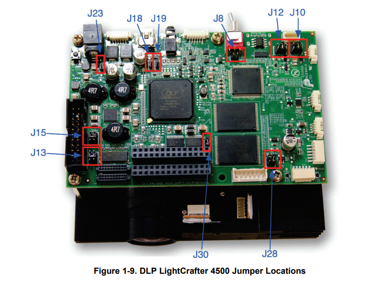

- <del>WIN10 系统将 DLPC350 设备识别成键盘</del>

  - <del>打开设备管理器，连接 DLP 后，找到新增的通用串行总线控制器</del>

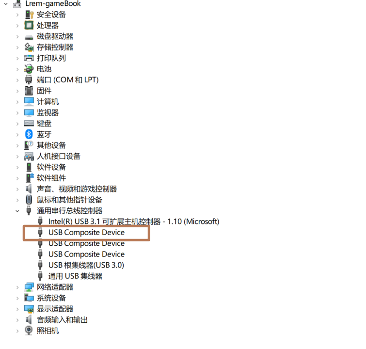

- <del>卸载此设备：USB Composite Device</del>
- <del>重新连接 DLP，检查连接是否正常</del>

## <del>工作模式设置</del>

### <del>投影仪设置外触发</del>

##### <del>投影仪的 Pattern</del>

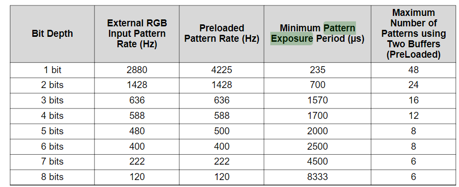

- <del>每个 Pattern 的曝光时间 Pattern Exposure 范围：>8333 (8bit）</del>
- <del>每个 Pattern 之间的间隔时间 Pattern Period 范围：???</del>

#### <del>要达到 2fps 的投影频率</del>

- <del>Pattern Exposure + Pattern Period < (500000 </del><del>/ img_num)</del>

<del>如果 img_num = 2 + 8 + 4 = 14</del>

<del>则（Pattern Exposure + Pattern Period）<=35714us</del>

<del>预设置</del>

- <del>Pattern Exposure = 15000</del>
- <del>Pattern Period = 20000</del>

## <del>DLP LightCrafter 4500 用户指南 </del>

### <del>3.3 Pattern 序列模式</del>

<del>当 DLP LightCrafter 4500 配置为图案序列模式时，DLPC350 支持 1、2、3、4、5、6、7 和 8 位图像，分辨率为 912 列 × 1140 行。这些图像是像素精确的，这意味着每个像素对应于 DMD 上的一个微镜，并且不被任何视频处理功能处理。三个子选项卡控制 Pattern Sequence 设置：Sequence Settings、Pattern Sequence Start/Stop/Pause、Trigger Controls 和 LED Delay Control</del>

### <del>设置序列</del>

<del>一个 Pattern 序列由从闪存加载或通过 24 位 RGB 视频端口流式传输的多个模式组成。每个单独的模式都可以有一组特定的 LED 来照亮它，一个特定的位深度，以及一个内部或外部触发器。序列设置子选项卡允许用户定义和设置所有单独的模式设置。 Trigger Controls 子选项卡和 LED Delay Control 子选项卡分别设置触发和 LED 启用边沿时序。Pattern 序列开始/停止/暂停选项卡显示 Pattern 序列验证状态指示器，并允许用户播放、暂停和停止序列。图 3-5 显示了选择了 Pattern Sequence 选项卡的 DLP LightCrafter 4500 GUI。</del>

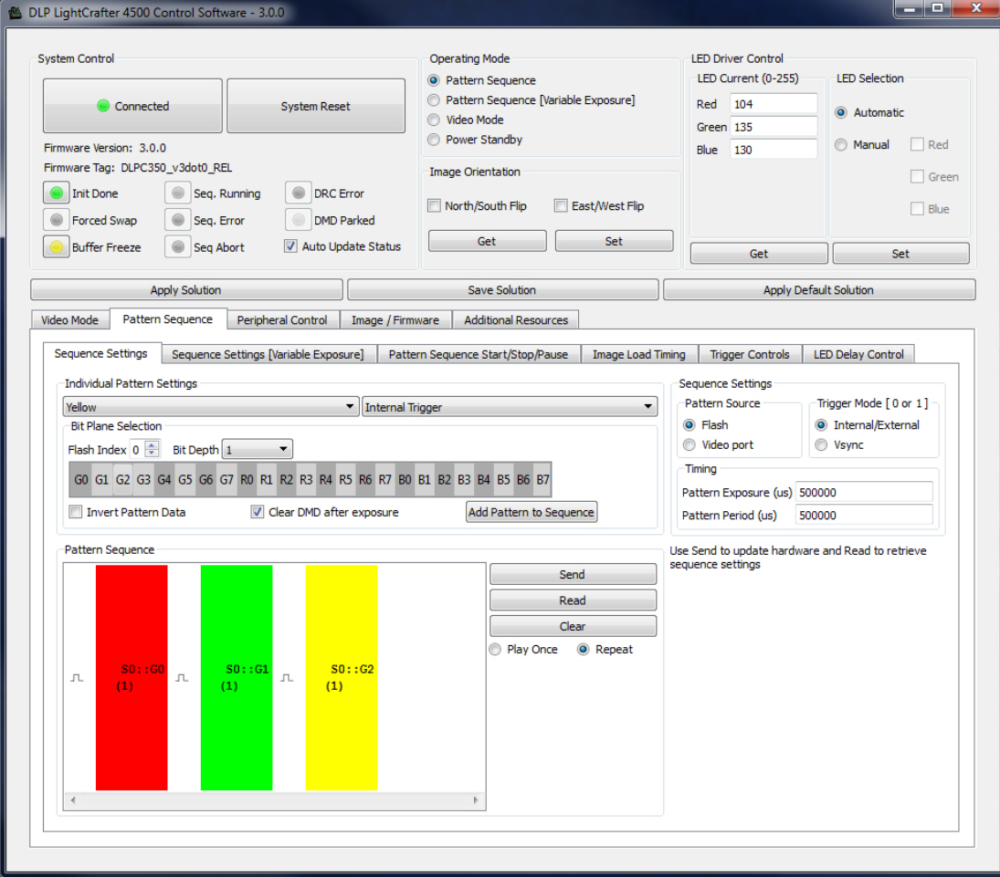

<del>Pattern 序列显示来自以下两个输入源之一的图像（Pattern Source）： </del>

- <del>闪存：存储在闪存中的图像。闪存最多可存储 64 个 24 位压缩图像。 </del>
- <del>视频端口：通过并行 RGB 或 FPD-link 接口进行流式传输。在图案序列模式下，这些接口中只有一个可以连接到 DLP LightCrafter 4500。</del>

<strong>为了使相机或外部系统与显示的图案同步</strong><del>，DLP LightCrafter 4500 支持一组触发输入和输出。这些输入和输出通过触发模式部分和触发控制子选项卡进行配置。触发模式选择触发输入，（Trigger Mode、Timing）选项卡内容：</del>

- <del>Internal/External (内部/外部)：使用内部触发周期启动码型序列或使用 DLP LightCrafter 4500 TRIG_IN2 信号启动和暂停码型序列。码型序列中的每个码型都可以配置有内部或外部触发器。使用内部触发设置，内部触发周期显示下一个码型。通过外部触发周期，DLP Light Crafter 4500 TRIG_IN_1 信号显示下一个模式。</del>
- <del>Vsync：使用来自并行 RGB 或 FPD-link 接口的 VSYNC 信号来触发码型序列的开始。在 VSYNC 之后，模式以 Pattern Sequence 部分中显示的顺序显示。每个图案长度由图案曝光时间决定。</del><strong>因此，图案总数乘以图案曝光必须小于或等于 VSYNC 周期，</strong><del>图案序列时序由图案周期和图案曝光时间控制</del>
- <del>Pattern Exposure，Pattern 曝光 (us)：定义单个模式显示的时间量（以微秒为单位），500000/1000000 s = 0.5s</del>
- <del>Pattern Period，Pattern 模式周期（us）：定义 Pattern 序列中 Pattern 之间的时间量</del>

<del>500000/1000000 s = 0.5s</del>

<del>Pattern 序列可以是位深度模式与 LED 源的任意组合的任意组合。Pattern 序列可以播放一次或连续重复。允许的 LED 光源为：</del>

- <del>White: Red, green, and blue LEDs on</del>
- <del>Cyan: Green and blue LEDs on</del>
- <del>Magenta: Red and blue LEDs on</del>
- <del>Yellow: Red and green LEDs on</del>
- <del>Red: Only red LED on</del>
- <del>Green: Only green LED on</del>
- <del>Blue: Only blue LED on</del>

<del>要创建码型序列，请执行以下步骤：</del>

1. <del>从 Pattern Source 部分选择码型输入源（闪存或视频端口 Flash or Video port）</del>
2. <del>从触发模式 Trigger Mode 部分选择内部/外部或 VSYNC 触发模式 </del>
3. <del>设置适当的触发控制，参见第 3.3.4 节</del>
4. <del>设置码型曝光周期和码型周期</del>
5. <del>在 Individual Pattern Settings 部分创建 Pattern 序列</del>
6. <del>选择 LED 以在图案序列中照亮该图案</del>
7. <del>选择码型的触发：无触发、外部正向、外部负向或内部触发</del>

```
1. <del>内部触发：有一个内部硬件信号输入到花样显示状态机（即控制器收到信号后开始显示）</del>

1. <del>无内部触发no internal trigger：选项将显示一个花样，无需等待触发；每个模式将与前一个模式继续显示。使用外部触发输入创建内部触发模式序列可能会导致意外行为</del>
```

1. <del>选择 Flash 索引（用于 Flash 模式源）或 Frame 索引（用于视频端口模式源）并设置模式的位深度</del>

```
1. <del>Flash索引：这是与 DLP LightCrafter 4500 上加载的固件捆绑在一起的闪存中的图像索引。可以通过将输入配置 > 源选择更改为来自闪存的图像，在视频模式下查看这些图像</del>

1. <del>Frame索引：该值可以单独保留。模式将从每个传输的视频帧的指定位平面中按顺序提取</del>
```

> 注意：在模式序列模式下，一组图像被并行发送，而不是单个标准的 24 位 RGB 图像，并且发送 3 个 8 位图像（灰度）到 24 个单独的 1 位图像。序列中每个模式的颜色由将该模式添加到序列时选择的 LED 确定

1. <del>选择要显示的所需模式位深度。位平面标记为 G0 - G7、R0 - R7 和 B0 - B7。单击矩形将选择该位平面。位平面的分组由选择的位深度决定。不能更改分组。当源是视频端口时，触发将始终为 VSYNC，而 VSYNC 周期将是显示模式的总可用时间（即视频帧将在每个 VSYNC 上更新）。此时可以显示的图案数量由所选的图案曝光和图案周期时间设置</del>

> 请注意，如果使用视频端口，传入的图像分辨率必须为 912x1140

1. <strong>如果图案之间需要黑色图像</strong><del>，请在曝光后检查 Clear DMD</del>
2. <del>单击将模式添加到序列按钮</del>
3. <del> 对序列中的每个模式重复步骤。</del>
4. <del>如果 Pattern 序列必须播放一次，请在图 3-5 中设置 Play Once。此设置将播放在 Trigger Controls 子选项卡下 Trigger 2 Patterns per pulse 下设置的 Pattern 数量，如果设置为 1，它将播放序列中的第一个 Pattern 并停止。如果设置为 10，它将播放序列中的前 10 个模式。如果图案序列要连续重复，设置为重复。单击“播放一次”以下载新设置后，请确保单击“发送”按钮。如果选择 Video Port 作为模式源，Play Once 可能无法按预期工作。重复是视频输入的推荐设置</del>
5. <del>单击发送将使 GUI 跳转到模式序列开始/停止/暂停子选项卡，如图 3-6 所示。单击 Validate Sequence 按钮执行数据验证并更新此选项卡中的数据验证状态指示器。如果数据验证成功，则将图案序列下载到 DLP LightCrafter 4500 并等待按下播放按钮以开始显示图案序列。如果发生数据验证问题，则会在“数据验证”部分突出显示相应的状态指示器</del>
6. <del>曝光/周期 OOR：当以红色突出显示时，图案曝光周期或帧周期超出范围。图案曝光周期必须大于支持的最快周期，如表 4-1 中所列。</del>
7. <del>模式编号 OOR：当以红色突出显示时，模式编号超出范围。允许的最大模式取决于位宽，并在表 4-1 中列出。</del>
8. <del>连续触发重叠黑色：当以红色突出显示时，连续图案曝光有触发 Out1 请求或重叠黑色扇区。</del>
9. <del>黑色矢量缺失：当以红色突出显示时，黑色矢量缺失（这也可以称为后矢量）。</del>
10. <del>周期，曝光差异 < 230：当以红色突出显示时，帧周期或内部触发周期与图案的曝光周期之间的差异小于 230 μs。 DMD 需要 230 μs 来加载模式，因此触发或帧周期必须比模式曝光时间长 230 μs</del>
11. <del>分别通过暂停和播放按钮暂停或重新启动模式序列。如果先前加载了一个模式序列，用户可以单击“读取”按钮将序列加载到 GUI 窗口中</del>

<del>序列设置选项卡中的模式序列部分将模式序列显示为一组彩色矩形。颜色对应于使用的 LED。矩形上的条目代表图像源、位平面和位深度，如下所示： S0::G0 (1) 表示闪存位置 0，位平面 = G0，位深度 = 1。 F2:: G5(3)表示第 2 帧，bit-plane = G5，bit-depth = 3。例如，在图 3-5 中，显示了三个 pattern 的 pattern 序列。每个模式每 500 毫秒触发一次并暴露 500 毫秒。第一个图案是使用来自闪存位置 0 的位平面 G0 的 1 位红色图案。第二个图案是使用来自闪存位置 0 的位平面 G1 的 1 位绿色图案。第三个图案是一个 1 位黄色图案使用来自闪存位置 0 的位平面 G2。</del>

<del>模式之间的脉冲图标表示模式之间需要触发。右键单击此图标可以移除触发器，因此两个或多个图案可以共享同一个触发器并在总曝光时间内按顺序曝光。右键单击图案可以选择反转图案、移除图案或通过在曝光时间后清除 DMD 来插入黑色图像。</del>


<del>图 3.6  Pattern 序列模式：开始、暂停、停止</del>

- <del>GitHub - GlatzeJ/structured-light at master</del>

# 10-20

# 10-21

- <del>投影仪触发相机，可参考 dlpu011f.pdf</del>

  - <del>相机接受外部触发，可参考？？？</del>
- <del>相机触发投影仪，可参考？？？</del>

  - <del>投影仪接收外部触发，可参考 dlpu011f.pdf</del>

## <del>DLP4500 用户指南</del>

- 补充：(如果 Period = 2*Exposure，每个曝光之间的间隔时间恰好等于曝光时间)

### <del>3.1 DLP Light Crafter 4500 Software</del>

<del>DLP LightCrafter 4500 包含一个基于 QT 的 GUI 应用程序，可通过 USB 接口控制模块。 QT 是一个诺基亚跨平台应用程序和用户界面框架，具有开源和商业许可证。要安装 QT GUI，只需将 LightCrafter4500_GUI.zip 文件展开到一个目录中，然后双击可执行文件。 DLP LightCrafter 4500 支持三种主要操作模式：:</del>

- <del>视频模式显示来自：</del>

  - <del>通过 mini-HDMI 连接器的 DVI 输入</del>
  - <del>存储在闪存中的 24 位 RGB 位图</del>
  - <del>通过系统板连接器（J1、J3、 J4 和 J6) 内部测试图案</del>
  - <del>通过平板显示器 (FPD) 链接的 30 位 RGB </del>
- <del>图案序列模式显示来自： </del>

  - <del>1-、2-、3-、4-、5-、6-、7 的图像- 和 8 位位图图像存储在闪存中</del>
  - <del>通过 DLPC350 24 位 RGB 接口流式传输的 1、2、3、4、5、6、7 和 8 位位图图像（ mini-HDMI、FPD-link 或系统板连接器）</del>
  - <del>所选图案曝光和图案周期时间适用于图案序列中的所有图案</del>
- <del>图案序列 [可变曝光] 模式显示来自与图案序列模式相同来源的图像：</del>

  - <del>存储在闪存中的 1、2、3、4、5、6、7 和 8 位位图图像</del>
  - <del>1、2、3、4、5、6、通过 DLPC350 24 位 RGB 接口（mini-HDMI、FPD-link 或系统板连接）流式传输的 7 位和 8 位位图图像 ctors)</del>
  - <del>此模式允许在图案序列中为每个图案设置图案曝光时间和图案周期</del>

### <del>3.2 PC Software</del>

<del>执行 LightCrafter4500.exe 文件后，将显示如图 3-1 所示的窗口。 GUI 窗口包含以下两个部分</del>

- <del>GUI 窗口的顶部显示系统控制并控制操作模式、图像方向、LED 驱动器控制设置和 LED 选择。</del><strong>还有用于保存和应用解决方案的控件。</strong>
- <del>GUI 窗口的底部提供一组选项卡以进一步控制选定的</del><strong>操作模式</strong>

<del>在任何 GUI 部分中，单击“Get”按钮将读取该特定子部分的当前设置。单击“Set”按钮对相应小节中的设置进行编程。在更新 GUI 显示之前，某些命令可能需要额外的步骤。</del>

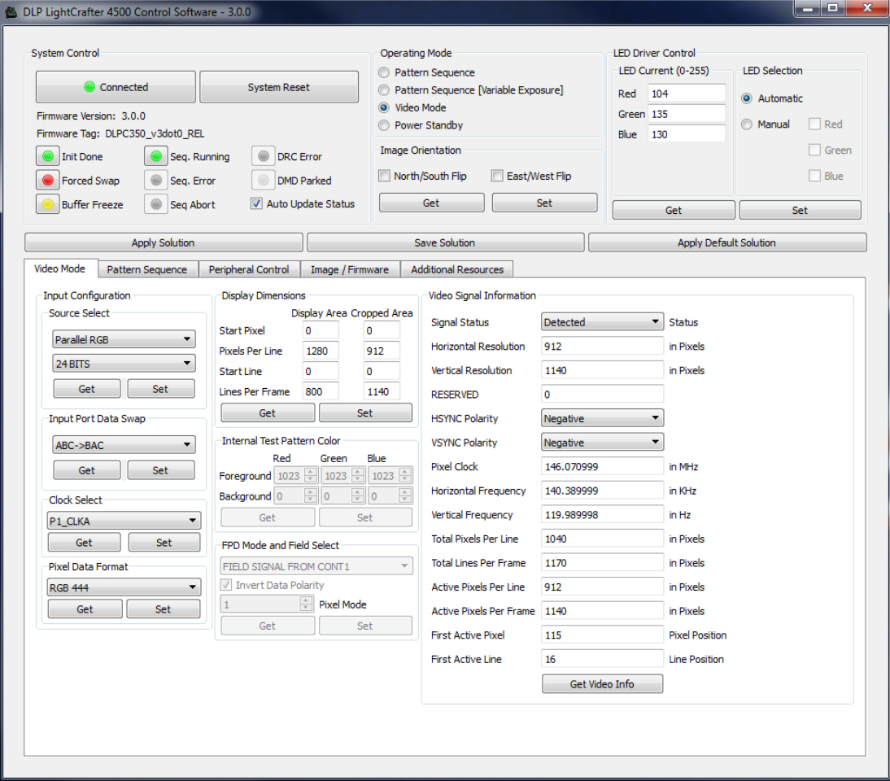

> 图 3-1。 DLP LightCrafter 4500 GUI – 视频模式

<del>DLP LightCrafter 4500 GUI 使用 USB 1.1 与 DLPC350 通信。 DLPC350 模拟为支持 HID 的 USB 设备。 </del><strong>PC 轮询所有 HID 外围设备，</strong><del>一旦 PC 检测到 DLPC350，Connected 按钮将变为绿色。如果 USB 电缆断开，已连接按钮的颜色变为红色，已连接文本变为灰色。一旦系统状态显示已连接，就会</del><strong>显示固件版本、固件标签、硬件和系统状态指示器</strong><del>。无需按下 Connected 按钮，因为 HID 外围设备在 USB 枚举后被操作系统检测到</del>

#### <del>3.2.1 System Status</del>

<del>在 GUI 窗口的左上角，硬件和系统状态指示器报告以下内容：</del>

- <strong>Init Done</strong><em>：</em><del>绿色突出显示时，表示 DLPC350 初始化成功完成。当以灰色突出显示时，表示 DLPC350 在初始化期间出现错误。 </del>
- <strong>Sequencer Running</strong><em>：</em><del>当以绿色突出显示时，DLPC350 序列照常运行。当以灰色突出显示时，DLPC350 序列停止。 </del>
- <strong>DRC Error</strong><del>：DMD 重置控制器错误指示器。当以灰色突出显示时，DMD 重置控制器未检测到错误。当以红色突出显示时，DMD 复位控制器发现多个重叠的偏置或复位操作访问同一 DMD 微镜块。</del>
- <strong>Forced Swap</strong><del>：当以红色突出显示时，DLPC350 定序器检测到强制</del><strong>缓冲区</strong><del>交换错误，表明图像数据已从错误的内部显示缓冲区显示。当以灰色突出显示时，没有发生缓冲区交换错误。如果 DLP LightCrafter 4500 </del><strong>设置为视频模式并且垂直后沿时序太小</strong><del>，则可能会发生此错误。如果 DLP LightCrafter 4500 设置为模式序列模式且模式从视频端口输入且模式序列时序与视频端口 VSYNC 不匹配，也会发生此错误</del>
- <strong>Sequencer Error</strong><del>：当以红色突出显示时，DLPC350 定序器检测到错误。当以灰色突出显示时，DLPC350 定序器检测到未发生错误</del>
- <strong>DMD Parked</strong><del>：当以黄色突出显示时，DMD 微镜停放在与 DMD 平面垂直的位置。当以灰色突出显示时，DMD 微镜未停放。 </del>
- <strong>Buffer Freeze</strong><del>：当以黄色突出显示时，帧缓冲区被冻结。当以灰色突出显示时，帧缓冲区未冻结。这在下一次缓冲区交换时被清除。 </del>
- <strong>Sequencer Abort</strong><del>：当以红色突出显示时，DLPC350 定序器检测到导致中止的错误条件。当以灰色突出显示时，DLPC350 定序器检测到没有发生错误。</del>

> 这些指示灯每 2 秒更新一次，或者在向 DLPC350 发出命令时更新。

- <strong>Auto Update Status：</strong><del>选中后，所有指标将继续每两秒更新一次。未选中时，指示灯将停止更新并变为灰色。在模式序列模式下运行时，保持该选项未选中可防止 GUI 中断 DLPC350 控制器，该控制器将处理与模式显示相关的关键功能。</del>

#### <del>3.2.2 Operating Mode</del>

<del>在系统状态右侧，操作模式设置 DLP LightCrafter 4500 的操作方式：</del>

- <del>Pattern 序列模式：DLPC350 从以下接口之一获取 1、2、3、4、5、6、7 和 8 位数据：</del>

  - <del>24 位 RGB 接口 </del>
  - <del>FPD-link 接口</del>
  - <del>闪存 DLPC350 </del>

> 不应用任何视频处理功能，并提供像素精确模式，其中每个像素都映射到 912 × 1140 的原始 DMD 分辨率

- <del>Pattern 序列 [可变曝光] 模式：DLPC350 从以下接口之一获取 1、2、3、4、5、6、7 和 8 位数据：</del>

  - <del>24 位 RGB 接口 </del>
  - <del>FPD-link 接口</del>
  - <del>闪存 DLPC350 </del>

> 该模式与图案序列模式的不同之处在于图案曝光时间和图案周期可以在图案序列中的每个图案中变化。 DLPC350 不应用任何视频处理功能并提供像素精确模式，其中每个像素都映射到 912 × 1140 的原始 DMD 分辨率

- <del>视频模式：DLPC350 从以下接口之一获取 24、20、16、10 和 8 位数据</del>

  - <del>24 位 RGB 接口 </del>
  - <del>FPD-link 接口 </del>
  - <del>内部测试码型发生器</del>
  - <del>闪存</del>

> 然后，DLPC350 应用视频处理功能，例如缩放、伽马校正和色坐标调整，并将处理后的图像发送到 DMD

- <del>电源待机：将 DLPC350 置于低功耗状态并关闭 DMD 接口</del>

> NOTE：如果 DLP LightCrafter 4500 与 USB 断开连接并重新连接，则操作模式可能无法反映它刚刚工作的模式。当模式在发送到 DLP LightCrafter 4500 之前未完全验证时，可能会在模式序列模式中发生这种情况

#### <del>3.2.3 Image Orientation</del>

<del>在操作模式下，图像方向控制长轴和短轴翻转以支持前、后、桌面和天花板安装投影。图像方向发生在视频模式下的下一个图像或帧加载时，以及模式序列模式下下一次下载到 DLP LightCrafter 4500 时。 </del>

- <em>East/West Flip</em><del>：如果选中，图像将沿投影图像的东西轴翻转。通常的桌子前投影未选中此设置。否则，图像水平翻转。</del>
- <em>North/South Flip</em><del>：如果选中，图像将沿投影图像的南北轴翻转。通常的桌子前投影未选中此设置。否则，图像将垂直翻转。</del>

#### <del>3.2.4 LED Current Settings</del>

<del>在 GUI 窗口的右上角，LED 电流设置控制红色、绿色和蓝色 LED 的各个电流。设置为 255 对应于最大 LED 电流。设置为 0 对应于最小 LED 电流。 LED 电流计算如下： </del>

<del>红色 LED 电流 (A) = 0.0175 × (LED 电流值) + 0.4495 (1)</del>

<del> 绿色 LED 电流 (A) = 0.0181 × (LED 电流值) + 0.3587 (2)</del>

<del> 蓝色 LED 电流 ( A) = 0.0160 × (LED 电流值) + 0.1529 (3) </del>

<del>红色、绿色和蓝色 LED 的典型性能分别如图 2、图 3 和图 4 所示。制造过程会导致 LED 亮度和电流消耗的变化。实际 LED 性能可能与下图中显示的有所不同</del>

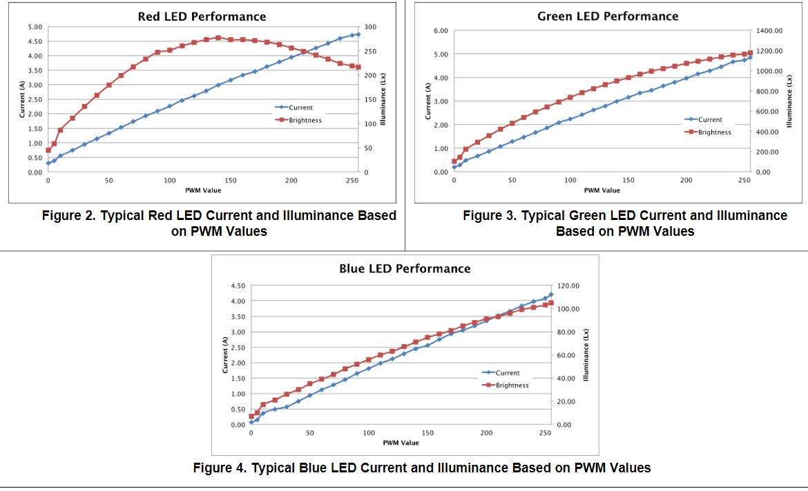

小心 DLP LightCrafter 4500 是一种主动冷却系统，它具有热限制，可导致 LED 连续运行的同时红色、绿色和蓝色 LED 总电流小于 4.3 A。在长时间和同时使用 LED 时，不要通过以最大功率打开所有 LED 来使系统过热。连续或同时运行 LED 超过 4.3 A 会损坏 DLP LightCrafter 4500 LED。

<del>LED 制造中的典型变化会导致亮度和电流消耗的变化。因此，对于典型的白平衡点，TI 建议使用以下颜色百分比： </del>

- <del>红色或绿色约为 87.5% </del>
- <del>蓝色或绿色约为 97.6% </del>

<strong>默认 LED 电流值为： </strong>

- <strong>红色 = 104 </strong>
- <strong>绿色 = 135 </strong>
- <strong>蓝色 = 130 </strong>

<del>LED 选择框确定 LED 启用信号的控制。有两个选项： </del>

- <del>自动：LED 启用由 DLPC350 定序器控制。在视频模式下，LED 启用按颜色顺序设置。在模式序列模式下，LED 启用由下载的模式序列设置控制。 </del>
- <del>手动：LED 启用由复选框控制。检查颜色，在给定的 LED 电流设置下连续启用该颜色的 LED</del>

#### <del>3.2.5 Video Mode</del>

<del>略</del>

### <del>3.3 Pattern Sequence</del>

#### <del>3.3.1 Sequence Settings</del>

<del>略</del>

#### <del>3.3.2 Sequence Settings [Variable Exposure]</del>

在 Pattern Sequence [Variable Exposure] 模式下操作时，使用此子选项卡设置序列设置。所有部分都与“序列设置”子选项卡相同，除了“模式曝光时间”和“模式周期”现在基于每个模式设置，而不是为序列中的所有模式设置相同的值。

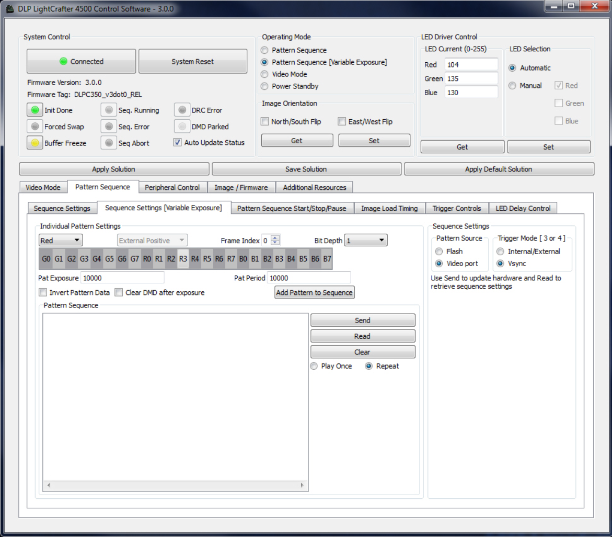

> 图 3-7。图案序列模式 - 可变曝光

#### <del>3.3.3 Image Load Timing</del>

该子选项卡即时计算 DLPC350 从闪存加载完整的 24 位 RGB 位图所需的时间。这种测量是瞬时的，不是平均时间，也不是最坏情况下的时间。要获得瞬时测量值，请执行以下步骤：

1. 从图像索引中选择所需的图像编号。
2. 单击获取加载图像时序按钮。

DLPC350 解压缩存储在图像索引位置的 24 位 RGB 位图，并将其加载到内部缓冲区。此过程所需的时间以毫秒为单位显示。此功能会覆盖当前显示缓冲区中的图像。

> 典型的时间是 200 毫秒。从闪存加载图像后，24 位字段驻留在帧缓冲区中，并且可以以更高的速度进行排序。 DLPC350 提供两个 24 位字段显示缓冲器。如果模式序列使用两个以上的图像（48 位字段），则需要大约 200 ms 将新图像加载到 DLPC350 内部显示缓冲区中<br/>14 张 8bit 图片需要 5 张 24 位位图(5>2)，则需要额外 200ms 的图片加载时间

#### <del>3.3.4 Trigger Controls</del>

Trigger Controls 子选项卡设置极性并调整触发输入和输出的上升沿和下降沿延迟，请参见图 3-9。可以使用以下触发控件：

- TRIG_IN_1:

  - Trigger 1 In Delay：设置 DLPC350 TRIG_IN_1 信号的上升沿延迟，与 DMD 上的码型显示相关。每个数字增加 107.136 ns。 GUI 允许的延迟范围介于 0 μs 和 28084.95 μs 之间，但有关如何扩展延迟范围的更多信息，请参阅 DLPC350 程序员指南 DLPU010
- TRIG_OUT_1：

  - Trigger 1 Out Rising Edge Delay：设置 DLPC350 TRIG_OUT_1 信号的上升沿延迟，与 DMD 上的模式显示相关。每个数字增加 107.136 ns。<strong>范围为 –20.05 μs（图案曝光前）至 +2.79 μs（图案曝光后）延迟</strong>。
  - Trigger 1 Out Falling Edge Delay：设置 DLPC350 TRIG_IN_1 信号的下降沿延迟，与 DMD 上的码型显示相关。每个数字增加 107.136 ns。范围为 –20.05 μs（图案曝光完成前）至 +2.79 μs（图案曝光完成后）延迟。
  - <strong>Invert Trigger 1 Output：设置 TRIG_OUT_1 信号的极性。未选中时，TRIG_OUT_1 的极性为高电平有效。勾选后，TRIG_OUT_1 的极性为低电平有效</strong>
- TRIG_OUT_2

  - Trigger 2 out Rising Edge Delay:：设置 DLPC350 TRIG_OUT_2 信号的上升沿延迟，与 DMD 上的模式显示相关。每个数字增加 107.136 ns。范围为 –20.05 μs（图案曝光前）至<strong> +7.29 μs</strong>（图案曝光后）延迟。
  - Invert Trigger 2 Output：设置 TRIG_OUT_2 信号的极性。未选中时，TRIG_OUT_2 的极性为高电平有效。选中后，TRIG_OUT_2 的极性为低电平有效。
  - Trigger 2 Patterns per Pulse：表示每个 TRIG_OUT_2 脉冲的模式数

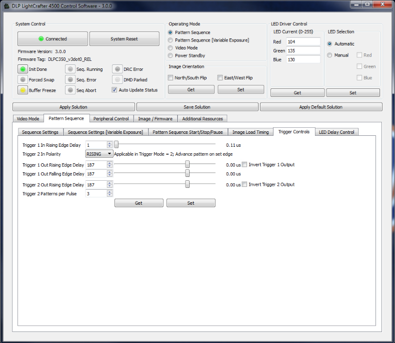

触发输出信号为：

- TRIG_OUT_1 构图图案的曝光时间
- TRIG_OUT_2 指示模式序列的开始或 24 位平面的内部缓冲区边界。

信号示例如图 3-10 和图 3-11 所示。

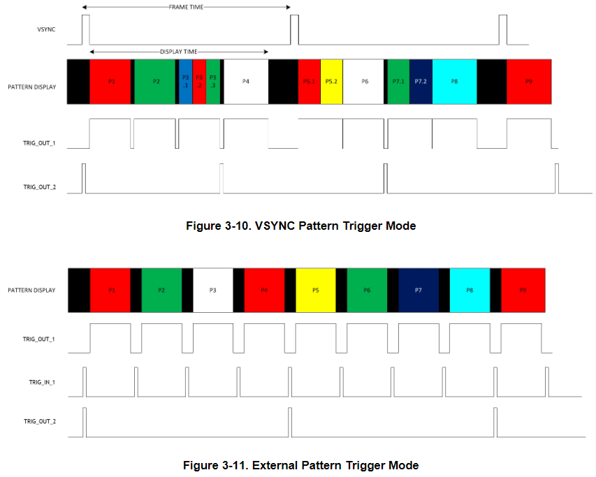

#### <del>3.3.5 LED 延时控制</del>

> 触发延时和 LED 延时，共同控制着投影仪投图的时序

在 Pattern Sequence 模式下，LED Delay Control 子选项卡（参见图 3-9）设置 LED 使能信号相对于 DMD 上的模式显示的上升沿和下降沿偏移。红色、绿色和蓝色 LED 使能信号的上升沿和下降沿可在 –20.05 μs（图案曝光前）至 +7.29 μs（图案曝光后）延迟之间独立更改。当 DLP LightCrafter 4500 在视频模式下运行时，将这些延迟设置为 0 (–20.05 μs)。

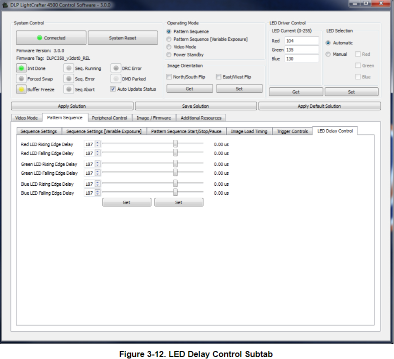

### <del>3.4 Firmware Upgrade</del>

<del>DLP LightCrafter 4500 GUI 允许现场更新 DLPC350 固件。要更新 DLPC350 固件，请执行以下步骤 图 3-13 </del>

1. <del>选择 Image / Firmware 选项卡和 Firmware Upload 子选项卡。 </del>
2. <del>单击浏览按钮选择要安装的文件。 </del>
3. <del>根据偏好标记 Skip Bootloader update 和 Fast Flash Update 复选框。如果选择跳过引导加载程序更新，则不会对保存引导加载程序的存储器扇区进行编程。快速闪存更新将在系统上创建已上传固件的本地缓存，GUI 会将未来的固件上传与该本地缓存进行比较，并仅对已更改的部分进行重新编程。 </del>
4. <del>单击上传按钮。 </del>
5. <del>等待上传过程完成。闪存首先被擦除，然后用选择的新固件映像重写。</del>

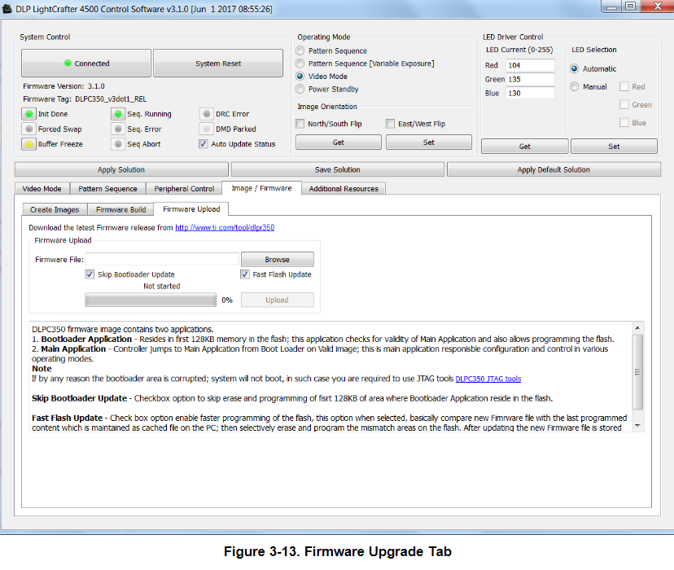

### <del>3.5 Storing Images in Flash Memory</del>

<del>LightCrafter 4500 允许将图像压缩并存储到 32 MB 闪存中。为了最有效地存储和压缩图像，存储的图像被打包成 24 位 RGB 位图图像组，并在从闪存加载时即时解压缩。为了简化任何位宽图像的打包，LightCrafter 4500 GUI 提供了 Create Images 子选项卡，请参见图 3-14。要从不同的多位深度图像创建 24 位图像，请执行以下步骤： </del>

1. <del>选择图像/固件选项卡和创建图像子选项卡。</del>
2. <del>单击输入 bmp 文件旁边的 ... 按钮选择 912 列 x 1140 行的位图文件 </del>
3. <del>单击输出 bmp 文件旁边的 ... 按钮选择输出位图文件</del>
4. <del>对于输入文件，添加通过重复以下过程来设置各个位平面： (a) 分别使用位深度和在位位置下拉选择器设置位深度和位域位置。 (b) 单击添加到输出文件按钮。当前图像经过位加权并保存到输出文件的 24 位图像中。</del>

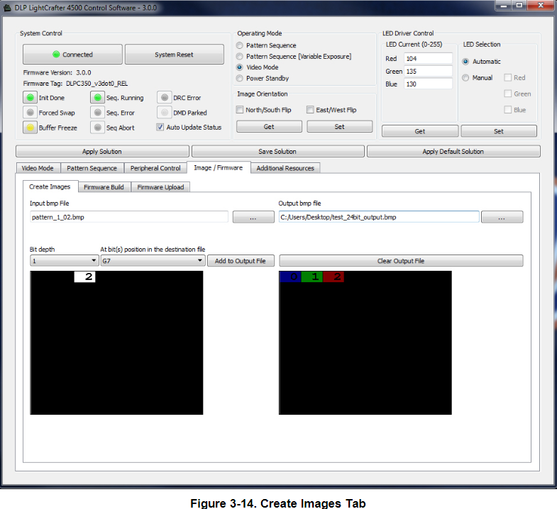

<del>在这些选择下方，左侧窗口显示输入文件的预览。右侧窗口显示 24 位输出文件的预览，该文件已获取所有输入文件并根据请求的位平面位置对添加的图像进行位加权。在位位置 B0 到 B7 添加的图像显示蓝色，位位置 G0 到 G7 显示红色，位位置 R0 到 R7 显示绿色。这是因为 DLPC350 显示顺序是 GRB（请参见 DLPC350 程序员指南中的表 2-69，模式编号映射），而 BMP 图像存储为 RGB。对于每种颜色，位位置 0 是最低有效位，而位位置 7 是最高有效位。要将映像下载到闪存中，必须使用</del><strong>Firmware Build</strong><del>子选项卡将一系列 24 位映像添加到固件文件中，步骤如下：</del>

1. <del>选择 Image / Firmware 选项卡和 Firmware Build 子选项卡。 </del>
2. <del>单击固件文件旁边的浏览按钮选择一个固件文件。 </del>
3. <del>如果需要新的 INI 文件，请参阅第 5.2 节了解有关创建自定义文件的详细信息。使用保存更新按钮上方左下方的选择 .ini 文件按钮来选择现有的 INI 文件。否则，将此字段留空会将 GUI 顶级目录中的 Default.ini 文件与此固件版本捆绑在一起</del>
4. <del>添加固件标签。这是一个 32（或更少）的字符串，将与此固件版本相关联。当 DLP LightCrafter 4500 连接到 GUI 时，固件标签列在 GUI 左上角系统控制部分的固件版本下。构建固件包需要固件标签。</del>
5. <del>通过以下方式添加 24 位图像： (a) 使用下拉菜单选择图像的位置，然后单击添加按钮。浏览 24 位图像文件并选择它。图像显示在这些按钮旁边。重复此步骤以添加其他图像。</del>
6. <del>选择将与此固件一起使用的照明控制类型。如果只使用一个颜色通道，请选择单色并选中与正在使用的颜色通道关联的框。否则，选择 RGB 颜色照明选项。 </del>
7. <del>完成上述步骤后，单击保存更新按钮。将出现输入固件文件名的提示。用户必须在名称中包含 .bin 扩展名以避免任何错误。 GUI 然后将构建并保存固件。</del>
8. <del>按照第 3.4 节中的固件升级步骤将固件下载到 DLP LightCrafter 4500</del>

> 单击保存更新后，所有 24 位图像都被压缩并打包在一起。由于 24 位图像的打包，图像的数量可能与下拉列表中的数量不同。

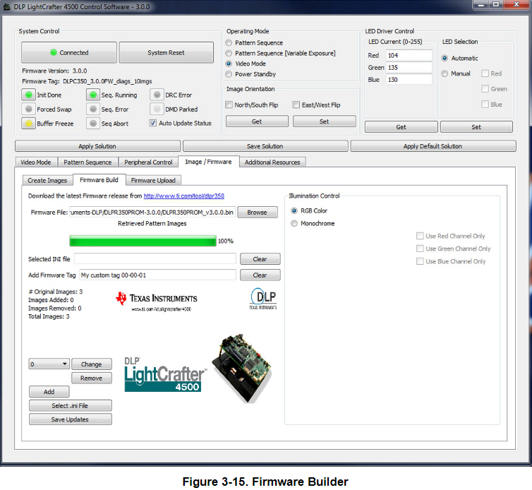

### <del>3.6 Peripheral Control（外部控制）</del>

<del>DLPC350 提供多个</del><strong>可配置引脚</strong><del>。 GUI 的 Peripheral Control 选项卡控制这些引脚的配置方式。以下选项可用</del>

- <em>General Purpose Clock</em><del>：两个 DLPC350 引脚可单独配置为时钟</del>
- <del>PWM Output Set：两个 DLPC350 引脚，GPIO_00（</del><strong>J6 中的引脚 18</strong><del>）和 GPIO_02（J6 中的引脚 22），可单独设置为 PWM 输出</del>
- <del>GPIO Configuration：多个 DLPC350 引脚可单独配置为 GPIO。一旦配置为 GPIO，则可以配置引脚方向（输入或输出），如果设置为输出引脚状态（高或低）和输出类型（开漏输出或驱动高或低）。固件已经为特定功能配置了一些 GPIO 引脚，这些引脚与它们的当前配置一起列出。</del>
- <del>PWM Capture Setup：两个 DLPC350 引脚 GPIO_05（J6 中的引脚 14）和 GPIO_06（J6 中的引脚 17）可以单独设置为 PWM 输入。这些引脚将以 PWM 采样率中指定的频率进行采样，并报告输入信号的占空比</del>
- <del>I2C0（主）读/写控制：可以通过 DLP LightCrafter 4500 上的 J16 连接器访问 DLPC350 主 I2C0 端口。本部分提供对此端口的控制。十六进制地址和数据的格式应为 <value><space><value><space>... 例如：0x22 0x11。要读取的字节数以十进制值输入</del>

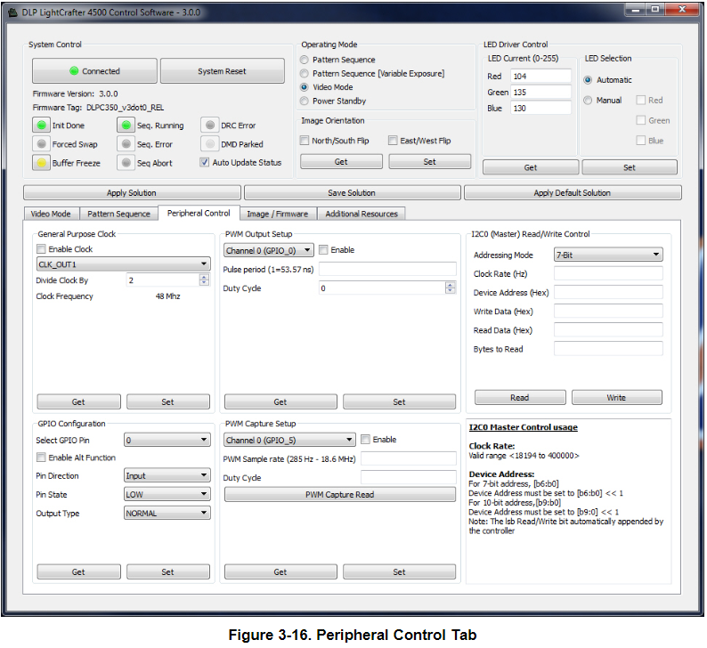

### <del>4 Pattern Sequences</del>

<del>本章介绍 DLP LightCrafter 4500 模块支持的模式序列</del>

## <del>eBUS Player 用户指南</del>

> 参考：

### <del>驱动程序安装</del>

<del>安装 Pleora 驱动程序 </del>

1. <del>在 Windows 开始菜单上，单击 eBUS > eBUS 驱动程序安装工具。 </del>
2. <del>在与您要连接的设备类型相匹配的驱动程序下，单击安装。 USB3 Vision 驱动程序安装在您计算机上的所有 USB3 Vision 设备上。 GigE Vision 驱动程序安装在您计算机上的所有网络适配器上。如果要禁用特定网络适配器的驱动程序，请参阅第 10 页的“配置网络适配器”</del>
3. <del>3. 关闭 eBUS 驱动安装工具。（您可能需要重新启动计算机）</del>

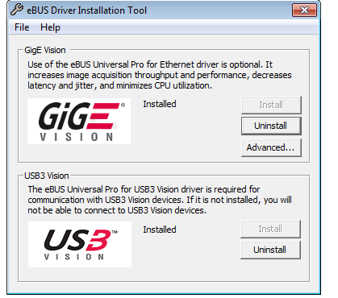

### <del>驱动连接</del>

> 与 USB3 Vision 设备和主机控制器相关的警告和错误可能会出现在设备选择对话框的右侧面板中。例如，如果您已将 USB3 Vision 设备连接到 USB 2.0 端口，则可能会出现警告。

## <del>JAI GO-5000M/C-USB</del>

> 参考：用户手册

参考：Data-Sheet

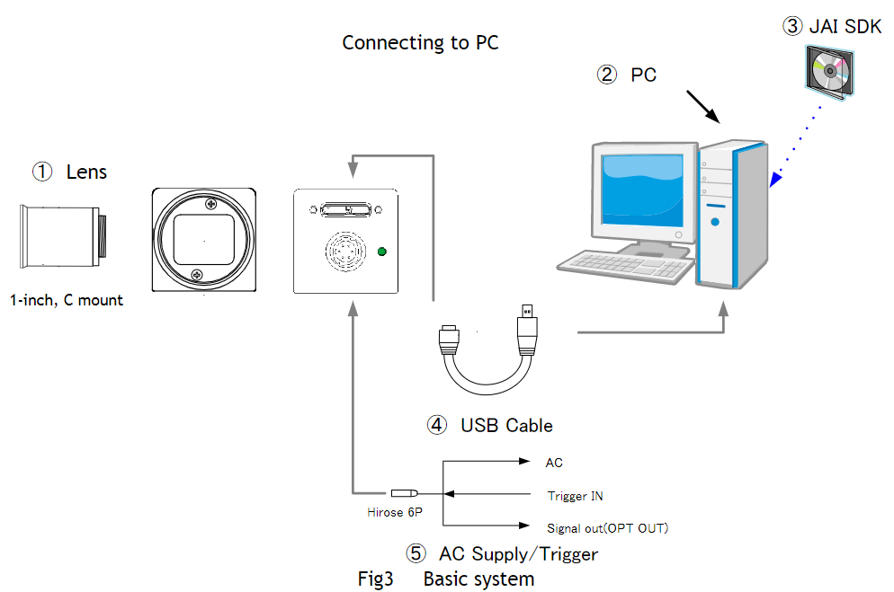

- <del>JAI 6-Pin 线的对应关系</del>

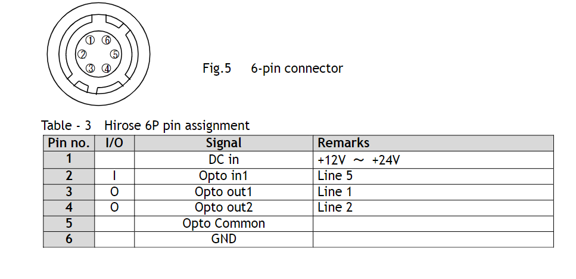

- <del>Pin1: 电源</del>
- <del>Pin2: 黑线</del>
- <del>Pin3: 白线</del>
- <del>Pin4: 灰线</del>
- <del>Pin5: 蓝线</del>

### <del>8 操作模式 Operating modes</del>

#### <del>8.3 Trigger Control</del>

<del>通过触发选择器、触发模式、曝光模式和触发选项的组合，可以使用以下 5 种触发控制：</del>

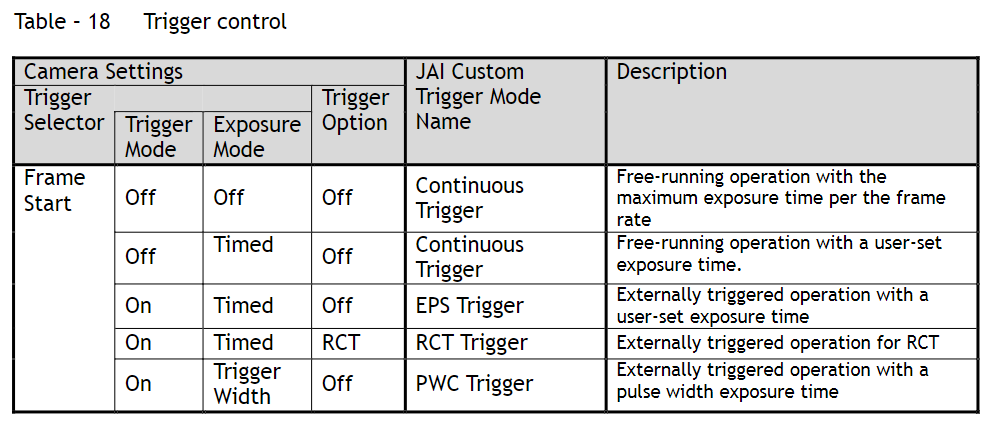

> 建议使用：后三种

##### <del>8.3.1 Trigger Selector</del>

<del>选择触发操作。在 GO-5000-USB 中，可以选择以下触发操作作为触发。</del>

- <del>Acquisition Start： Set to start Acquisition or not</del>
- <del>Acquisition End：Set to end Acquisition or not</del>
- <del>Frame Start：Set to start Frame control or not</del>
- <del>Acquisition Transfer Start: Set to start the stream or not</del>

<del>每个触发器选择都有自己的设置。因此，有必要在每个选定的触发器上设置以下项目。</del>

- <del>Trigger Mode</del>
- <del>Trigger Source</del>
- <del>Trigger Activation</del>

##### <del>8.3.2 触发模式</del>

<del>选择自由运行操作或外部触发操作。 </del>

- <del>OFF：自由运行 </del>
- <del>ON：外部触发运行</del>

##### <del>8.3.3 触发源</del>

<del>以下信号可用作触发源信号</del>

- <del>Low：将 LOW 电平信号连接到选定的触发操作 （默认设置）</del>
- <del>High：Connect HIGH level signal to the selected trigger operation</del>
- <del>Soft Trigger：将软触发信号连接到选定的触发操作 触发可以通过执行软件触发手动输入 每个触发源上都有触发软件，？？</del>
- <del>PulseGenerator0 Out：连接脉冲发生器 0 信号</del>
- <del>User Output 0：将 User Output 0 信号连接到选定的触发操作 </del>
- <del>User Output 1：将 User Output 1 信号连接到选定的触发操作</del>
- <del>Line 5 - OPT IN： 将 OPTO IN 1 信号连接到选定的触发操作</del>
- <del>NAND 0 Out ：将 NAND 0 OUT 信号连接到选定的触发操作 </del>
- <del>NAND 1 Out： 将 NAND 1 OUT 信号连接到选定的触发操作</del>

##### <del>8.3.4 触发器激活</del>

<del>该命令可以选择如何激活触发器。</del>

- <del>上升沿：在脉冲的上升沿，触发被激活。</del>
- <del>下降沿：在脉冲的下降沿，触发被激活。</del>
- <del>高电平： 在触发高电平期间，累积激活。</del>
- <del>低电平： 在触发低电平期间，累积激活。</del>

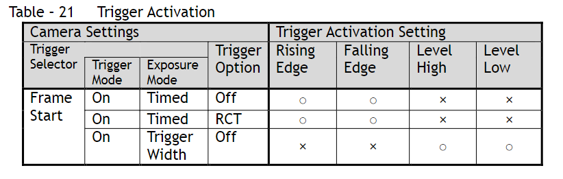

### <del>8.4 正常连续操作（定时曝光模式/触发模式关闭）</del>

<del>最小帧间隔</del>

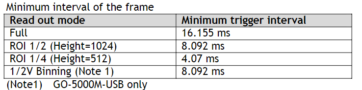

- <del>JAI 相机自带 HDR 模式</del>


- <del>触发关闭时，摄像机的默认帧速率基于指定的 ROI。 ROI 越小，默认帧速率越快。但是，可以指定比默认速率慢的自由运行帧速率（即不需要触发器）。当特定 ROI 需要更长的曝光时间时，这可能很有用。通过在 AcquisitionFrameRate 控件中输入与帧频率对应的值来修改帧速率。 GO-5000-USB 的允许值范围为 3846 Hz 至 0.125 Hz。但是，如果输入的值小于指定格式的默认帧率所需的时间，则忽略该设置并使用默认帧率。例如，最小可能 ROI（1 行）的最小帧周期需要 3846 Hz (fps)，因此任何超过 3846 Hz (fps) 的条目将始终被忽略。</del>

## <del>结构光系统硬件触发实现高速扫描</del>

> 参考：[Bringing fast, accurate 3D scanning into embedded applications](https://e2e.ti.com/blogs_/b/industrial_strength/posts/bringing-fast-accurate-3d-scanning-into-embedded-applications)<br/>[TIDA-00254 参考设计 | 德州仪器 TI.com.cn](https://www.ti.com.cn/tool/cn/TIDA-00254)<br/>参考：使用 DLP® LightCrafter™ 4500 触发器将相机与图案同步

### <del>技术路线（操作思路）</del>

#### <del>相机触发投影仪</del><del>（1021：确定这条路线是否可行，如何执行？？）（该方案可以少连一根线）</del>

- <del>相机产生外触发信号，延迟 Xus 拍摄：【似乎 JAI 相机不支持触发输出：不是这样的，它支持】</del>

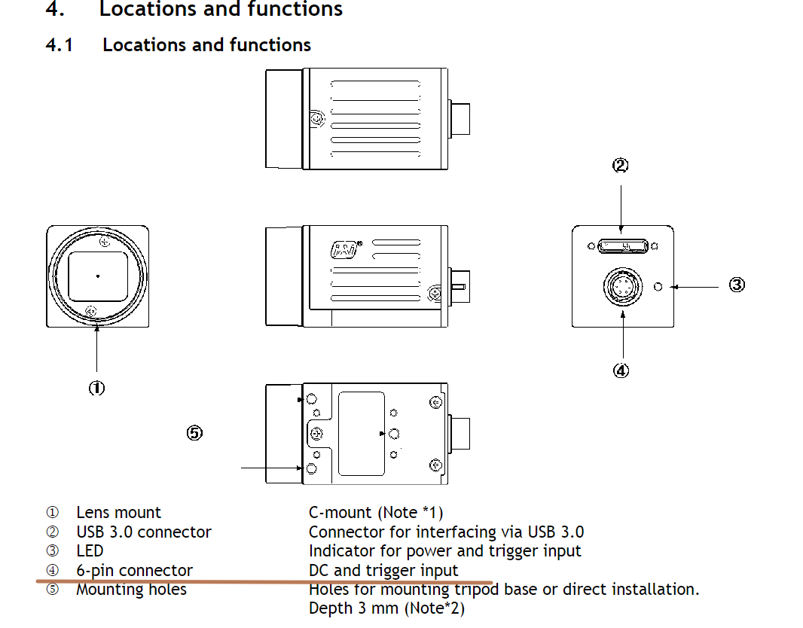


- <del>投影仪接收触发信号，立刻投影</del>

<del>注意事项：</del>

- <del>相机拍摄模型需要设置为：Multi Frame，指定 Acquisition Frame Count =Num_Img=14 张编码图像</del>
- <del>垂直同步</del>

#### <del>投影仪触发相机</del>

- <del>投影仪产生触发信号，即刻投影</del>
- <del>相机接收触发信号，存储图片到程序中去</del>

> 参考：[DLP4500 投影模块 video 模式下使用 vsync 信号如何实现和相机同步](https://e2echina.ti.com/support/dlp/f/dlp-products-forum/151459/dlp4500-video-vsync)<br/>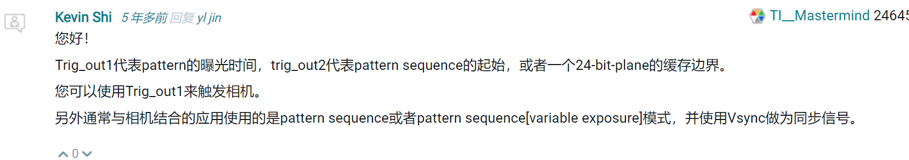<br/>

<del>图 7 显示了将 DLP LightCrafter 4500 设置为在图案序列上触发相机的示例。请注意，在操作模式下，图案序列按钮已被选中。这会自动打开模式序列/序列设置选项卡。对于此插图，已创建模式序列并将其发送到 DLP LightCrafter 4500。在序列设置下，模式源设置为闪烁，触发模式已设置为内部/外部。图案曝光 (μs) 已设置为 33333 μs，它设置了连续图案之间的周期。该周期导致大约每秒 30 帧的模式速率。重要提示：如果希望图案曝光 (μs) 小于图案周期 (μs) 并且未检查曝光后清除 DMD，则必须将图案曝光 (μs) 设置为比图案周期 (μs) 短多于 230 微秒。如果不满足此要求，则该模式将不会运行。控制软件通过点亮周期旁边的信号器来指示错误，曝光差异 < 230 在图案序列开始/停止/暂停选项卡中。</del><strong>触发输出 1 信号高电平时间对应于图案曝光 (μs)。也就是说，触发输出信号将在触发周期内的曝光长度内有效。（Exposure Time）</strong>

### <del>具体操作流程——方案 2：投影仪触发相机</del>

#### <del>总体流程</del>

- <del>设置并检查投影仪触发</del>
- <del>通过正确的触发接口连接投影仪和相机</del>
- <del>设置相机触发</del>
- <del>检查系统是否正常工作</del>

#### <del>设置并检查投影仪触发</del>

> 实现：投影仪每投影一个 Pattern，输出一个与曝光时间等长的脉冲（曝光时间有效）

1. <del>连接投影仪</del>
2. <del>检查 J13、J15 是否安装跳线帽，以确定触发输出（J14）的触发电源使能。</del>

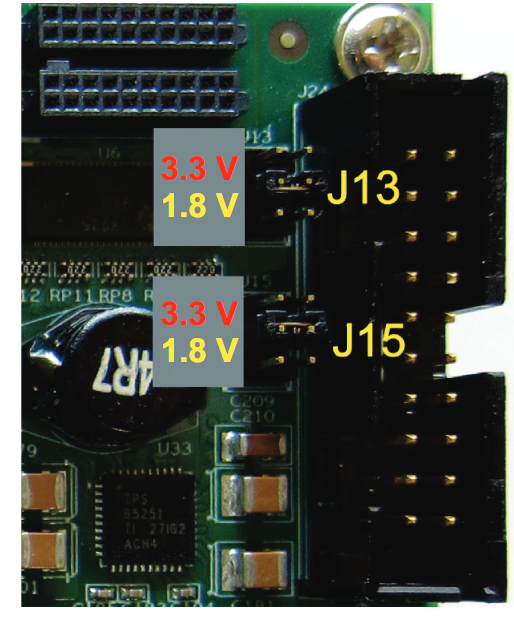

1. <del>接入触发输入接口 J14，并准备好示波器</del>

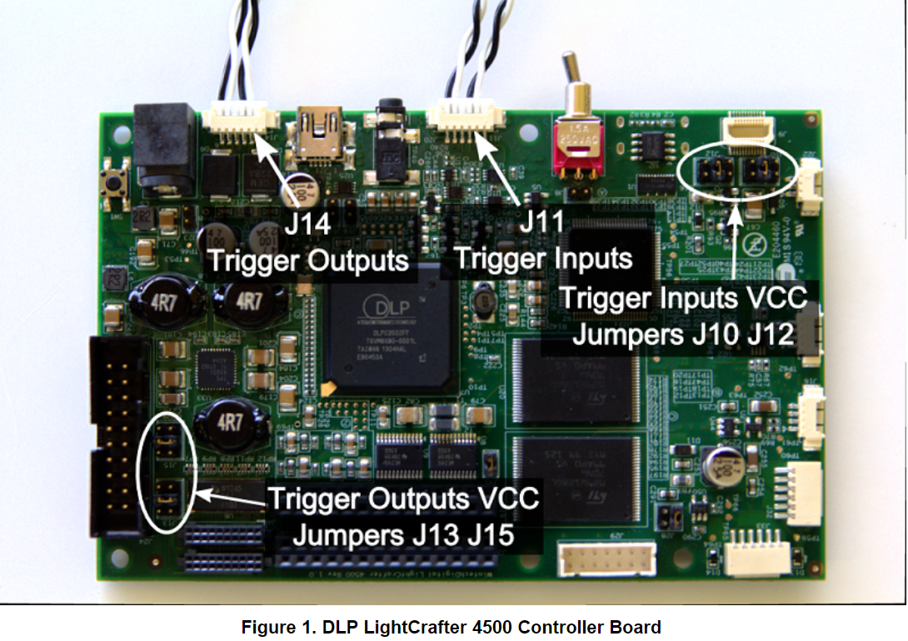

- <del>示波器接 J14 中的触发 1，如下图所示</del>

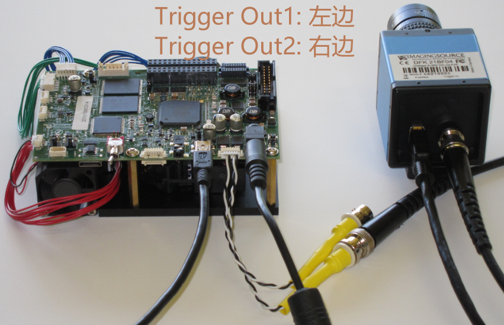

- <del>配置 DLPLightCrafter 4500 触发控制模式</del>

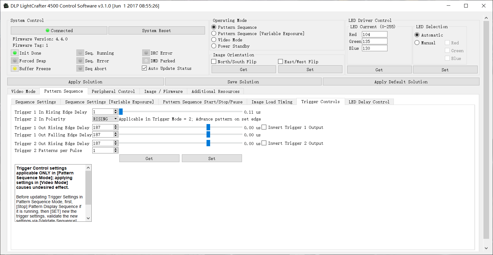

- <del>设置 Pattern 序列</del>

  - <del>Pattern Exposure：20000us</del>
  - <del>Pattern Period：20000us【 Exposure=<Period<35000】</del>

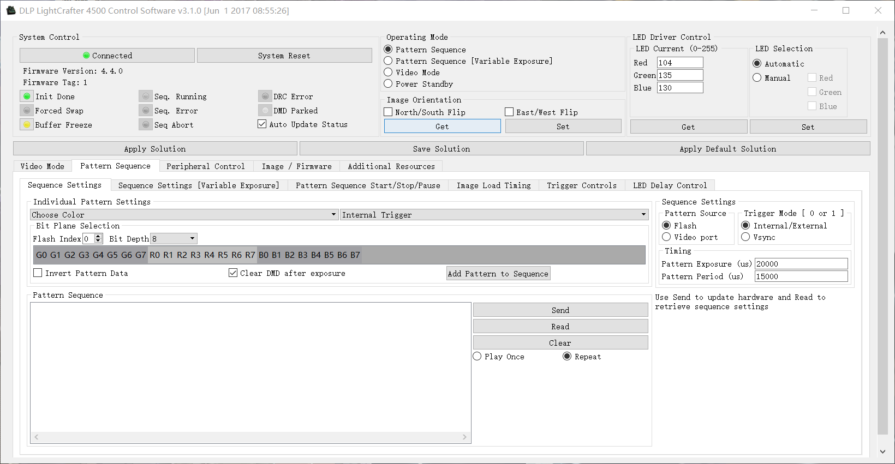

- <del>开始投影序列，检查示波器是否有脉冲，正常情况如下图</del>

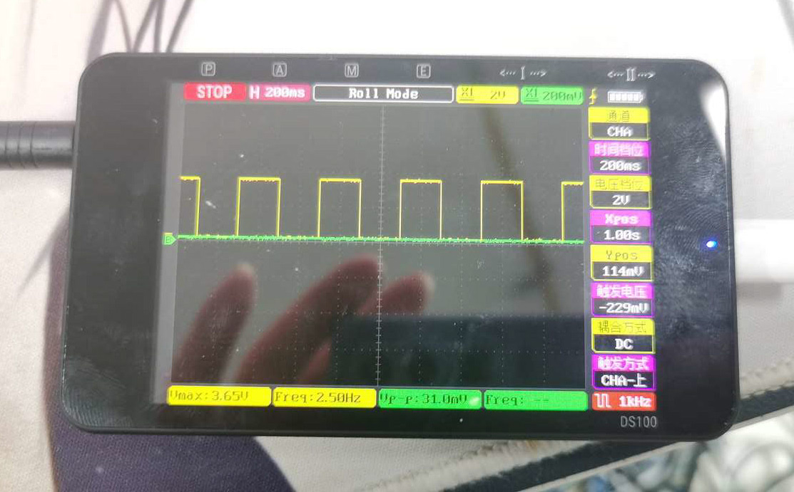

- <del>正确连接投影仪的触发输出和相机的触发输入，连线对应关系如下</del>

  - <del>DLP-J14-GND-黄色线   ——  JAI 6-Pin -Opto Common</del>
  - <del>DLP-J14-Trigger Out1 黑色 —— JAI 6-Pin -Opto in1 Line5</del>
- <del>设置相机外触发模式</del>

  - <del>TriggerSelector: AcquisitionStart</del>
  - <del>TriggerMode: On</del>
  - <del>TriggerSource: Line5</del>
  - <del>TriggerActication：LevelHigh</del>
  - <del>ExposureMode: TriggerWidth</del>

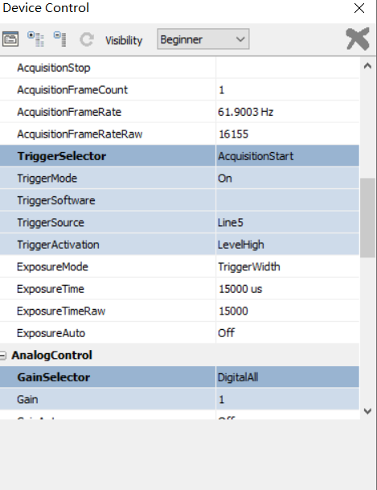

- <del>开始投影序列，测试所有工作是否正常</del>

## <del>编解码优化</del>

<del>图片模式</del>

- <del>1bit 的图片：2 张黑白 +8 位格雷码</del>
- <del>8bit 的图片：4 张相移码</del>

<del>14 张图模式下，现有硬件设备的最快重建时间：</del>

- <del>对于相机来说：17000（相机满幅面的最小触发间隔，对于最大帧率 60fps）* 14 = 238000us = 0.238s = 4.2fps</del>
- <del>对于投影仪：235*10 + 8333*4 = 35682us =  0.035s = 28.57fps</del>

> Fast FrameRate = Min(4.2, 28.57) = 4.2fps

<del>最快重建存在一个问题：投影仪 Flash 读速度跟不上，因为：</del>

- <del>8 位相移码读取慢了</del>
- <del>14 张图片太多，需要 5 张 24 位图片，特别是第 5 张 24 位图很容易出错</del>

> 使用 1bit+8bit 的方案解决了该问题，可以实现 4.2fps 的扫描速度

<del>编解码优化方式</del>

- <del>减去黑白图-2</del>
- <del>使用互补格雷码-2</del>
- <del>动态调整相机 ROI（创新，需要黑白图）</del>
- <del>使用离焦投影技术（影响精度）</del>
- <del>使用位移码替换相移码（影响精度）</del>

# 10-22

## OpenCv

### openCV 将 8bit（1 像素对应 8bit）图像保存为 1bit（1 像素对应 1bit）

- 使用 Matlab 可以解决此问题

## <del>DLP4500 SDK 实现外触发设置</del>

> 参考：暂未找到 DLP350API 的帮助文档，建议从 GUI 的操作逻辑中分析 API 使用方法

<del>需要了解的函数操作是</del>

- <del>Individual Pattern Setting</del>

  - <del>光源设置：ChooseColor，White</del>
  - <del>触发模式：Internal Trigger</del>
- <del>Bit Plane Selection</del>

  - <del>Image Index（24 位图的索引）：0，1</del>
  - <del>Bite Depth（预设）：1，8</del>
  - <del>序列选择（G0-G7,R0-R7,B0-B7）</del>
  - <del>Clear DMD after exposure（预设）</del>
  - <del>Add Pattern to Sequence</del>
- <del>Pattern Sequence</del>

  - <del>选择投影模式：连续（Repeat）、</del><strong>单次（Play Once）</strong>
- <del>Sequence Setting（预设）</del>

  - <del>Pattern Source：Flash</del>
  - <del>Trigger Moode[0or1]: Internal/External</del>
- <del>Timing</del>

  - <del>Pattern Exposure: 20000us</del>
  - <del>Pattern Period: 20000us</del>
- <del>Trigger Controls</del>

  - <del>Trigger 1 Out Rising Edge Delay</del>
- <del>Pattern Sequence Start/Stop/Pause</del>

  - <del>Validate Sequence：初次连接时使用</del>
  - <del>Play：投影</del>
  - <del>Pause：暂停（被测工件切换时间）</del>

# 10-23

- <del>什么是 DLP LUT 的缓冲区交换？</del>
- 为什么 DLP，投影 14 张图，只需要 Send2 张 24 位图索引，而不是 14 张索引？

# 10-24

## JAI 相机 C++ 触发模式设置测试

- <del>查看 Sample 源代码</del>
- <del>通过测试触发，判定不同模式的标识符</del>
- <del>搜索 GitHub 相关内容</del>
- <del>问杰博</del>
- <del>eBUS 里有</del>

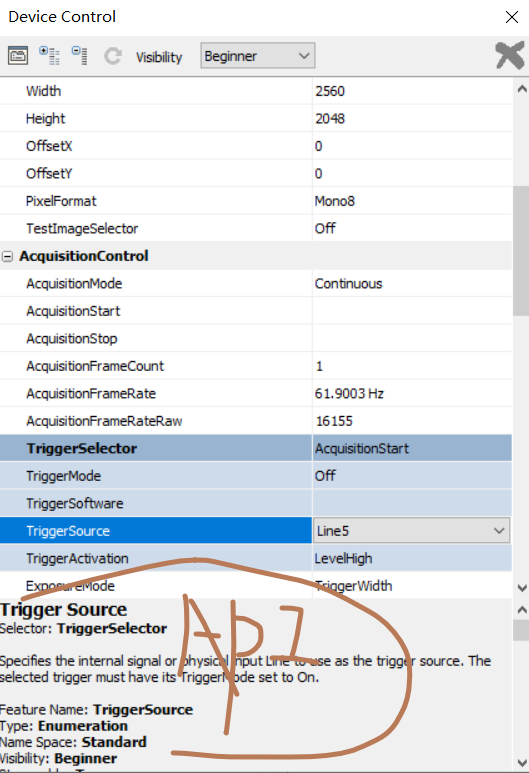

## <del>JAI 相机使用逻辑</del>

- <del>连接相机</del>
- <del>设置触发模式</del>
- <del>开始采集</del>

  - <del>创建 Stream、Pipeline 等</del>
  - <del>使能 Stream、Pipeline 等</del>
  - <del>开启采集 Loop（多线程、或者使用回调函数）</del>
- <del>投影仪提供触发信号，获取图像</del>
- <del>停止采集</del>
- <del>断开相机</del>

## <del>相机投影仪外触发实现</del>

1. <del>实现相机外触发拍照代码</del>
2. <del>实现 VS+eBUS+ 读图模式，测试重建时间</del>
3. <del>使用函数回调功能，模拟相机投影仪多线程，实现 VS 外触发</del>
4. <del>使用多线程编码，实现相机投影仪外触发</del>
5. <del>使用 Qt 实现简单界面</del>

## <del>收藏歌单</del>

- <del>曾经的你，许巍</del>

# 10-25

- <del>如何动态监测相机是否 Lost?</del>
- <del>Stream 和 Pipeline 的关系是什么？</del>
# 第四周

> 10.24-10.30

# 10-24

# 10-25

# 10-26

# 10-27

## <del>JAI 程序优化</del>

- <del>GetImg 耗时优化</del>

  - <del>同一个函数，不同电脑需要时间不一样，这是为什么</del>
- <del>VS 中断退出时，执行 StopDisconnected</del>

  - <del>解决方案 1：在每次连接相机后，清空相机缓冲区。该方案无效</del>
  - <del>现象</del>

    - <del>如果在 VS 窗口中途关闭，下次运行就会失效，如果不采取任何措施，无论几次都会失效</del>
    - <del>如果采取了一定措施，如？？？ </del>
- <del>相机模式调整</del>

  - <del>单投图形式</del>
  - <del>错误类型：| RESYNC</del>

# 10-28

# 10-29

- <del>学习如何生成 DLL 文件</del>

# 10-30

## <del>DLP 投影仪 Pattern 控制逻辑</del>

### <del>PatternConfig</del>

- <del>PlayOnce 模式下，numLutEntries = numPatterns = 4(用户想要投影的图案数量</del>
- <del>numImages</del>

  - <del>numImage=用到的 Flash Image 数量</del>
  - <del>numImage = Pattern 数量</del>

### <del>SendImageLut —— Flash Image Index</del>

- <del>只需要 Send 所用到的图像 Image 的索引，numEntries 可以不等于 numPattern</del>

  - <del>用户需要通过控制 Buff swap 手动切换 flash image Index</del>

    - <del>第一张图片也需要 Swap</del>
    - <del>第一张图片不需要 Swap</del>
    - <del>第一张需要 Swap，第三张不需要 Swap</del>
    - <del>都不需要 Buff swap【极不合理】</del>
- <del>需要 Send 所有 Pattern 对应的 image 索引，numEntries = numPattern</del>

  - <del>用户不需要手动控制 Buff swap</del>
  - <del>用户仍然需要手动控制 Buff Swap【有些不合理】</del>

    - <del>第一张图片也需要 Swap</del>
    - <del>第一张图片不需要 Swap</del>
    - <del>第一张需要 Swap，第三张不需要 Swap</del>
    - <del>都不需要 Buff swap【极不合理】</del>

### <del>配置 1：</del>

- <del>PlayOnce 模式下，numLutEntries = numPatterns = 4(用户想要投影的图案数量</del>
- <del>numImage=用到的 Flash Image 数量</del>
- <del>只需要 Send 所用到的图像 Image 的索引，numEntries 可以不等于 numPattern</del>

  - <del>用户需要通过控制 Buff swap 手动切换 flash image Index</del>

    - <del>第一张图片也需要 Swap</del>

#### <strong>实验结果：</strong>

<strong>第一张图片：正常的黑色，[0,0,1] </strong>

<del>第二张图片：奇怪的条纹，[1,1,1]</del>

<del>第三张图片：奇怪的跳舞，[1,2,1]</del>

<del>第四张图片：奇怪的格雷码，[0,0,8]</del>

### <del>配置 2：</del>

- <del>PlayOnce 模式下，numLutEntries = numPatterns = 4(用户想要投影的图案数量</del>
- <del>numImage=用到的 Flash Image 数量</del>
- <del>只需要 Send 所用到的图像 Image 的索引，numEntries 可以不等于 numPattern</del>

  - <del>用户需要通过控制 Buff swap 手动切换 flash image Index</del>

    - <del>第一张图片不需要 Swap</del>

#### <strong>实验结果：</strong>

<strong>第一次投影</strong>

<del>第一张图片：略带条纹的白色，？？？？</del>

<del>第二张图片：奇怪的条纹，[1,1,1]</del>

<del>第三张图片：奇怪的跳舞，[1,2,1]</del>

<del>第四张图片：奇怪的格雷码，[0,0,8]</del>

<strong>第二次投影</strong>

<strong>第一张图片：黑色，[0,0,1] </strong>

<del>第二张图片：奇怪的条纹，[1,1,1]</del>

<del>第三张图片：奇怪的跳舞，[1,2,1]</del>

<del>第四张图片：奇怪的格雷码，[0,0,8]</del>

### <del>配置 3：配置 1 基础上 numImage = Pattern 数量</del>

- <del>PlayOnce 模式下，numLutEntries = numPatterns = 4(用户想要投影的图案数量</del>
- <del>numImage = Pattern 数量</del>
- <del>只需要 Send 所用到的图像 Image 的索引，numEntries 可以不等于 numPattern</del>

  - <del>用户需要通过控制 Buff swap 手动切换 flash image Index</del>

    - <del>第一张图片也需要 Swap</del>

#### <strong>实验结果：</strong>

<del>第一张图片：略带条纹的白色，？？？？</del>

<del>第二张图片：奇怪的条纹，[1,1,1]</del>

<del>第三张图片：奇怪的跳舞，[1,2,1]</del>

<strong>第四张图片：正常的条纹，[1,0,8]</strong>

### <del>配置 4：配置 2 基础上 numImage = Pattern 数量</del>

- <del>PlayOnce 模式下，numLutEntries = numPatterns = 4(用户想要投影的图案数量</del>
- <del>numImage = Pattern 数量</del>
- <del>只需要 Send 所用到的图像 Image 的索引，numEntries 可以不等于 numPattern</del>

  - <del>用户需要通过控制 Buff swap 手动切换 flash image Index</del>

    - <del>第一张图片不需要 Swap</del>

#### <strong>实验结果：</strong>

<del>第一张图片：略带条纹的白色，？？？？</del>

<del>第二张图片：奇怪的条纹，[1,1,1]</del>

<del>第三张图片：奇怪的跳舞，[1,2,1]</del>

<strong>第四张图片：正常的条纹，[1,0,8]</strong>

<strong>合理的假设 1：第一张图片是否需要 Swap，与结果关系不大</strong>

### <del>配置 5：</del>

- <del>PlayOnce 模式下，numLutEntries = numPatterns = 4(用户想要投影的图案数量</del>
- <del>numImage=用到的 Flash Image 数量</del>
- <del>需要 Send 所有 Pattern 对应的 image 索引，numEntries = numPattern</del>

  - <del>用户不需要手动控制 Buff swap</del>

#### <strong>实验结果：</strong>

<del>第一张图片：略带条纹的白色，？？？？； 第一张图片 有时又是黑色</del>

<strong>第二张图片：正常的白色，[0,1,1]</strong>

<strong>第三张图片：正常的黑色格雷码，[0,2,1]</strong>

<del>第四张图片：奇怪的格雷码，[0,0,8]</del>

### <del>意外的设置？？？——与配置 5 情况相同合理</del>

- <del>PlayOnce 模式下，numLutEntries = numPatterns = 4(用户想要投影的图案数量</del>
- <del>numImage=用到的 Flash Image 数量</del>
- <del>需要 Send 所有 Pattern 对应的 image 索引，numEntries = numPattern</del>

  - <del>用户不需要手动控制 Buff swap</del>
- <del>四张图片的 Pattern 索引为[0,1,2,2]，图案位深度[1,1,1,8]</del>

#### <del>实验结果：</del>

<strong>第一张图片：正常的黑色，[0,0,1] </strong>

<strong>第二张图片：正常的白色，[0,1,1]</strong>

<strong>第三张图片：正常的黑色格雷码，[0,2,1]</strong>

<strong>第四张图片：正常的条纹，[0,2,8]</strong>

### <del>配置 5：</del>

- <del>PlayOnce 模式下，numLutEntries = numPatterns = 4(用户想要投影的图案数量</del>
- <del>numImage=用到的 Flash Image 数量</del>
- <del>需要 Send 所有 Pattern 对应的 image 索引，numEntries = numPattern</del>

  - <del>用户仍然需要手动控制 Buff swap</del>

    - <del>第一张不需要 Swap</del>

#### <strong>实验结果：</strong>

<strong>第一张图片：正常的黑色，[0,0,1] </strong>

<strong>第二张图片：正常的白色，[0,1,1]</strong>

<strong>第三张图片：正常的黑色格雷码，[0,2,1]</strong>

<del>第四张图片：奇怪的格雷码，[0,0,8]</del>

<del>为什么第四张明明 swap 了，却没有跳转？</del>

### <del>配置 5：</del>

- <del>PlayOnce 模式下，numLutEntries = numPatterns = 4(用户想要投影的图案数量</del>
- <del>numImage=用到的 Flash Image 数量</del>
- <del>需要 Send 所有 Pattern 对应的 image 索引，numEntries = numPattern</del>

  - <del>用户仍然需要手动控制 Buff swap</del>

    - <del>第一张也需要 Swap</del>

#### <strong>实验结果：</strong>

<strong>第一张图片：正常的黑色，[0,0,1] </strong>

<strong>第二张图片：正常的白色，[0,1,1]</strong>

<strong>第三张图片：正常的黑色格雷码，[0,2,1]</strong>

<del>第四张图片：奇怪的格雷码，[0,0,8]</del>

<del>为什么第一张即使 swap 了也不跳转？</del>

### <del>配置 6：</del>

- <del>PlayOnce 模式下，numLutEntries = numPatterns = 4(用户想要投影的图案数量</del>
- <del>numImage=用到的 Flash Image 数量</del>
- <del>需要 Send 所有 Pattern 对应的 image 索引，numEntries = numPattern</del>

  - <del>用户仍然需要手动控制 Buff swap</del>

    - <del>第一张需要 Swap，第三张不需要</del>

#### <strong>实验结果：</strong>

<strong>第一张图片：正常的黑色，[0,0,1] </strong>

<strong>第二张图片：正常的白色，[0,1,1]</strong>

<strong>第三张图片：正常的黑色格雷码，[0,2,1]</strong>

<del>第四张图片：奇怪的格雷码，[0,0,8]</del>

### <del>配置 7：配置 1 基础上 numImage = Pattern 数量</del>

- <del>PlayOnce 模式下，numLutEntries = numPatterns = 4(用户想要投影的图案数量</del>
- <del>numImage = Pattern 数量</del>
- <del>需要 Send 所有 Pattern 对应的 image 索引，numEntries = numPattern</del>

  - <del>用户不需要手动控制 Buff swap</del>

#### <del>实验结果：</del>

<strong>第一张图片：正常的黑色，[0,0,1] </strong>

<strong>第二张图片：正常的白色，[0,1,1]</strong>

<strong>第三张图片：正常的黑色格雷码，[0,2,1]</strong>

<del>第四张图片：奇怪的格雷码，[0,0,8]</del>

### <del>配置 8：配置 1 基础上 numImage = Pattern 数量</del>

- <del>PlayOnce 模式下，numLutEntries = numPatterns = 4(用户想要投影的图案数量</del>
- <del>numImage = Pattern 数量</del>
- <del>需要 Send 所有 Pattern 对应的 image 索引，numEntries = numPattern</del>

  - <del>用户需要手动控制 Buff swap</del>

    - <del>只需要最后一张</del>

#### <del>实验结果：</del>

<strong>第一张图片：正常的黑色，[0,0,1] </strong>

<strong>第二张图片：正常的白色，[0,1,1]</strong>

<strong>第三张图片：正常的黑色格雷码，[0,2,1]</strong>

<del>第四张图片：奇怪的格雷码，[0,0,8]</del>

### <del>配置 9：配置 1 基础上 numImage = Pattern 数量</del>

- <del>PlayOnce 模式下，numLutEntries = numPatterns = 4(用户想要投影的图案数量</del>
- <del>numImage = Pattern 数量</del>
- <del>需要 Send 所有 Pattern 对应的 image 索引，numEntries = numPattern</del>

  - <del>用户需要手动控制 Buff swap</del>

    - <del>第一张 + 最后一张</del>

#### <del>实验结果：</del>

<strong>第一张图片：正常的黑色，[0,0,1] </strong>

<strong>第二张图片：正常的白色，[0,1,1]</strong>

<strong>第三张图片：正常的黑色格雷码，[0,2,1]</strong>

<del>第四张图片：奇怪的格雷码，[0,0,8]</del>

### <del>配置 10：配置 1 基础上 numImage = Pattern 数量</del>

- <del>PlayOnce 模式下，numLutEntries = numPatterns = 4(用户想要投影的图案数量</del>
- <del>numImage = Pattern 数量</del>
- <del>需要 Send 所有 Pattern 对应的 image 索引，numEntries = numPattern</del>

  - <del>用户需要手动控制 Buff swap</del>

    - <del>第一张</del>

#### <del>实验结果：</del>

<strong>第一张图片：正常的黑色，[0,0,1] </strong>

<strong>第二张图片：正常的白色，[0,1,1]</strong>

<strong>第三张图片：正常的黑色格雷码，[0,2,1]</strong>

<del>第四张图片：奇怪的格雷码，[0,0,8]</del>

<strong>合理的假设 2：不能 Send 所有 Pattern 对应的 image 索引，只需要 Send 所需要的几张图片</strong>

<strong>必要的设置：flash_index[2] = {0,1}</strong>

### <del>配置 11：</del>

- <del>PlayOnce 模式下，numLutEntries = numPatterns = 4(用户想要投影的图案数量</del>
- <del>numImage=用到的 Flash Image 数量</del>
- <del>只需要 Send 所用到的图像 Image 的索引，numEntries 可以不等于 numPattern</del>

  - <del>用户需要通过控制 Buff swap 手动切换 flash image Index</del>

    - <del>第三张图片不需要 Swap，第一张需要</del>

#### <del>实验结果：</del>

<strong>第一张图片：正常的黑色，[0,0,1]   好像第一张就进行了一次 Swap</strong>

<del>第二张图片：奇怪的条纹，[1,1,1]</del>

<del>第三张图片：奇怪的跳舞，[1,2,1]</del>

<strong>第四张图片：正常的条纹，[1,0,8]</strong>

### <del>配置 12：同配置 2</del>

- <del>PlayOnce 模式下，numLutEntries = numPatterns = 4(用户想要投影的图案数量</del>
- <del>numImage=用到的 Flash Image 数量</del>
- <del>只需要 Send 所用到的图像 Image 的索引，numEntries 可以不等于 numPattern</del>

  - <del>用户需要通过控制 Buff swap 手动切换 flash image Index</del>

    - <del>第四张图片需要 Swap，第一张不需要</del>

#### <del>实验结果：</del>

<strong>第一张图片：黑色，[0,0,1] </strong>

<del>第二张图片：奇怪的条纹，[1,1,1]</del>

<del>第三张图片：奇怪的跳舞，[1,2,1]</del>

<del>第四张图片：奇怪的格雷码，[0,0,8]</del>

<strong>合理的假设 3：无论第一张是否 Swap，程序都会自动将 Image 索引跳到下一张</strong>

### <del>配置 13【极不合理】</del>

- <del>PlayOnce 模式下，numLutEntries = numPatterns = 4(用户想要投影的图案数量</del>
- <del>numImage=用到的 Flash Image 数量</del>
- <del>只需要 Send 所用到的图像 Image 的索引，numEntries 可以不等于 numPattern</del>

  - <del>用户不需要通过控制 Buff swap 手动切换 flash image Index</del>

#### <del>预期实验结果：</del>

<strong>第一张图片：黑色，[0,0,1] </strong>

<del>第二张图片：奇怪的条纹，[1,1,1]</del>

<del>第三张图片：奇怪的跳舞，[1,2,1]</del>

<strong>第四张图片：正常的条纹，[1,0,8]</strong>

#### <del>实验结果 = 预期结果  假设 3 成立</del>

<strong>猜想 1：第一张会自动 Swap，但后面几张不会，需要手动 Swap</strong>

### <del>配置 14 ——验证猜想 1</del>

- <del>PlayOnce 模式下，numLutEntries = numPatterns = 4(用户想要投影的图案数量</del>
- <del>numImage=用到的 Flash Image 数量</del>
- <del>numEntries 等于 numPattern</del>

  - <del>除了第一张，其余都需要 Swap</del>
  - <del>特殊设置：numEntries = 2;  flash_index[4] = { 0,0,0,1};</del>

#### <del>实验结果：</del>

<strong>第一张图片：正常的黑色，[0,0,1] </strong>

<strong>第二张图片：正常的白色，[0,1,1]</strong>

<strong>第三张图片：正常的黑色格雷码，[0,2,1]</strong>

<del>第四张图片：奇怪的格雷码，[0,0,8]</del>

### <del>配置 15 ——验证猜想 1</del>

- <del>PlayOnce 模式下，numLutEntries = numPatterns = 4(用户想要投影的图案数量</del>
- <del>numImage=用到的 Flash Image 数量</del>
- <del>只需要 Send 所用到的图像 Image 的索引，numEntries 可以不等于 numPattern</del>

  - <del>除了第一张，其余都需要 Swap</del>
  - <del>设置：numEntries = 4;  flash_index[4] = { 0,0,0,1};</del>

#### <del>实验结果：</del>

<strong>第一张图片：正常的黑色，[0,0,1] </strong>

<strong>第二张图片：正常的白色，[0,1,1]</strong>

<strong>第三张图片：正常的黑色格雷码，[0,2,1]</strong>

<del>第四张图片：奇怪的格雷码，[0,0,8]</del>

#### <del>猜想 1 基本不成立</del>

### <del>配置 16</del>

- <del>PlayOnce 模式下，numLutEntries = numPatterns = 4(用户想要投影的图案数量</del>
- <del>numImage=numPattern</del>
- <del>只需要 Send 所用到的图像 Image 的索引，numEntries 可以不等于 numPattern</del>

  - <del>用户不需要通过控制 Buff swap 手动切换 flash image Index</del>

#### <del>预期实验结果：</del>

<strong>第一张图片：黑色，[0,0,1] </strong>

<del>第二张图片：奇怪的条纹，[1,1,1]</del>

<del>第三张图片：奇怪的跳舞，[1,2,1]</del>

<strong>第四张图片：正常的条纹，[1,0,8]</strong>

#### <del>实验结果：</del>

- <del>得到的全是棋盘格？？？？？？哪里来的残留，</del><del>是不是程序前期逻辑有误</del>

#### <del>第二次实验结果</del>

- <del>得到的全是棋盘格？？？？？？</del>

#### <del>第三次实验：numImage= 用到的 Image 数量</del>

- <strong>第一张图片：黑色，[0,0,1] </strong>
- <del>第二张图片：奇怪的条纹，[1,1,1]</del>
- <del>第三张图片：奇怪的跳舞，[1,2,1]</del>
- <strong>第四张图片：正常的条纹，[1,0,8]</strong>

<strong>合理的假设 4：numImage= 用到的 Image 数量</strong>

### <del>目前可能的最好配置</del>

- <del>PlayOnce 模式下，numLutEntries = numPatterns = 4(用户想要投影的图案数量</del>
- <strong>numImage= 用到的 Image 数量</strong>
- <del>只需要 Send 所用到的图像 Image 的索引，numEntries 可以不等于 numPattern</del>

  - <del>第四张图片需要 Swap，第一张不需要</del>

#### <del>实验结果</del>

- <strong>第一张图片：黑色，[0,0,1] </strong>
- <del>第二张图片：奇怪的条纹，[1,1,1]</del>
- <del>第三张图片：奇怪的跳舞，[1,2,1]  Swap 了一下，跳出 2，返回 0 值</del>
- <strong>第四张图片：奇怪的格雷码，[0,0,8]</strong>

#### <del>问题分析：第一张自动跳到了下一个索引</del>

- <del>解决办法 1： flash_index[3] = { 0,0,1};</del>

#### <del>实验结果</del>

- <strong>第一张图片：黑色，[0,0,1] </strong>

<strong>第二张图片：正常的白色，[0,1,1]</strong>

<strong>第三张图片：正常的黑色格雷码，[0,2,1]</strong>

<del>第四张图片：奇怪的格雷码，[0,0,8]</del>

#### <del>问题分析：第一张又不跳了？？？，第四张图案无法跳到下一个 flash</del>

## 结构光讨论会

### 我们的特色

- 使用高位格雷码，具有很好的环境适应性，实现强鲁棒的三维重建和测量
- 相机和投影仪使用极致的触发控制，能充分发挥相机或投影仪的最大支持帧率
- 多投影多相机技术，支持更多工作场景
- 高动态范围技术，适应高反光物体表面的三维重建

## <del>结构光硬件设备报价</del>

### <del>投影模块</del>

- <del>型号：DLPLCR4500 LightCrafter4500 EVM</del>
- <del>报价：9500+￥</del>

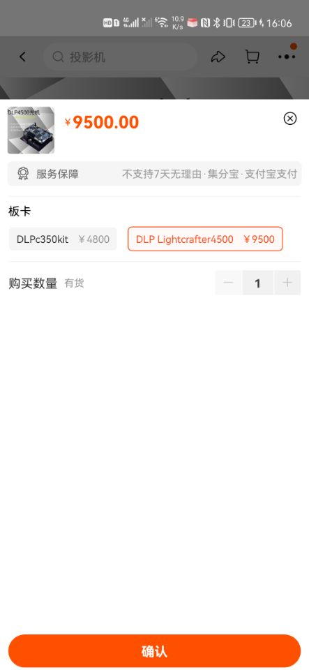

<del>DLP 光学引擎 - 北京闻亭泰科(Wintech)技术发展有限公司</del>

### <del>相机（不带镜头）</del>

- <del>型号：JAI-GO-5000M-USB 接口：C 口</del>
- <del>报价：8100+ ￥</del>

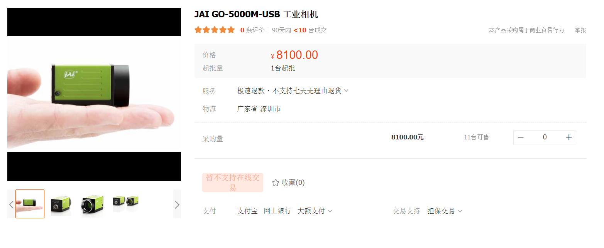

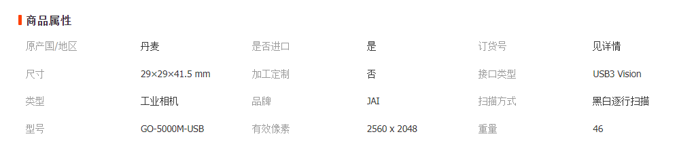

### <del>相机镜头</del>

- <del>型号：Computar 12mm</del>
- <del>报价：600￥</del>

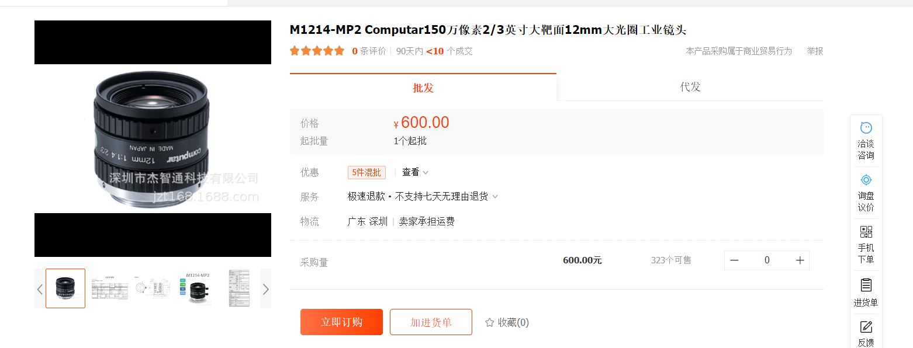

### <del>标定板(浅色）</del>

- <del>尺寸：290*440*5mm 圆形标定板</del>
- <del>参数：点直径 20mm，圆心间距 30mm</del>
- <del>报价：1700￥</del>

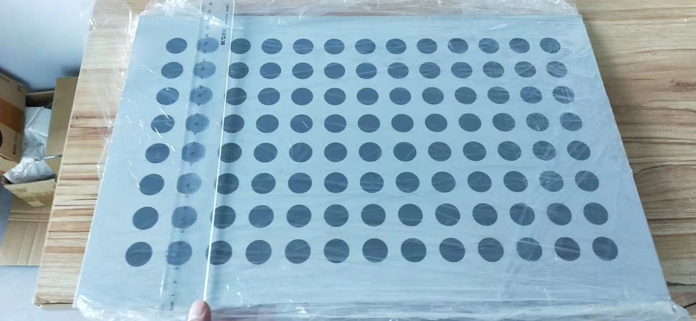

### <del>标定球</del>

- <del>尺寸：25.4mm</del>
- <del>参数：误差小于 2um</del>
- <del>报价：2205￥</del>


### <del>总计</del>

| 类别         | 型号                               | 厂家         | 购买价格  |
| ------------ | ---------------------------------- | ------------ | --------- |
| 工业投影仪   | LCR4500 EVM                        | TI / Wintech | 9500￥    |
| 工业相机     | JAI-GO-5000M-USB                   | JAI          | 8100￥    |
| 相机镜头     | Computar 12mm                      | Computar     | 600￥     |
| 标定板(浅色) | ~                                  | 桂庆光电     | 1700￥    |
| 标定球       | 哑光面陶瓷标定球 25.4mm            | 江南西道     | 2205￥    |
| 其他配件     | 相机快装板夹座、触发线、固定三脚架 |              | 150+500￥ |
| 总计         |                                    |              | 22,755￥  |

### 

## <del>DLP 购买咨询——Wintech</del>

<del>想要咨询的产品：</del>

- <del>LightCrafter4500 EVM（1140*912）</del>
- <del>PRO4500（1140*912）：基于 LightCrafter4500</del>

  - <del>PRO4500MV</del>
  - <del>Pro4500cv（500lm+ 蓝光 3D 机器视觉结构光专用）：PRO4500cv 是闻亭泰科继 Pro4500mv 成功推出后又一款面向机器视觉领域的扛鼎之作。</del>
- <del>PRO6500（1920*1080）</del>

  - <del>PRO6500s：产品在 Pro6500 的基础上进行了全面的需求评估改进而来</del>
  - <del>PRO6500MV</del>
- <del>PRO4710（1920*1080）</del>

  - <del>PRO4710lc（1080p+437fps）：升级版本</del>
# 第五周

> 10.31

# <del>10-31</del>

> DLPC350 软件用户指南

## <del>Read This First</del>

### <del>About This Manual</del>

- <del>本文档指定 DLP4500 和 DLP4500NIR 芯片组的命令和控制接口</del>
- <del>该文档定义了与 DLP4500 和 DLP4500NIR 芯片组通信的所有适用命令、默认设置和控制寄存器位定义</del>

### <del>Related Documents from Texas Instruments</del>

- <del>DLPC350 数据表：用于 DLP4500 和 DLP4500NIR DMD 的 DLP® 数字控制器：</del><del>DLPS029</del>
- <del>DLP4500 数据表：DLP4500 0.45 WXGA DMD：</del>
- <del>DLP4500NIR 数据表：DLP4500NIR 0.45 WXGA 近红外 DMD</del>
- <del>DLPC350 配置和支持固件：</del><del>DLPR350 Firmware | TI.com</del>

### <del>If You Need Assistance</del>

## <del>接口协议  Interface Protocol</del>

<del>本章介绍 DLPC350 和主机处理器之间的接口协议。 DLPC350 支持两种主机接口协议：I2C 和 USB 1.1 从接口</del>

### <del> I2C interface</del>

### <del> USB Interface</del>

<del>DLPC350 控制器支持 USB 1.1 人机接口设备 (HID) 与主机处理器交换命令和数据。 USB 命令是可变长度的数据包，以最低有效字节在前发送。 DLPC350 根据 I2C_ADDR_SEL 引脚是高电平还是低电平，为 USB 枚举提供两种不同的字符串描述符。这两个字符串是“L”、“C”、“R”、“2”或“L”、“C”、“R”、“3”。 USB 供应商 ID (VID) 为 0x0451，产品 ID (PID) 为 0x6401</del>

#### <del> USB Transaction Sequence</del>

#### <del> USB Read Transaction Sequence</del>

<del>要发出命令请求 DLPC350 值，主机必须执行以下步骤：</del>

1. <del>主机发送报告 ID 字节，设置为 0。 </del>
2. <del>主机发送标志字节，其中： </del>

- <del>位 2:0 设置为 0x0 用于常规 DLPC350 操作，设置为 0x7 用于调试帮助</del>
- <del>位 6 设置为 0x1，表示主机需要来自设备的回复 </del>
- <del>位 7 设置为 0x1，表示读取事务</del>

1. <del>主机发送序列字节。当单个命令超过 64 字节时，该命令作为多个 USB 数据包发送，并且序列字节对数据包进行编号，以便设备可以按正确的顺序组合它们。在其他情况下，该值无关紧要，一般设置为 0。 </del>
2. <del>主机发送数据包长度的两个字节。该长度表示数据包中的数据字节数，不包括步骤 1 到 4 中的字节数。它表示步骤 5（命令字节）和 6（数据字节）中发送的字节总数。 </del>
3. <del>主机发送两个子命令字节：CMD2 和 CMD3。 </del>
4. <del>主机发送适合命令的数据。 </del>
5. <del>完成该命令后，DLPC350 会响应一个数据包，其中包括：</del>

- <del>主机请求的命令字节（匹配序列字节）</del>
- <del>数据包长度 </del>
- <del>请求数据</del>

#### <del> USB Write Transaction Sequence</del>

<del>要发出设置 DLPC350 值的命令，主机必须执行以下步骤：</del>

1. <del>主机发送报告 ID 字节，设置为 0。 </del>
2. <del>主机发送标志字节，其中 </del>

- <del>位 2:0 设置为 0x0 用于常规 DLPC350 操作，设置为 0x7 用于调试帮助</del>
- <del>位 6 设置为 0x1 表示主机需要设备回复。只有在需要确认或回复时才必须为写事务设置该位，这不是典型的。对于多包事务，对于中间包，位 6 不得设置为 0x1</del>
- <del>位 7 设置为 0x1 以指示读取事务 </del>

1. <del>主机发送序列字节。当单个命令超过 64 字节时，该命令作为多个 USB 数据包发送，并且序列字节对数据包进行编号，以便设备可以按正确的顺序组合它们。在其他情况下，该值无关紧要，一般设置为 0。</del>
2. <del>主机发送数据包长度的两个字节。该长度表示数据包中的数据字节数，不包括步骤 1 到 4 中的字节数。它表示步骤 5（命令字节）和 6（数据字节）中发送的字节总数。 </del>
3. <del>主机发送两个子命令字节：CMD2 和 CMD3。</del>
4. <del>主机发送适合命令的数据。</del>
5. <del>完成此命令后，DLPC350 会响应一个数据包，该数据包包含一个字节，其中包含主机请求的命令。只有在标志字节中设置了第 6 位时才会发生这种情况。</del>

## <del> </del><del> DLPC350 控制命令</del>

<del>DLPC350 有两种操作模式：正常模式和编程模式。 A.3 节显示了编程模式命令。正常模式命令在程序模式下不起作用。本章列出了正常模式 DLPC350 控制命令。以下部分列出了 DLPC350 支持的控制命令。在 Type 列中，“WR”类型是可通过 I2C 或 USB 写入事务写入的字段。数据通过“WR”类型位的 I2C 或 USB 读取事务读取。类型 r 是只读的。将忽略写入只读字段的事务。以下所有命令表中的 Reset 列都是上电后的默认值。上电后这些值可能会被覆盖。</del>

<del>注意：保留位和寄存器。写入有效命令位字段时，所有标记为未使用或保留的位必须设置为 0，除非另有说明。</del>

<del>注意：命令写入期间的瞬时图像损坏。在某些情况下，某些命令可能会导致显示图像中出现短暂的视觉伪影。可以始终读取命令数据值而不影响显示的图像。为避免由于命令造成的瞬间图像损坏，请在命令写入之前禁用 LED，然后在发出所有命令后重新启用 LED。</del>

<del>注意：不推荐写入或读取未记录的寄存器</del>

### <del>DLPC350 状态命令 </del>

<del>DLPC350 具有以下一组状态命令： </del>

<del>硬件状态 </del>

<del>系统状态 </del>

<del>主状态 </del>

<del>检索固件版本 </del>

<del>输入视频信号检测状态 </del>

#### <del> 硬件状态</del>

<del>（I2C：0x20）</del>

<del>（USB：CMD2：0x1A，CMD3：0x0A）</del>

<del>硬件状态命令提供有关 DLPC350 的定序器、DMD 控制器和初始化的状态信息。</del>

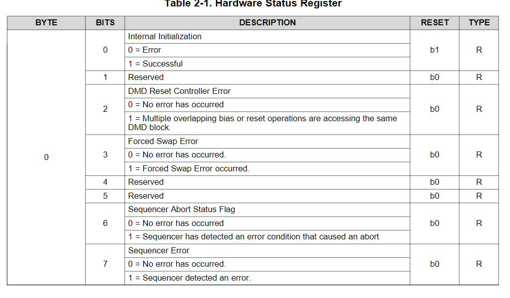

<del>注意：任何错误情况都表示故障情况，必须予以纠正。</del>

#### <del>System Status</del>

<del>System Status 命令在内部存储器测试中提供 DLPC350 状态</del>

> 建议添加系统状态检查

#### <del>Main Status</del>

<del>Main Status 命令显示 DMD 停放和 DLPC350 定序器、帧缓冲区和伽马校正的状态。</del>

> 什么是伽马校正状态？因为 DMD 在响应中本质上是线性的，所以 Gamma Correction 命令指定移除应用于源视频数据的 Gamma 曲线。提供了两个 degamma 表：TI 视频（增强）和 TI 视频（最大亮度）。

#### <del>Retrieve Firmware Version</del>

<del>此命令（固件版本 2.0.0 及更高版本支持）读取 DLPC350 固件的版本信息</del>

#### <del> Input Video Signal Detection Status</del>

<del>执行此命令（固件版本 2.0.0 和更高版本支持）时，DLPC350 控制器会根据通过 I2C 命令 0x00 或 USB 命令 0x1A00 进行的视频端口选择返回输入视频信号时序信息。此命令适用于 RGB Parallel Interface 和 FPD-link 接口。在收到命令后，控制器会在报告信号状态之前监控信号约 200 毫秒。此命令用作调试辅助，以检测控制器是否正确读取分辨率，特别是在分辨率必须与 912 × 1140 像素的原始分辨率匹配的模式显示模式下</del>

### <del>DLPC350 Programming Commands</del>

> DLPC350 的程序模式，是不是就是 DLP 嵌入式模式，它内部运行着一套代码

<del>编程命令将新的固件映像下载到闪存中。这是通过 I2C 或 USB 通信实现的。在正常模式下操作时，可以发出进入程序模式命令，退出正常模式并进入程序模式。在程序模式下，用户必须发出正确的退出程序模式命令才能返回正常模式。正常模式命令在程序模式下不起作用。有关程序模式命令的列表，请参见第 A.3 节。</del>

#### <del>Enter Program Mode</del>

<del>如果主应用程序在正常模式下收到此命令，则控制器进入程序模式。调用时，主应用程序关闭照明系统，停放 DMD，并跳转到引导加载程序应用程序。如果引导加载程序收到此命令，则该命令无效。</del>

### <del> Chipset Control Commands 芯片组控制命令</del>

#### <del>芯片组配置和控制命令</del>

##### <del>Software Reset</del>

<del>无论发送什么参数，此命令都会向 DLPC350 发出软件复位。该命令提供了备份恢复机制</del>

> 可以尝试使用该命令，去解决投影仪不够黑的问题

##### <del>DMD Park/Unpark</del>

##### <del>Power Control</del>

##### <del> Buffer Controls</del>

1. <strong>Force Buffer Swap</strong>

<del>Force Buffer Swap 命令通过交换读写指针在两个内部内存缓冲区之间切换。在缓冲区交换之后，将数据流式传输到 DMD 的 24 位平面缓冲区现在用于输入，而之前的 24 位平面输入缓冲区现在将数据流式传输到 DMD。执行此命令前必须冻结缓冲区</del>

1. <strong>Display Buffer Freeze</strong>

<del>Display Buffer Freeze 命令禁用交换内存缓冲区。在通过一系列更改输入源或操作模式的命令重新配置芯片组时，TI 建议使用 Display Buffer Swap Freeze 命令以防止临时伪影到达显示器。当显示缓冲区冻结时，流向 DMD 的最后一个图像继续显示。</del>

> 可能就是因为没有执行缓冲区冻结，导致的 Pattern 序列失控的问题

1. <strong>Buffer Write Disable</strong>

<del>缓冲区写入禁用命令可防止覆盖 48 位平面或内部存储器缓冲区的两个 24 位帧缓冲区的内容。</del>

1. <del>当前读取缓冲区指针</del>

<del>Current Read Buffer Pointer 命令返回指向当前内部内存缓冲区的指针（此数据流式传输到 DMD）</del>

1. <del>Display Curtain Control</del>

<del>该寄存器提供图像帘控制。启用且输入源设置为外部视频且未连接视频源时，整个 DMD 显示屏上会显示一个纯色字段。 Display Curtain Control 提供了一种替代方法，用于屏蔽由于动态重新配置而导致的临时源损坏到达显示器。该寄存器可用于光学测试和调试支持</del>

#### <del>Interface Configuration and Control</del>

<del>接口配置和控制管理并行和 FPD 链路接口的操作</del>

##### <del>Input Data Channel Swap</del>

<del>Input Data Channel Swap 命令配置指定的输入数据端口并映射数据子通道。 DLPC350 将通道 A 解释为绿色，通道 B 解释为红色，通道 C 解释为蓝色</del>

##### <del>2.3.4.6 Load Image</del>

<del>此命令从闪存加载图像，然后</del><strong>执行缓冲区交换以在 DMD 上显示加载的图像</strong>

> 执行缓冲区交换！！！！，好像是自动进行的

##### <strong>2.3.4.9 RetrieveNumber of Images in the Flash</strong>

<del>此命令检索有关闪存中图像数量的信息。在创建模式 LUT 期间，此命令很有用。使用此命令可减少在图像 LUT 中设置错误索引号的机会。一个虚拟字节必须作为命令的一部分发送</del>

> 目前问题可能的突破口

#### <del>2.3.5 Image Flip</del>

<del>DLPC350 支持长轴和短轴图像翻转，支持背投和正投，台面和吊顶投影</del>

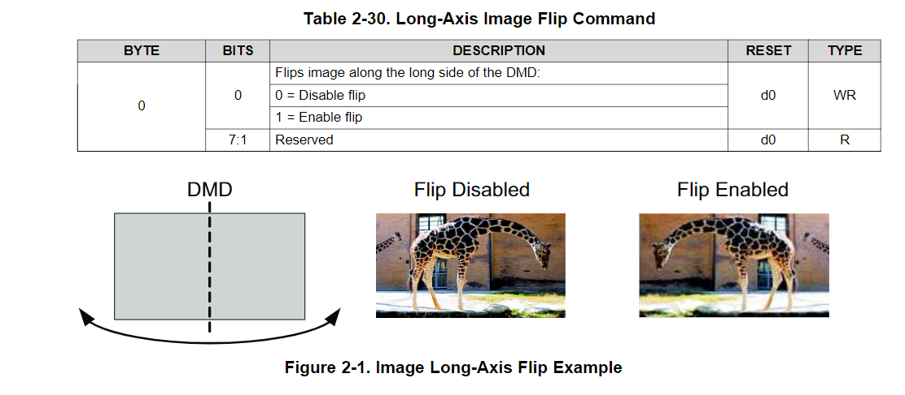

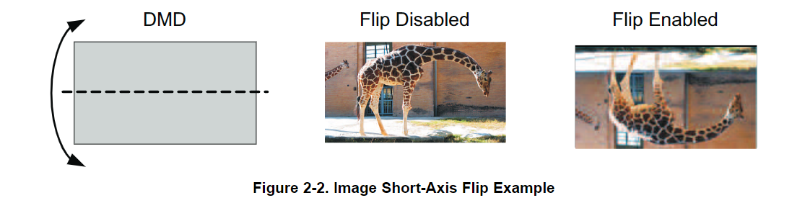

### <del>Display Sequences</del>

<del>DLP 显示序列由几个参数组成，这些参数指示 DMD 的加载和对 LED 的 PWM 控制。 DLPC350 支持两种主要序列模式： </del>

- <del>视频显示模式 </del>
- <del>模式显示模式 </del>

<del>显示模式选择命令（第 2.4.1 节）在视频或模式显示模式之间进行选择。</del>

<del>在视频模式下，DLPC350 通过 30 位 RGB 或 FPD-link 接口在 120 Hz 时支持高达 1280 × 800 像素分辨率。 DLPC350 处理数字输入图像并将数据转换为适合 DLP4500 DMD 的格式。 </del>

<del>DLPC350 处理功能包括格式转换和视频增强模块（见图 2-4）。请注意，并非所有这些功能都可用于用户控制。在图案显示模式下，DLPC350 提供高达 120 Hz 的高速、像素精确的 912 × 1140 分辨率，可绕过视频处理和图像增强功能。该模式支持通过 DLPC350 24 位 RGB 或 FPD-link 接口和闪存进行数据输入。此功能专为结构光、增材制造或数字曝光等技术而设计。 DLPC350 可以显示一组图案，并在显示这些图案时向相机发出信号以进行捕捉。图 2-4 显示了 DLPC350 框图以及视频和模式显示模式的主要功能块。表 2-48 列出了允许的位深度、模式数量和最大模式速度的模式组合。</del>

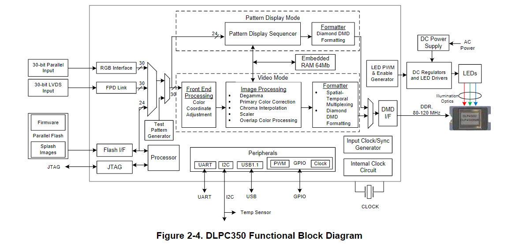

> Splash Image：这到底是什么意思？1 张 24 位图像？

<del>结果，单个视频帧由一系列位平面组成。因为 DMD 反射镜 c 是打开或关闭的，所以通过打开和照射与位平面中的位设置相对应的反射镜上的光来创建图像。使用二进制脉宽调制，通过控制镜子打开和照明的时间量来再现颜色的强度级别。对于输入到 DLPC350 的 24 位 RGB 帧图像，DLPC350 创建 24 个位平面，</del><strong>将平面存储在内部存储器缓冲区中</strong><del>，并在下一帧（一次一个位平面）将平面发送到 DLP4500 DMD .根据位平面的位权重，DLPC350 控制该位平面暴露在光线下的时间。位平面被照亮的时间与位平面的强度成正比。 DLPC350 交织和交错位平面、时隙和彩色帧以提高图像质量。请注意，此功能在视频模式下自动执行，用户无法调整。对于不需要这种图像增强的其他应用，视频处理算法被绕过并用一组特定的位平面代替。模式的位深度被分配到相应的二进制加权时隙中。此外，输出触发信号与这些时隙同步，以指示何时显示图像。对于结构光应用，该机制显示一组图案并向相机发出信号，以捕捉这些叠加在物体上的图案。如图 2-7 所示，DLPC350 在内部存储器缓冲区中存储了两个 24 位帧。</del><strong>这个 48 位平面显示缓冲区允许 DLPC350 将一个 24 位缓冲区发送到 DMD 阵列，而第二个缓冲区从闪存填充或通过 24 位 RGB 接口流入</strong><del>。在流模式下，DMD 阵列显示前一个 24 位帧，而当前帧填充显示缓冲区的第二个 24 位帧。在显示一个 24 位帧后，缓冲区</del><strong>会旋转并将下一个 24 位帧访问到 DMD</strong><del>。因此，显示的图像是通过 24 位 RGB 并行接口流式传输的数据后面的 24 位帧。</del>

#### <del>2.4.3 Pattern Display Mode Commands</del>

<del>在图案显示模式下，DLPC350 支持 1、2、3、4、5、6、7 和 8 位图像，分辨率为 912 × 1140 像素，通过 24 位 RGB 或 FPD 流式传输-link 接口或存储在闪存位置。以下命令仅在图案显示模式下受支持：</del>

- <del>Validate Data</del>
- <del>Trigger Controls</del>
- <del>LED Enable Delay Controls</del>
- <del>Pattern Display Controls</del>
- <del>Exposure Controls</del>
- <del>Buffer Controls</del>

<del>注意：必须使用 validate data 命令验证设置中的任何更改。</del>

<del>注意：停止时，在“开始”之前，至少必须再次发送模式显示 LUT (0x75 I2C) 和模式显示查找表，然后是验证。如果图案曝光和帧周期不相等，则图案曝光时间必须比帧周期小 230 μs。</del>

> 是否需要发送两次 LUT

##### <del>2.4.3.4.5 Pattern Display LUT Control</del>

<del>模式显示 LUT 控制命令控制存储在查找表中的模式的执行。在执行此命令之前，请停止当前模式序列。执行此命令后，在开始模式序列之前发送一次验证命令（I2C：0x7D 或 USB：0x1A1A）</del>

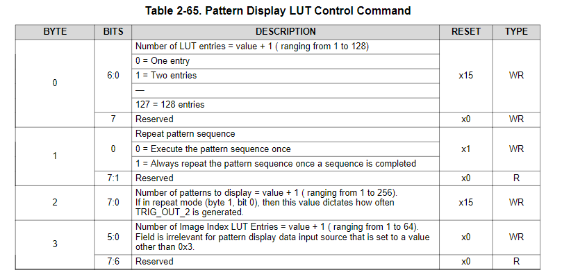

##### <del>2.4.3.4.6 Pattern Display Look-Up Table</del>

<del>DLPC350 支持模式显示查找表 (LUT)，该表定义了 Pattern 序列和序列中每个 Pattern 的配置参数。</del><strong>要创建此 LUT，程序员必须先设置显示模式、触发模式、曝光、帧速率等</strong><del>，然后再将数据写入 LUT。正确配置后，Pattern Display LUT Access Control 命令会写入 LUT</del>

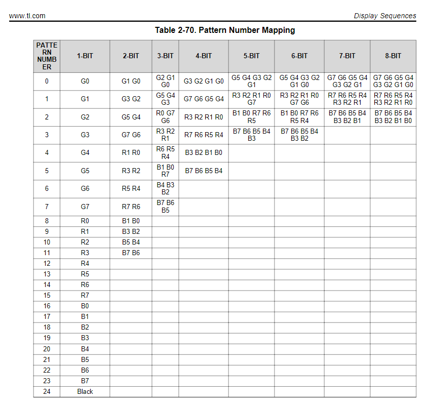

- <del>在使用 GUI 或者 ALC SDK 更新 Firmware 的时候遇到“Unable to read flash manufacturer ID”怎么办？</del>

<del>下面提供了一些可能的解决方案：</del>

- <del>检查"FlashDeviceParameters.txt" 文件在 GUI 的安装目录下</del>
- <del>确认电脑的操作系统，尝试使用 Win7 操作系统</del>
- <del>卸载 USB 驱动，重新启动电脑，并自动安装驱动</del>
- <del>更换更短的 USB 线</del>
- <del>重现</del><del>安装 GUI 软件</del>
- <del>Interface 接口</del>
- <del>LUT　Look_up Table :显示查找表</del>

## <del>《智能机器人》</del>

- <del>模型</del>
- <del>标定</del>
- <del>重构</del>

<del>相机模型和相机标定</del>

- <del>简介（为什么需要相机模型，有哪些模型，各自特点是什么、什么是相机标定，有哪些标定方案，相机标定的目的是什么）</del>
- <del>相机模型</del>

  - <del>针孔模型</del>
  - <del>正投影模型</del>
  - <del>其他模型</del>
- <del>相机标定</del>

  - <del>基本矩阵与单相机标定</del>
  - <del>对极几何与多相机标定</del>
- <del>类相机模型设备的标定（可选，主要介绍像投影仪这种可以当作”逆相机“的设备的标定方法)</del>

### <del>立体视觉与三维重建</del>

<del>三维重建的三件事：二维图像采集、三维重构、点云后处理</del>

- <del>简介（什么是三维重建，三维重建的本质，技术分类，各分类的主要特点，应用场景……）</del>
- <del>面结构光三维重建</del>

  - <del>系统标定</del>
  - <del>相位展开和相位补偿</del>
  - <del>三角测距原理</del>
- <del>双目立体视觉</del>

  - <del>系统标定和极线矫正</del>
  - <del>立体</del>
- <del>TOF 技术</del>
- <del>其他三维重建技术（简要介绍）</del>

  - <del>运动恢复图像</del>
  - <del>Nerf</del>
- <del>点云后处理技术（简要介绍）</del>

  - <del>点云滤波技术</del>
  - <del>点云拼接技术</del>
  - <del>点云三角化技术</del>
- <del>三维测量并行计算（简要介绍）</del>
- <del>本章小结</del>
# 2022 年 11 月

# 子页面目录
# 第一周

> 11 月 1 日-11 月 6 日

# 11-1

## <del>DLP 投影程序 PatternSequence 异常</del>

- <del>只要切换 Flash，投影工作就会出现异常。所以可以从 Flash 缓冲区的工作逻辑入手去解决该问题</del>
- <del>很有可能是 Buff 的问题</del>

<del>救命：其实是 DLP 检查程序的延迟不够，且无法绝对性的判断是否已经 Ready；</del>

> 蝴蝶效应中，要找到那只蝴蝶，真的太难了！！！！

```cpp
<del>// 原来的：延迟太短、超时超次也能正常退出</del>
<del>bool DLP::CheckPatternSequence()</del>
<del>{</del>
<del>        unsigned int status;</del>
<del>        bool ready;</del>

<del>        if (DLPC350_StartPatLutValidate()<0)</del>
<del>        {</del>
<del>                std::cout << "error validating LUT data" << std::endl;</del>
<del>                return false;</del>
<del>        }</del>

<del>        int re_check = 5;</del>
<del>        for (int i = 0; i < re_check; i++)  // 重复两次检查</del>
<del>        {</del>
<del>                if (DLPC350_CheckPatLutValidate(&ready, &status) < 0)</del>
<del>                {</del>
<del>                        std::cout << "error validating LUT data" << std::endl;</del>
<del>                        return false;</del>
<del>                }</del>
<del>                if (ready)</del>
<del>                {</del>
<del>                        std::cout << "Is Ready." << std::endl;</del>
<del>                        break;</del>
<del>                }</del>
<del>                else</del>
<del>                {</del>
<del>                        Sleep(1000);   // 休眠10ms，重新检查</del>
<del>                }</del>
<del>        }</del>

<del>        return true;</del>
<del>}</del>

<del>// 改为</del>
<del>bool DLP::CheckPatternSequence()</del>
<del>{</del>
<del>        unsigned int status;</del>
<del>        bool ready;</del>

<del>        if (DLPC350_StartPatLutValidate()<0)</del>
<del>        {</del>
<del>                std::cout << "error validating LUT data" << std::endl;</del>
<del>                return false;</del>
<del>        }</del>

<del>        int re_check = 5;</del>
<del>        for (int i = 0; i < re_check; i++)  // 重复两次检查</del>
<del>        {</del>
<del>                if (DLPC350_CheckPatLutValidate(&ready, &status) < 0)</del>
<del>                {</del>
<del>                        std::cout << "error validating LUT data" << std::endl;</del>
<del>                        return false;</del>
<del>                }</del>
<del>                if (ready)</del>
<del>                {</del>
<del>                        std::cout << "Is Ready." << std::endl;</del>
<del>                        std::cout << "Status:" << status << std::endl;</del>
<del>                        break;</del>
<del>                }</del>
<del>                else</del>
<del>                {</del>
<del>                        if (i == re_check - 1)</del>
<del>                        {</del>
<del>                                return false;     // 超时、超次异常退出</del>
<del>                        }</del>
<del>                        std::cout << "No Ready." << std::endl;</del>
<del>                        Sleep(1000);   // 休眠10ms，重新检查，休眠足够时间</del>
<del>                }</del>
<del>        }</del>

<del>        return true;</del>
<del>}</del>
```

# 11-2

# 11-3

# 11-4

- <del>程序的流程保护设计</del>

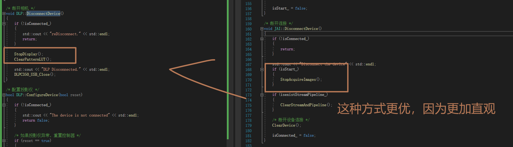

# 11-5

## <del>宁波实习前准备</del>

### <del>生活</del>

#### <del>整理寝室</del>

- <del>衣服</del>
- <del>鞋子</del>
- <del>洗漱用品：衣架、牙刷、沐浴露</del>
- <del>床铺</del>
- <del>手办</del>
- <del>工具：雨伞</del>
- <del>书籍</del>
- <del>电子产品：充电器、充电宝</del>

#### <del>整理实验室</del>

- <del>电脑：电脑、电脑充电器、拓展坞、HDMI 线、电脑显示器</del>
- <del>ipad：iPad、ipad 充电器</del>
- <del>充电宝</del>
- <del>多肉</del>
- <del>手柄</del>
- <del>键盘</del>
- <del>鼠标、鼠标连接器</del>
- <del>耳机</del>
- <del>内存包</del>
- <del>多页文件夹*1</del>
- <del>日记本、练字本</del>
- <del>咖啡</del>
- <del>手办</del>
- <del>桌垫</del>
- <del>书包</del>
- <del>药</del>
- <del>电脑支架</del>
- <del>音响</del>
- <del>自行车</del>

#### <del>准备宁波的生活用品</del>

- <del>床单</del>
- <del>被子</del>
- <del>床垫</del>
- <del>枕头</del>
- <del>拖鞋</del>
- <del>毛巾</del>
- <del>洗漱用品</del>

### <del>学习和工作</del>

#### <del>结构光</del>

- <del>近期安排</del>

  - <del>完成标定板的对公转账</del>
  - <del>完成 DLP 的购买</del>
  - <del>完成结构光 DLP+JAI 相机程序的交接</del>
- <del>一年规划</del>

  - <del>高效编码策略</del>
  - <del>Cuda 编程</del>
  - <del>Qt 界面，Qt 界面 +Cuda</del>
  - <del>软件封装、软著</del>
  - <del>工业设计</del>
- <del>一年预期成果</del>

  - <del>产品：</del>

    - <del>具有完整上位机（操作界面）</del>
    - <del>具有美观且稳定的外壳</del>
    - <del>500mm 工作范围内，实现扫描精度 0.02mm、扫描帧率 30hz（在线测量，输出点云）</del>
    - <del>其他：高反光表面的高速测量（5hz 以上）、集成嵌入式（只需要一个输出接口）</del>
  - <del>专利：多结构光系统标定及重建方法</del>
  - <del>论文：冯创的小论文</del>

#### <del>3D 打印</del>

- <del>近期安排</del>

  - <del>星期一之前完成专利申请书</del>
  - <del>尽量在去宁波之前完成喷头测试</del>
- <del>一年规划</del>
- <del>一年预期成果</del>

#### <del>科研论文</del>

- <del>点云配准论文：理论分析</del>
- <del>gamma 矫正、非线性优化、离焦投影</del>
- <del>高反光表面的高速测量：收集资料</del>
- <del>基于图像的三维重建方法：Nerf （看文献为主）</del>

### <del>人际关系</del>

- <del>和妈妈交代</del>
- <del>和伍老师说</del>
- <del>和冯创说清除、并交接工作</del>

### <del>其他</del>

<del>？？？？？</del>

### <del>需要寄的东西</del>

- <del>显示器</del>
- <del>为什么投影仪可以投彩色图像？？</del>

<del>马桶溅水怎么办？</del>
# 第二周

> 11 月 7 日-11 月 13 日

# 11-7

- <del>3D 打印为什么一直火不起来：因为 3D 打印一直缺少一个“杀手应用 Killer app"</del>


# 11-8

# 11-9

# 11-10

# 11-11

# 11-12

- <del>买限位开关、有刷电机</del>

## <del>电机选型指南</del>

### <del>Step 1：电机类型选择</del>

| 类型     | 控制方式 | 控制精度 | 速度 | 价格 | 其他特点 |
| -------- | -------- | -------- | ---- | ---- | -------- |
| 有刷电机 |          |          |      |      |          |
| 无刷电机 |          |          |      |      |          |
| 步进电机 |          |          |      |      |          |
| 伺服电机 |          |          |      |      |          |

#### <del>有刷电机</del>

#### <del>无刷电机</del>

#### <del>步进电机</del>

#### <del>伺服电机</del>

### <del>Step 2：转矩选择</del>

### <del>Step 3：转速选择</del>

#### <del>关键参数</del>

- <del>电机转速： </del>
  $$
  N(r/min)
  $$
- <del>单转位移： </del>
  $$
  x(cm/r)
  $$
- <del>移速： </del>
  $$
  v=N*x(cm/min)
  $$
- <del>总位移： </del>
  $$
  L(cm)
  $$
- <del>总耗时： </del>
  $$
  t=\frac{L}{N*x}(min)
  $$

#### <del>参数说明</del>

- <del>齿轮传动下的单转位移计算</del>

$$
x=p*z=m*z*\pi
$$

<del>其中：p 齿距</del>

<del>    m 齿轮模数(单位 mm)；</del>

<del>     z 齿轮齿数；</del>

#### <del>选型实例</del>

- <del>已知总位移 </del>
  $$
  L=90cm
  $$

  <del>，单转位移 </del>
  $$
  x=mz\pi=1*25*\pi=7.85(cm/r)
  $$

  <del>，预计总耗时 </del>
  $$
  t=2\sim 3s
  $$

  <del>.</del>

<del>     求电机转速(负载转速)范围</del>

$$
N=\frac{L}{t*x}=\frac{90}{[2,3]*7.85}=[5.73,3.82]r/s=[343,229]r/min
$$

<del>如果单转位移 </del>
$$
x=mz\pi=1*16*\pi=5.03(cm/r)
$$

<del>，负载转速范围 </del>
$$
N=[536,357]r/min
$$


### <del>Step 4：其他指标</del>

## <del>传送机构</del>

## <del>产品研发店铺收藏</del>

### <del>电子</del>

- <del>zave 旗舰店</del>

### <del>电机</del>

- <del>新永泰旗舰店</del>

### <del>传动</del>

- <del>首页-广发传动配件-淘宝网</del>
- <del>这世上，比所有人都瞧不起你还难受的滋味，就是让所有人都同情你</del>

# 11-13

- <del>公司部门 OKR</del>
- <del>每周跟进会：根据公司部门 OKR 制定每周的项目和任务</del>
- <del>个人 OKR：完成每周部门跟进会项目任务之中之后，需要根据个人 OKR 主动去安排</del>

## <del>型材和螺丝选型指南</del>
# 第三周

> 11 月 14 日-11 月 20 日

## 本周计划

- [X] 完成[目标产品](https://xmvy91fahl.feishu.cn/wiki/wikcn1id6Nhj3Xt6titlZJpRPAb) 中单体家居整理机器人的宏观规划，张新凯
- [ ] 完成智能鞋架的技术路线，参考 [2022 年 11 月 14 日 智能鞋架技术路线头脑风暴会议纪要](https://xmvy91fahl.feishu.cn/docx/QDMGdfxOeogmKKxwyufckqFGnFd)提出的需求点、功能点
- [X] 完成汇报 PPT [项目汇报内容汇总](https://xmvy91fahl.feishu.cn/wiki/wikcngdDdfIrq2xZN5JdLY73sSd)技术部分的制作规划，补充需要的示意图、样机图、技术可行性分析等
- [X] 促进团队成员对项目管理甘特图的使用
- [X] 完成智能鞋凳硬件、软件的整合，买齐所需的所有耗材[[10/31] 研发工具采购 会议纪要](https://xmvy91fahl.feishu.cn/docx/Brl0dgd4Yo8gxLxHBkscOTx1nrf)，隔离期结束后，尽快完成样机搭建
- [X] 完成智能鞋凳的成本估算，并填入[成本估算](https://xmvy91fahl.feishu.cn/wiki/wikcnl7G8jjYCoRSOT4PRsdNj9f) 中
- [ ] 学习和了解“技术文档”的撰写内容和撰写方法，填入[参考资料](https://xmvy91fahl.feishu.cn/wiki/wikcnFxuw7zCEcUNxY8nTGui6Gc) 中，并与技术部门分享，形成一份技术文档填写模板
- [X] 完成智能鞋架的项目管理甘特图[项目管理甘特图](https://xmvy91fahl.feishu.cn/wiki/wikcnuwOrgcRQ0KlbBFC75Nxusg)，（由宇铭完成）
- [X] 出酒店吃火锅唱歌、按摩
- [X] 完成研发工具/耗材采购 SOP
- [X] 思考技术开发 SOP（包括技术路线、技术细节、技术文档的撰写、项目管理甘特图的使用等）
- [X] 项目工程文件(机械图、程序等)的共享和存储：共享文件夹
- [X] <strong>产品研发过程中关键性指标（如托盘必须贴地）没有做好即时记录：关键性指标记录文档，产品研发 SOP</strong>
- [ ] 代码管理问题：git+github
- [X] <strong>材料准备时间有点烦（不能随时搭，需要等）原材料（板材，型材）需要商家加工之后才能用，不能灵活应用：找研究院商量</strong>
- [X] 电机、传感器可供了解选型太少了（我们已知的 TB 上搜索，扩展面太窄了）：找谢总电机借一下用用
- [X] <strong>研发之前可能需要全员确定好哪些是不变量，哪些是可变量，就是罗说的关键指标：添加一个文档</strong>
- [X] <strong>关键结构（十字，和托盘伸出）是否需要在建模之前进行脑暴，全员确定好最佳方案，或者寻找市面上最佳方案：产品研发 SOP</strong>

[[11/13]OKR 第三次跟进会](https://xmvy91fahl.feishu.cn/wiki/wikcnzSFeoizJgJ1myU904n44Gf)

# 11-14

# 11-15

- <del>如何简化繁琐的采购流程？？？：采购 SOP</del>
- <del>修改完成采购 SOP，费用清单</del>

# 11-16

- <del>开始着手安排 PPT 任务</del>
- <del>安排学习 Solidworks 动画和渲染（购买新电脑 幻 15 - 2022）</del>

## <del>《决断》——成大事者怎么才能不纠结？</del>

### <del>设立反对派</del>

- <del>人们面临若干选择时，总是会感情用事，对一个方案的“想”字可以抵抗这个方案可能存在的所有问题</del>
- <del>设立反对派一般来说需要他人的帮助，简单来说就是“求骂醒”</del>

### <del>10/10/10 法则（三 10 法则）</del>

- <del>10/10/10 指的是：10 分钟后、10 个月后、10 年后</del>

<del>当我们面临一个艰难决策时，为了克服感情的偏见，可以想一想如果做出了这个决策，10 分钟后的感受是什么，10 个月后的感受是什么，10 年后我们的感受又会是什么？</del>

举个例子。有个青年女性叫安妮，她有个男朋友叫卡尔。安妮 36 岁，卡尔 45 岁，安妮没结过婚，卡尔是离婚带一个女儿。两人正式交往已经九个月了，安妮对卡尔非常满意，想要赶紧结婚生孩子，但是卡尔的态度不明朗。事实上，卡尔就没让安妮见过他的女儿。这可能是因为卡尔经历了离婚，感情受到了创伤，他不想让自己的女朋友干扰孩子。两人相处以来，还没有谁说过“我爱你”这句决定性的话。

这个周末，安妮和卡尔要一起出去度假，安妮认为这是一个摊牌的机会。但是安妮有点拿不定主意，就请希斯兄弟帮忙。

希斯兄弟判断，安妮现在的纠结，完全是短期情绪的作用。她有点紧张，有点害怕，特别是担心如果卡尔拒绝，她怎么办。

“10/10/10 法则”最适合克服短期情绪。希斯兄弟就让安妮考虑，如果跟卡尔表白，自己十分钟、十个月和十年之后会怎么看待这次的决定。

安妮说，十分钟之后，我会很紧张，但是我也会很自豪自己说了；十个月之后，就算被卡尔拒绝了，我大概也不会后悔；十年之后，这次表白可能根本就不是个事儿，或者那时候我跟卡尔生活在一起，或者我跟别人生活在一起。

这么一分析，结论当然是向卡尔摊牌。这其实就是一种旁观者思维，站在一个远距离考虑问题，所有短期的情绪，什么害怕、紧张，可能就都不重要了

### <del>核心价值观</del>

<del>如果以上方法都没有用，请思考你的</del><strong>“初心”</strong>

# <del>11-17</del>

- <del>了解基于 DLP 光固化的相关知识，思考全彩光固化方案的可行性</del>
- <del>思考如何使用物理光栅完成物体重建。实现超低成本高精度测量</del>
- <del>非 RTX 显卡到底能不能用？？？</del>

- [X] <del>学习将一个算法封装成 DLL，并预留一个函数接口</del>

## <del>源码加密</del>

> - [blog.csdn.net](https://blog.csdn.net/jizhidexiaoming/article/details/122978326)<br/>- [VS 如何将核心函数封装成 dll、lib，并供给第三方调用?_weixin_33893473 的博客-CSDN 博客](https://blog.csdn.net/weixin_33893473/article/details/91387480)<br/>- [C++ 保护源代码(vs2015 生成动态链接库并调用)_Mr_不负此舟的博客-CSDN 博客_vs 如何把代码变成链接](https://blog.csdn.net/qq_43726582/article/details/121190601)<br/>- [为什么动态链接.dll 和.lib 都需要(详解静、动态链接库)_代码乌龟的博客-CSDN 博客](https://blog.csdn.net/weixin_43744293/article/details/117283686)

<del>我们在编写项目过程中，有时难免需要将项目核心</del><del>源码</del><del>进行加密，那么如何利用 VS 实现呢？最佳的策略便是将核心代码编译成动态库 dll 了</del>

### <del>DLL 和 lib 的区别和联系</del>

### <del>DLL 生成与调用</del>

> [技术文档](https://learn.microsoft.com/zh-cn/docs/)<br/>[C++ 动态链接库（DLL）的创建和调用](https://zhuanlan.zhihu.com/p/490440768)

#### <del>创建动态链接库（DLL）项目</del>

#### <del>向动态链接库添加类</del>

#### <del>调用 DLL</del>

### <del>常见问题</del>

- <del>.dll 不是 win32 程序：清除解决方案</del>
- <del>客户端使用</del>

> [C/C++ warning C4251: class ... 需要有 dll 接口由 class“..” 的客户端使用 - YZFHKMS-X - 博客园](https://www.cnblogs.com/YZFHKMS-X/p/11834989.html)

- <del>CMake 项目：不依赖.sln 的新式跨平台 C++ 应用</del>
- <del>购买船型螺母 M4、M3</del>
- <del>购买大齿数的同步轮</del>
- <del>亚克力板</del>
- <del>切木板防护手套</del>
- <del>买手锯</del>

# 11-18

## <del>学习 C++ 矩阵</del>

- <del>矩阵定义</del>
- <del>矩阵传递</del>
- <del>矩阵计算</del>
- <del>……</del>

## <del>电脑文件共享</del>

### <del>创建新用户</del>

### <del>共享文件夹</del>

### <del>访问文件夹</del>

#### <del>ipad 访问</del>

- <del>使用 sbm://<ip 地址 ></del>

#### <del>其他电脑访问</del>

- <del>开启网络发现，在文件管理器的网络文件夹中搜索即可看见其他人共享的文件夹</del>

## <del>L298N-有刷电机驱动</del>

<del>L298N、电机、单片机的线路连接(51、stm32 程序)_霄耀在努力的博客-CSDN 博客</del>

# <del>11-19</del>

## <del>Solidworks 帮助</del>

### <del>齿轮和齿条配合</del>

<del>简介 - 2018 - SOLIDWORKS 帮助</del>

<del>欢迎使用 SOLIDWORKS 在线帮助 - 2022 - SOLIDWORKS 帮助</del>

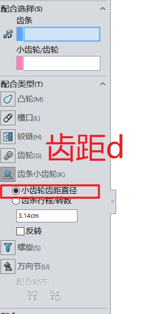

<del>齿距 p=分度圆周长\pi*d / 齿数 z = 模数 m* 齿数 z*\pi /齿数 z</del>

$$
p=dC/z=m\pi
$$

<strong>齿轮齿距=模数*pi</strong>

## <del>Solidworks 材料设置</del>

### <del>国标铝型材</del>

<del>国标铝型材和欧标铝型材归根到底都是采用</del><strong>6063-T5</strong><del>材质的铝棒挤压而成，所以两者除了截面，米重，价格之类的区别之外，其挤压工艺，使用的材质，氧化过程等等一样的。</del>

## <del>购买耗材</del>

- <del>胶棒（直接拿）</del>
- <del>木锯</del>

## <del>想法</del>

- <del>自动分螺丝的机器</del>
- <del>自动取螺丝的机器</del>

# <del>11-20</del>

## <del>想法</del>

- <del>可自动清洗杯子：芝麻糊、麦片等</del>
# 第四周

> 11 月 21 号-11 月 27 号

# 11-21

## <del>想法</del>

- <del>手据第一下很难据，怎么办</del>
- <del>电机连接需要用高硬度的材料</del>
- <del>前期机械设计要到位</del>

# <del>11-22</del>

## <del>想法</del>

- <del>Windows 触摸板 对标：Magic Trackpad2 </del>

# <del>11-25</del>

- <del>技术是什么、产品是什么，关系是什么</del>

## <del>项目/想法</del>

- <del>编写一个离线的 gif 转换器，具有界面</del>

# <del>11-26</del>

## <del>C 语言封装成 DLL 库</del>

> [c 语言创建 dll，c 语言调用 dll_befreedomjustice 的博客-CSDN 博客_c 语言调用 dll 函数](https://blog.csdn.net/bejustice/article/details/38294253)

### <del>创建 DLL 空项目</del>

<del>Matlab 函数编译成 dll 供 c 调用 - redips - 博客园</del>

## <del>ROS (Robot Operation System)</del>

### <del>What‘s ROS</del>

#### <del>Introduction</del>

#### <del>ROS1&ROS2</del>

#### <del>ROS Vesion (Foxy/Calactic/Humble/Rolling)</del>

### <del>How to Install</del>

### 

<del>问题从哪里来，我们从来不问（也是我最需要去寻找的）</del>
# 第五周

> 11 月 28 号-11 月 30 号

# <del>11-28</del>

# <del>11-29</del>

# <del>11-30</del>

## <del>电动螺丝刀</del>

### <del>结构</del>

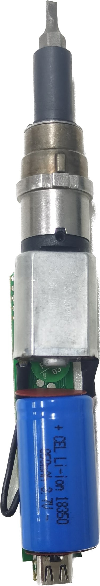

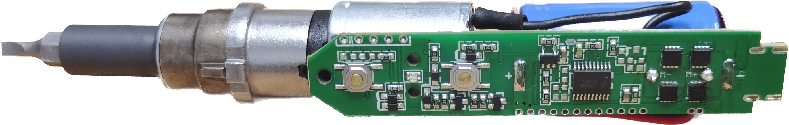

### <del>嵌入式</del>

#### <del>主控芯片：</del>

<del>简介：</del>

<del>应用：</del>

#### <del>按钮：</del>

### <del>软件</del>

- <del>电机正反转</del>

## <del>海康威视 全向麦克风</del>

### <del>结构</del>

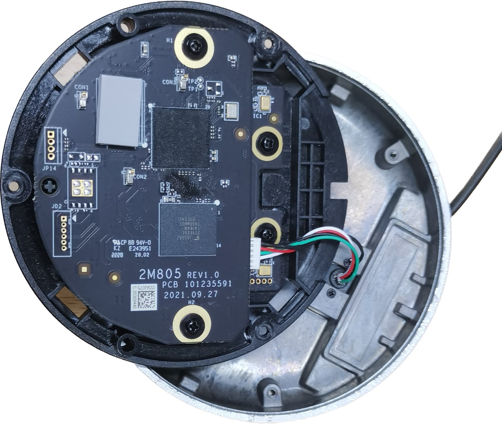

### <del>嵌入式</del>

#### <del>RK3308B</del>

> [Rockchip-瑞芯微电子股份有限公司](https://www.rock-chips.com/a/cn/product/RK33xilie/2018/0614/908.html)

- <del>厂商：</del><del>Rockchip-瑞芯微电子股份有限公司</del>
- <del>功能：音频处理（CODEC）</del>
- <del>描述：RK3308 是一颗针对专门</del><del>音频</del><del>和 IoT 应用而设计的主控芯片</del>

  - <del>瑞芯微 RK3308 产品详细信息介绍,RK3308 芯片性能分析_zhangbijun1230 的博客-CSDN 博客_rk3308</del>
- <del>开发套件/开发手册</del>

  - <del>欢迎使用 ROC-RK3308-CC 开发手册 ‒ Firefly Wiki</del>
  - <del>芯片介绍-RK3308 微处理器_漂泊在海上的星星的博客-CSDN 博客_rk3308</del>

#### <del>SEC 137 K4B4G16</del>

- <del>厂商：三星</del>
- <del>功能：内存 DDR</del>
- <del>描述：4G 16 颗粒</del>

  - <del>【科普】内存颗粒版本判断方法和编号解析 V2.0_内存_什么值得买</del>

#### <del>ESP7210</del>

- <del>厂商：</del><del>Everest Semiconductor</del>
- <del>功能：音频采集 ADC（ADC）</del>
- <del>描述：ES7210 是一颗 4 路音频 ADC 采集芯片</del>

  - <del>ES7210 四路音频麦克风 ES7243 两路音频麦克风 6 麦克风阵列方案 - 立创社区</del>
  - <del>顺芯半导体 ES7210 支持 4 路 ADC 麦克风音频模数转换 ES7243E 支持 2 路 ADC 麦音频模数转换 IC - 音频/视频/显示 - 电子工程网</del>
- <del>开发套件/开发手册</del>

#### <del>ES7P2023</del>

- <del>厂商：</del><del>上海东软载波微电子有限公司</del>
- <del>功能：触摸按键控制</del>
- <del>描述：8 位 MCU，本系列芯片可广泛用于触摸按键显示面板、智能门锁、小家电、白色家电等领域</del>
- <del>开发套件/开发手册</del>

  - <del>文档：</del><del>ES7P202x◆-上海东软载波微电子有限公司</del>
  - <del>集成开发环境：</del><del>ES7P202x◆-上海东软载波微电子有限公司</del>

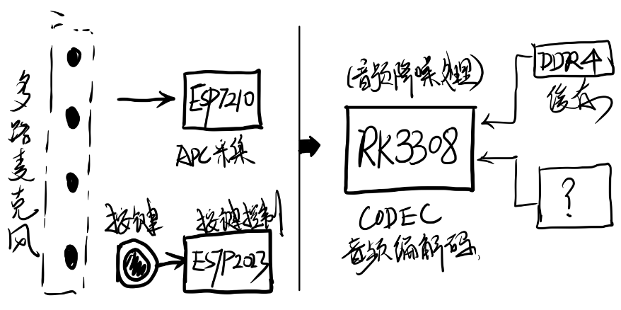

#### <del>S1AV1A20</del>

- <del>声音传感器</del>

### <del>软件</del>

- <del>音频 ADC</del>
- <del>音频处理：降噪</del>
- <del>按键控制</del>
- <del>Cero 产品结构设计（MD）</del>
# 2022 年 12 月

# 子页面目录
# 第一周

> 12 月 1 日-12 月 4 日

# <del>12-1</del>

## <del>智能视觉移动抓取机器人研发调研</del>

### <del>硬件</del>

#### <del>整机</del>

<del>ROS 机器人小车</del>

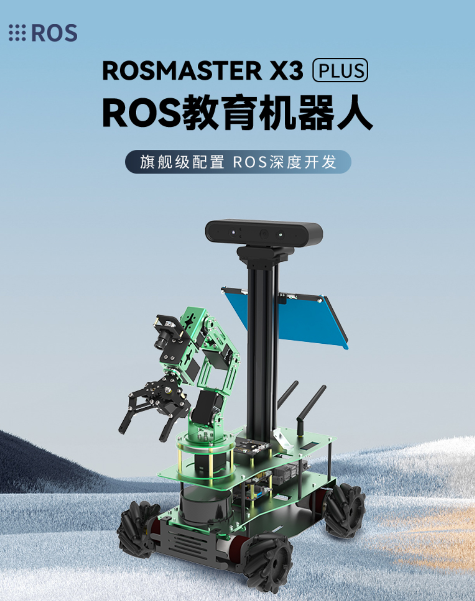

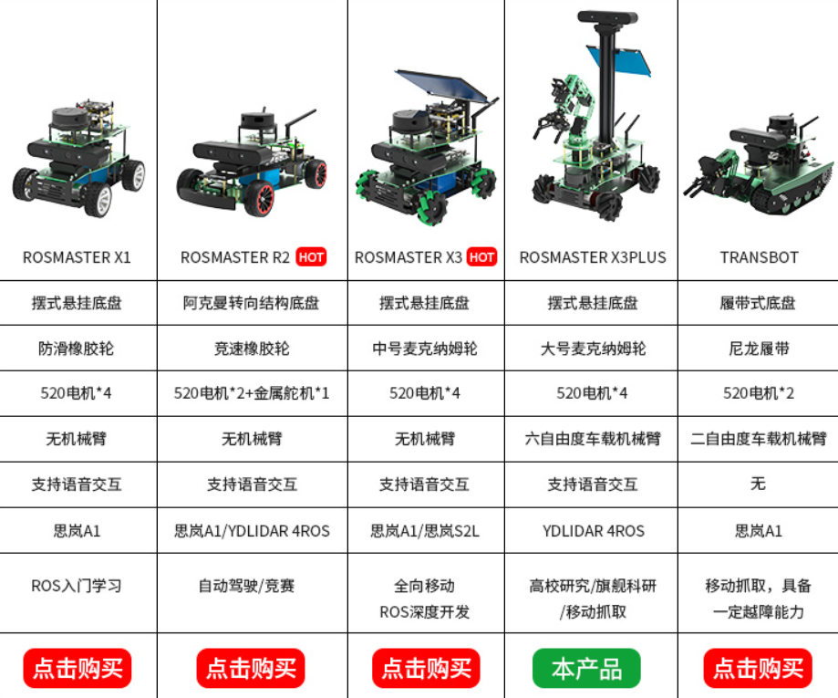

#### <del>深感相机</del>

<del>1000-2000</del>

- <del>奥比中光</del>
- <del>英特尔 Intel RealSense</del>
- <del>Azure Kinect DK 3</del>
- <del>Intel RealSense Tracking Camera T265</del>
- <del>乐视三合一深度体感摄像头</del>
- <del>MYNT EYE</del>
- <del>海康威视 双目感知相机</del>
- <del>奥比中光 Astra Pro 3D</del><del>； 奥比中光</del><del>item.taobao.com</del>

#### <del>激光雷达</del>

<del>500-1000</del>

- <del>360 度激光雷达测距模块</del>
- <del>思岚官方 ROS 激光雷达</del>
- <del>杉川 slam 激光雷达</del>
- <del>WHEELTEC 乐动单线激光雷达</del>

#### <del>底盘</del>

<del>2000+</del>

- <del>差速底盘 ROS 导航</del><del> </del>

### <del>嵌入式</del>

#### 

### <del>软件</del>

# <del>12-4</del>

## <del>13.3 寸显示器</del>

### <del>结构</del>

> 产品实拍图片、结构设计经验总结、……

# <del>嵌入式</del>

> 芯片选型、电路设计、……

## <del>CPU</del>

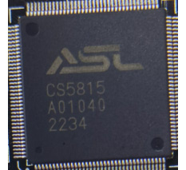

- <del>厂商：</del>
- <del>功能：【在本产品中，该芯片所起到的作用】</del>
- <del>描述：【该款芯片的特点、组成部分、……】</del>
- <del>开发套件/开发手册：</del>
- <del>应用领域：</del>

## <del>NS4263</del>

- <del>厂商：</del><del>深圳市纳芯威科技有限公司_专业从事音频和电源 IC 设计研发</del>
- <del>功能：音频功放</del>
- <del>描述：3Wx2 双声道 AB/D 类</del><strong>双模音频功率放大器</strong><del>附加耳机模式</del>
- <del>开发套件/开发手册：</del>

  - <del>NS4263 3Wx2 双声道 AB/ D 类双模音频功率放大器附加耳机模式(SOP-16)_深圳市纳芯威科技有限公司</del>
- <del>应用领域：音响、电脑设备音频驱动</del>

# <del>软件</del>

> 工作流程图、可能的软件设计、……

- <del>学习亚克力板加工工艺，设计一款显示器外壳</del>
# 第二周

> 12 月 5 日-12 月 11 日

# <del>12-5</del>

## <del>精英日课-《巅峰表现》</del>

### <del>成长=压力 + 休息</del>

- <del>完成一件</del><strong>略大于你能力的工作</strong><del>，给自己创造一定的压力（自己故意创造的压力），才能获得更好的工作体验、更丰富的工作成果</del>
- <del>长时间专注一件事时，一定需要充足且高质量的休息</del>
- <del>工作时间大概在 50-70 分钟，休息时间大概在 7-15 分钟</del>
- <del>创造活动有三个步骤</del>

  - <del>沉浸。完全集中注意力，把自己沉浸在你正在研究的这个内容之中；</del>
  - <del>孵化。专门有一个休息和恢复的时间段，在此期间完全不想那个研究内容；</del>
  - <del>洞见。也就是新想法出现的尤里卡时刻</del>

<strong>Q：为什么要压力？</strong>

<del>压力是故意给的，压力是“挑战”不是“威胁”；压力是脱离舒适区，完成一个具有挑战的工作才能避免填鸭式的学习和工作，才不是被动的接受；</del>

<del>事情太简单会无聊、事情太难会焦虑</del>

<strong>Q：为什么要休息？</strong>

<del>整个过程非常简单，关键词是“恢复”。这个道理我们以前也说过，当然是因为人体是一个“反脆弱”系统。能恢复过来，就是反脆弱，会变得更强大；恢复不过来，就练废了。</del>

### <del>进取者的工作作风</del>

- <del>水平高低与经验长短无关。10 万小时需要</del>
- <strong>压力是“挑战”不是“威胁”；</strong>
- <strong>想要达到心流状态，需要这个工作的难度和你的技能正好配得上</strong>
- <del>现在我们知道了要有信心，要保持压力，要专注。 有了这三点，具体的工作方法就非常简单了</del>

### <del>战略性休息</del>

- <del>冥想是一个“停止思考”的技术，冥想就是一种高效的休息方式；冥想的关键是“活在当下”</del>
- <del>常规休息方法</del>

  - <del>散步：散步给大脑提供了打扰，就算站起来也能起到很好的效果</del>
  - <del>回到大自然中去</del>
  - <del>跟朋友聚会</del>
  - <del>休假</del>
  - <del>冥想：三步呼吸法</del>

### <del>最宝贵的睡眠阶段</del>

- <del>睡眠的三段睡眠周期：浅睡、深睡、快速眼动(REM)</del>

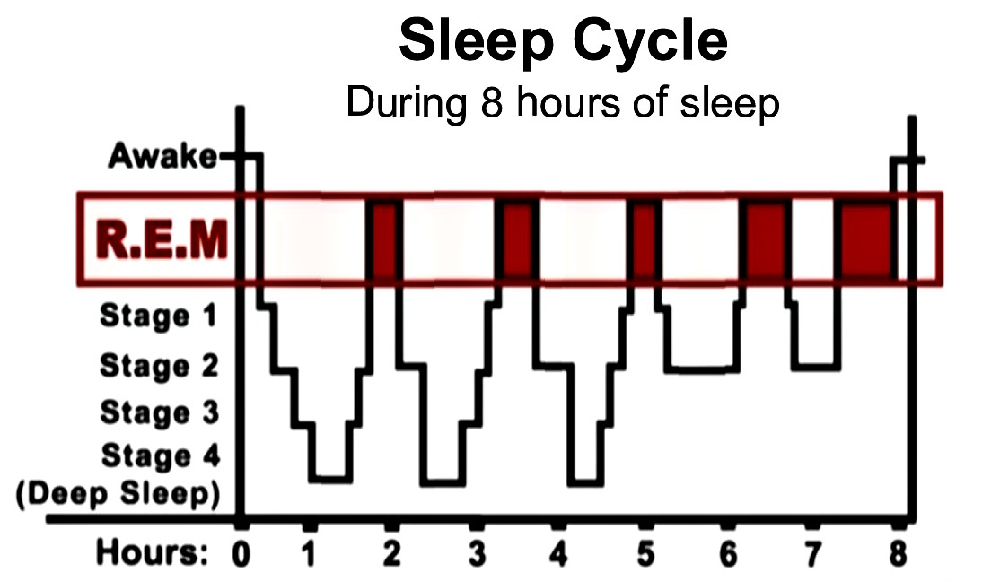

- <del>深睡期，开始了人体的修复过程；修复的前提需要一次快速眼动时期产生的代谢荷尔蒙</del>
- <del>最宝贵的睡眠阶段是：</del><strong>快速眼动时期（REM 睡眠）；</strong><del>快速眼动时期，会合成产生代谢荷尔蒙</del>
- <del>最好的起床(叫醒)时间是：REM 时期；</del><strong>一个软件：SleepTime </strong><del>，这款软件会在 REM 时期叫醒你</del>
- <del>睡前不要使用手机、电脑或者 iPad 之类的电子产品！这些东西的屏幕会给人一种“蓝光”照射，影响褪黑素分泌，让人不愿意入睡</del>

## <del>精英日课-《决断》</del>

### <del>决策法</del>

- <del>富兰克林道德算数：找一张纸，中间画一条竖线，在</del><strong>左边写下做这件事的理由</strong><del>，在</del><strong>右边写下不做的理由</strong><del>。所有理由都写好之后，你再权衡两边的理由。如果有两个对立的理由重要性对等，你就把它们都划掉，这样划掉一些，最后剩下的理由中，哪边多，你就选择哪边</del>
- <del>科学决策的四个步骤</del>

  - <del>确认有哪些选项：扩充你的选项</del>
  - <del>评估每个选项的优劣：用现实检验你的观点</del>
  - <del>从这些选项中选择一个：从长远考虑</del>
  - <del>对未来的不确定性有一定的准备：为一旦决策错误做好</del>

### <del>选项的价值</del>

- <del>有人做过一个实验。现在有一部的电影的 DVD，这个电影是你喜欢的明星主演的，DVD 要价 15 美元。研究者先问一组受试者，在这个情况下，你愿不愿意花这 15 美元，买这个 DVD？结果 80% 的受试者选择买； 然后研究者又找了一组受试者，这一次增加了一个选项：你是愿意花这 15 美元买这个 DVD，还是愿意把这 15 美元省下来、花到任何你想花的地方去？咱们仔细想想，这所谓增加的一个选项等于是废话 —— 我不买 DVD 当然就省了 15 美元，这 15 美元本来就是我的钱，我当然想怎么花怎么花！</del><strong>可就是这么一个多余的选项，就让愿意买 DVD 的人从 80% 下降到 55%。</strong>
- <del>仅仅</del><strong>*意识到*</strong><del>自己还会有别的选项，我们的决策水平都能大大改观—— 因为你现在不是钻牛角尖思维了。【什么是钻牛角尖：选项太少】</del>
- <strong>那就是，你要把多个选项都摆在桌子上，要选就一起参选</strong>

  - <del>这不是废话。比如说你要设计一个什么东西，找了两个设计小组。第一组，每想出来一个什么方案就给你看，然后你提各种意见，他们拿回去再修改，再提出不同的方案。第二组，一次性地给你提供了好几个方案，同时摆在你的面前，让你选。你选定一个，他们回去再略做修改；结果实验表明，第二组的做法效果要好得多。都摆出来，哪个好哪个不好一目了然。一个一个比较，费时费力而且到后面你会忘了前面的</del>
- <del>把显示器修一下</del>

# <del>12-6</del>

# <del>12-7</del>

# <del>《掌控谈话》读书分享</del>

- <del>给对方掌控感，令对方疲倦</del>
- <del>一个人在疲惫的时候特别容易让步</del>
- <del>一个优秀的谈判者不是让自己表现的如何亮眼，而是逐渐引导对方发现谈判者的目标并且让对方认同这些目标</del>

## <del>孤独九剑</del>

#### <del>1、重复他说的话</del>

<del>人脑在听到对方重复自己话的时候，感觉就是“你希望我给你解释一下”，会忍不住多说一些话来解释</del>

#### <del>2、深夜电台主持人的声音</del>

<del>四步走：重复对方的话，用深夜电台主持人的声音，开口先说对不起，然后沉默 4 秒钟</del>

#### <del>3、标注对方的痛苦</del>

<del>说出对方此刻痛苦的感受，策略性的同情心，能够帮助对方和你之间建立信任</del>

<del>对方不说话的时候，只需要标注对方的痛苦，把对方此刻的情绪讲出来</del>

#### <del>4、拔刺</del>

<del>先把对方对自己最不满的地方讲出来，对方就没话说了，再盯着说就没意思了。</del>

#### <del>5、谈判中要让对方说不，no</del>

<del>让对方感觉自己在掌控这场谈话，然后就会更富建设性的思考。用不去做引导，目标达成率更高</del>

#### <del>6、让对方说出“你说得对”</del>

<del>把前面的招数加在一起，然后加一个总结。</del>

#### <del>7、谈价格</del>

- <del>绝对不要相信折中（有锚定效应）</del>

<del>”我希望我们这个谈判是公平的“，给对面公平的感觉</del>

- <del>让时限成为你的盟友</del>

<del>要找到谈判对象的时限</del>

<strong>步骤：</strong>

<del>1、设定他们的情绪，说自己没有钱，那怎么办？（要问对方）</del>

<del>2、让对方先出价，要讲究公平，对方出少了可以追加，要讲究长期的合作</del>

<del>3、我们出价的时候，要划定一个范围</del>

<strong>4、操作非价格条款</strong>

<del>5、</del><strong>说出特定数字</strong><del>（不说 5000，而是说 4751 元，可能还要沉默一会说“我算一下”）</del>

<del>6、给出一个惊喜礼物【觉得亏了】</del>

#### <del>阿克曼议价法：</del>

<del>1、设定你的目标价</del>

<del>2、第一次出价是目标价的 65%</del>

<del>3、计算好准备三个可能增加到的价格，分别是目标价的 85%，95%，100%，三次让步。</del>

<del>在提价之前，用同理心原理和各种方法说不来对抗对方。</del>

#### <del>8、校准问题</del>

<del>谈到最后根们就没有良好的执行，因为双方理解本来就有偏差，可能还有情绪</del>

<del>如果对方做出很多不理智的言语和行动的时候，你需要用校准问题的方法</del>

<del>例子：对方生气要走了，应该说你打算离开是为了什么，而不是你不要走（是命令）</del>

<strong>多用 how 和 what，少用 why</strong>

<del>多用“怎么才能”和“是什么”，少用“为什么”（因为有种被质疑的感觉）</del>

- <del>这里面什么东西对你是更重要的？</del>
- <del>是什么把我们带到了这个境地？</del>
- <del>我们在这里想要完成什么目标？</del>
- <del>你希望我如何推进？</del>
- <del>我们如何才能解决这个问题？</del>
- <del>那我该如何做呢？</del>

<del>向对方示弱，要引发堆放大量的言语，让对方对方这个方案的达成做出更多的贡献</del>

#### <del>9、确保执行 7、38、55 原则</del>

<del>一个人在表达信息的时候</del>

<del>7% 是通过语言；38% 是通过语调；55% 是通过肢体和表情表达</del>

<del>为了确保执行，要更多用校准和标注的方法</del>

<del>比如：你告诉我觉得这事情可以执行，但为什么我看到你是犹豫的表情？</del>

<strong>三次原则：</strong><del>讨论一个协议的时候，至少要听到三次 yes</del>

#### <del>如何判断对方是否说了算</del>

<del>以”我“来开头的人，说“我”的次数越多，说明这个人越来越不重要</del>

<strong>真正的大佬都是说“你”“你们”“这个事情怎么做”</strong>

## <del>亚克力板设计与加工</del>

### <del>加工工艺</del>

- <del>切割：激光切割</del>
- <del>打孔：打孔机、激光切割机</del>
- <del>抛光：得到高透明度的亚克力板</del>
- <del>热弯：亚克力材料在 70-100 度会融化</del>
- <del>粘接：人工粘接</del>

## <del>屏幕\显示器\面板</del>

### <del>分类</del>

#### <del>LCD</del>

- <del>IPS 屏：IPS 屏幕属于 TFT-LCD 屏幕的一种</del>

#### <del>OLED</del>

### <del>采购和选型</del>

> [Panelook 屏库](https://www.panelook.cn/index_cn.php)

#### <del>面板类型</del>

- <strong>液晶模组 = 液晶面板 + 背光灯组件；</strong><del>液晶模组(LCM)简单点说就是液晶屏及背光组件总成。例如，液晶电视的显示部件就是液晶模组，其低温相当于 CRT 中的显像管。其它部分包括电源电路，信号处理电路等，当然还有外壳什么的。液晶模组主要分为屏和背光灯组件。两部分被组装在一起，但工作的时候是相互独立的。液晶显示的原理是背光灯组件发光，光线通过液晶屏再显示出来。液晶屏的作用就是按像素对这些光进行控制处理，以显示图像。</del>
- <strong>液晶面板；</strong>

#### <del>A+/A/A-</del>

- <del>A+：完美无坏点</del>
- <del>A：三个以内坏点</del>
- <del>A-：三个以上坏点</del>

### <del>厂商</del>

> [谈一谈全世界能做屏幕的厂商](https://zhuanlan.zhihu.com/p/41404348)

### <del>补充资料</del>

- <del>使用二阶弹簧阻尼系统制作丝滑的动画效果</del>

## <del>晨习分享会</del>

### <del>Zotero 文献管理工具</del>

> 用户指南（官方）：

#### <del>适用平台</del>

- <del>Windows</del>
- <del>IOS、iPadOS</del>
- <del>MAC</del>

#### <del>核心功能</del>

##### <del>Quick Look</del>

- <del>文献管理</del>
- <del>文献条目便捷导入</del>
- <del>文献 PDF 自动下载</del>
- <del>PDF 阅读、文献阅读笔记</del>
- <del>多端同步（支持 iPad 同步）</del>

##### <strong>文献管理基础功能</strong>

- <del>主页面</del>

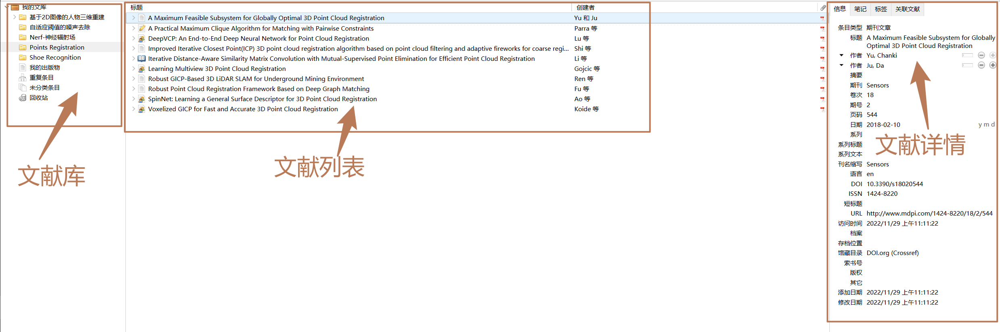

- <del>文献引用：支持 word 插件</del>

##### <strong>文献条目便捷导入</strong>

- <strong>强烈推荐：通过 DOI 直接导入（只支持英文）</strong>

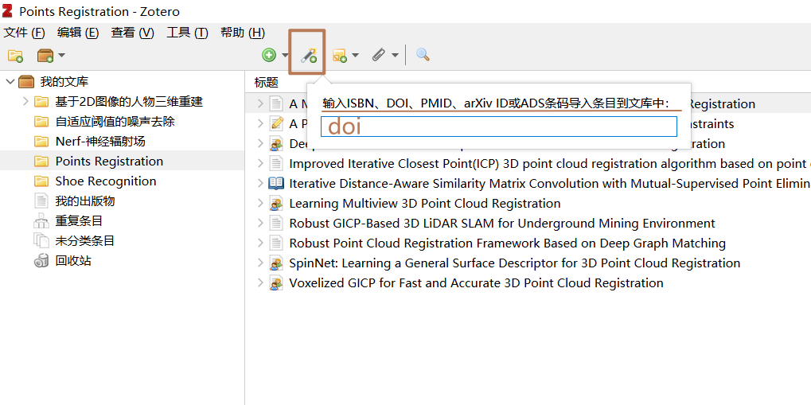

- <del>导入文献 PDF，软件自动搜索条目（只支持英文）</del>
- <del>浏览器官方插件导入</del>

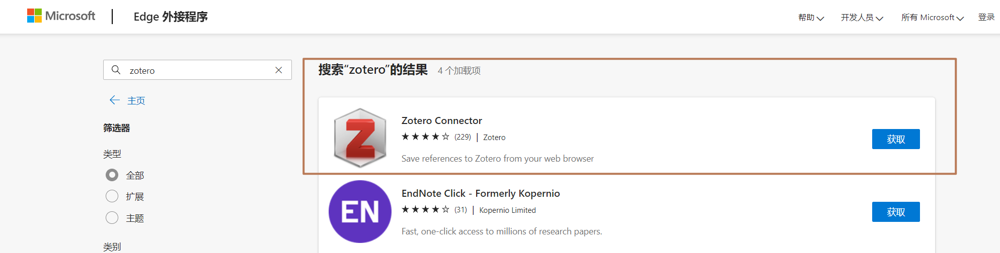

- <del>手动导入：文献名称、作者、期刊名、卷号、期号、……</del>
- <del>通过 bib 批量导入，可用于 latex、不同文献之间的数据同步</del>

> PS：中文文献据说也有自动导入方法，可自行百度

##### <strong>文献 PDF 自动下载</strong>

- <strong>强烈推荐：配置 SCI-Hub 搜索引擎(配置方法自行百度搜索)，自动下载文献 PDF（只支持英文）</strong>
- <del>通过 DOI 导入的文献，软件会自动检索 PDF</del>
- <del>手动导入</del>

> PS：中文文献据说也有自动导入方法，可自行百度

##### <strong>PDF 阅读、文献阅读笔记</strong>

- <del>重点高亮：操作很便捷</del>
- <del>侧边笔记支持 Markdown、</del><strong>Latex</strong><del>、HTML 语法（可编辑数学公式）；</del>

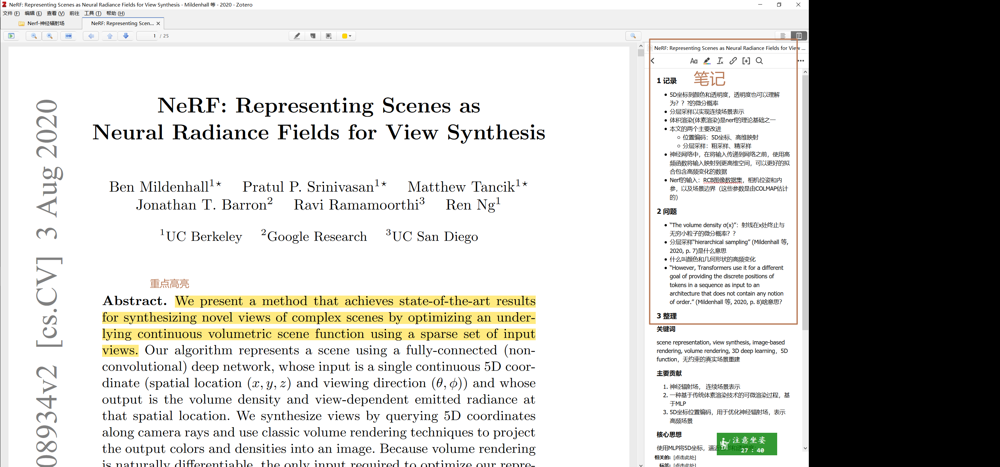

##### <del>多端同步</del>

<del>支持 MAC、IOS、iPadOS 多端同步，拥有 400M 免费云空间（大约可存储约 250 篇文献）</del>

- <del>iPadOS 同步</del><strong>【绝杀】</strong>

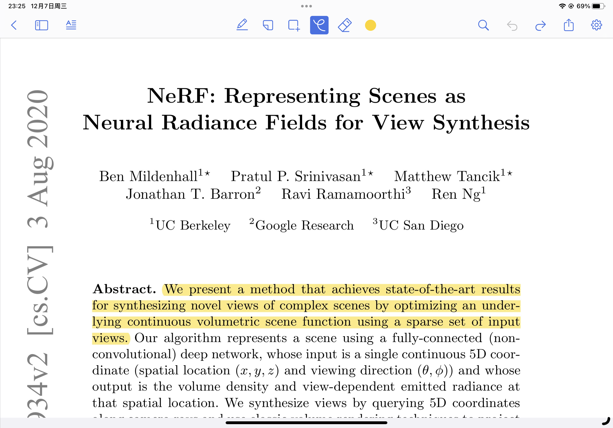

#### <del>实用插件</del>

> Zetero 常用插件：[Zotero 中文社区](https://zotero-chinese.gitee.io/zotero-plugins/#/)

##### <del>强烈推荐：翻译插件</del>

<del>[https://github.com/windingwind/zotero-pdf-translate](https://github.com/windingwind/zotero-pdf-translate)</del>

<del>谷歌翻译 API 的翻译效果最好，但需要翻墙</del>

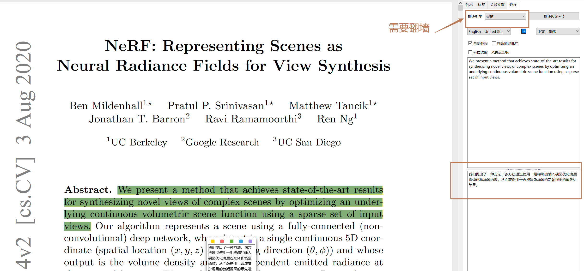

### <del>硬件产品设计</del>

#### <del>设计流程</del>

> 参考"稚晖君"：[【自制】我造了一台 钢 铁 侠 的 机 械 臂 ！【硬核】_哔哩哔哩_bilibili](https://www.bilibili.com/video/BV12341117rG/?spm_id_from=333.999.0.0&vd_source=4b1e60ea63d719404f67042d7e6c32d1)

<del>硬件设计流程如下</del>

- <del>Step1：功能设计</del>
- <del>Step2：理论分析</del>
- <del>Step3：技术路线预研</del>
- <del>Step4：机械设计（如果产品没有复杂的运动机构可省略机械设计）</del>
- <del>Step5：PCB 设计</del>
- <del>Step6：嵌入式软件</del>
- <del>Step8：产品结构设计</del>
- <del>Step9：工业设计</del>
- <del>Step10：组装与调试</del>

#### <del>材料选型和加工</del>

<del>在开始设计前思考所需要使用到的材料</del>

##### <del>常用材料</del>

- <del>塑料：PLA、ABS、亚克力、尼龙</del>
- <del>金属：铝型材、精加工、合金、不锈钢</del>

##### <del>加工方式</del>

- <del>标准件</del>

  - <del>铝方、角码</del>
  - <del>齿轮、齿条</del>
  - <del>电机连接件</del>
- <del>3D 打印</del>

  - <del>设计软件：任何可以导出 3D 格式（如 STL）的 CAD 软件（例如 Solidworks、犀牛、Free3D、Creo） </del>
  - <del>加工软件：切片软件生成 Gcode -> Cura、 ideaMaker</del>
  - <del>工艺：SLA(高精度)、FDM(低成本)</del>
  - <del>材料：PLA、ABS、……</del>
- <del>CNC</del>

> [干 CNC 编程的会用到哪些软件? - 知乎](https://www.zhihu.com/question/450912869)<br/>[CNC 加工需要注意的事项有哪些？](https://zhuanlan.zhihu.com/p/136135411#:~:text=CNC%E5%8A%A0%E5%B7%A5%E9%9C%80%E8%A6%81%E6%B3%A8%E6%84%8F%E7%9A%84%E4%BA%8B%E9%A1%B9%E6%9C%89%E5%93%AA%E4%BA%9B%EF%BC%9F%201.%E5%9C%A8%E6%AF%8F%E6%9D%A1%E7%A8%8B%E5%BA%8F%E5%8A%A0%E5%B7%A5%E5%89%8D%EF%BC%8C%E9%9C%80%E4%B8%A5%E6%A0%BC%E7%A1%AE%E8%AE%A4%E6%89%80%E4%B8%8A%E5%88%80%E5%85%B7%E6%98%AF%E5%90%A6%E4%B8%8E%E7%A8%8B%E5%BC%8F%E4%B8%80%E8%87%B4%E3%80%82,2.%E8%A3%85%E5%88%80%E6%97%B6%E9%A1%BB%E7%A1%AE%E8%AE%A4%E5%88%80%E5%85%B7%E7%9A%84%E9%95%BF%E5%BA%A6%E5%8F%8A%E9%80%89%E7%94%A8%E7%9A%84%E5%A4%B9%E5%88%80%E5%88%80%E5%A4%B4%E6%98%AF%E5%90%A6%E5%90%88%E9%80%82%E3%80%82%203.%E5%9C%A8%E6%9C%BA%E5%BA%8A%E8%BF%90%E8%BD%AC%E4%B8%AD%E7%A6%81%E6%AD%A2%E5%BC%80%E6%9C%BA%E9%97%A8%E4%BB%A5%E5%85%8D%E9%A3%9E%E5%88%80%E6%88%96%E9%A3%9E%E5%B7%A5%E4%BB%B6%E3%80%82)<br/>[要实现 CNC 数控模型，你应该知道的事情](https://waykenrm.cn/blogs/how-to-realize-a-cnc-model/)

- <del>设计软件：可以导出 3D 格式 (STL) 或者多视图 2D 图 (DWG) 的 CAD 软件（例如 MasterCAM、Cero、Solid works (CAM)、AutoCAD)</del>
- <del>加工软件：直接生成 CNC 文件的软件 -> MasterCAM、UnigraphicsNX（兼具三维设计功能）</del>
- <del>材料：铝、铁、铜、……</del>
- <del>激光雕刻</del>

> [常见的材料及其激光雕刻技术方法](https://zhuanlan.zhihu.com/p/376268247) <br/>[九款免费轻量的 AutoCAD 的开源替代品推荐](https://zhuanlan.zhihu.com/p/28230165#:~:text=%E4%B9%9D%E6%AC%BE%E5%85%8D%E8%B4%B9%E8%BD%BB%E9%87%8F%E7%9A%84%20AutoCAD%20%E7%9A%84%E5%BC%80%E6%BA%90%E6%9B%BF%E4%BB%A3%E5%93%81%E6%8E%A8%E8%8D%90%201%20%E5%BC%80%E6%BA%90%20CAD%2FCAE%E5%B7%A5%E5%85%B7%20FreeCAD%20FreeCAD%E6%98%AF%E4%B8%80%E4%B8%AA%E5%9F%BA%E4%BA%8E,LibreCAD%20...%206%20%E7%94%A8%E4%BA%8E%E5%88%9B%E5%BB%BA%E8%99%9A%E6%8B%9F%E4%B9%90%E9%AB%98%E6%A8%A1%E5%9E%8B%E7%9A%84%E5%BC%80%E6%BA%90%20CAD%20%E7%A8%8B%E5%BA%8F%20LeoCAD%20)

- <del>设计软件：任何可以导出 DXF 格式的 CAD 软件（</del><del>QCAD</del><del>、</del><del>FreeCAD</del><del>、AutoCAD、Solid works）</del>
- <del>材料：亚克力（有机玻璃）、木材木头、密度贴面板、双色板、镀锌铜板（激光氧化锌层）</del>
- <del>木工：手工</del>
- <del>吸塑：吸塑机表面贴膜</del>

#### <del>机械设计</del>

<del>机械设计一般在批量不大的机械装备、非标自动化设备、机器人等行业。</del>

<del>机械设计</del><strong>运动构建居多</strong>

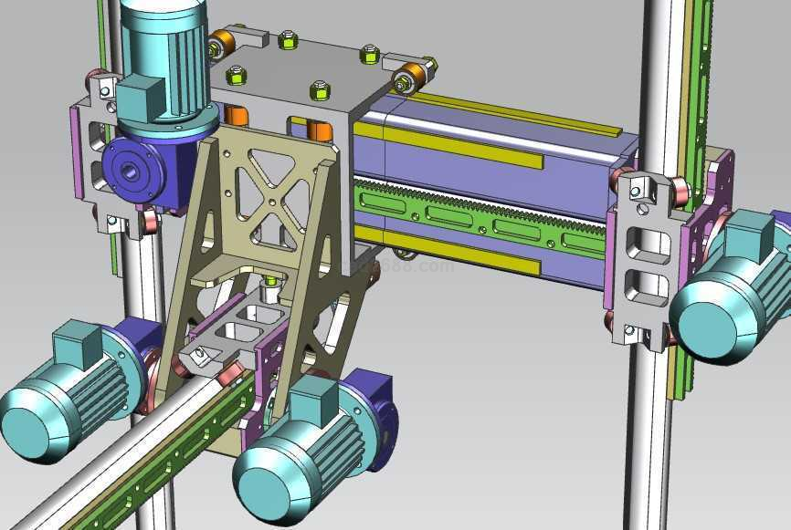

> 机械设计示意图

##### <del>工具/设计软件</del>

- <del>Solid works</del>

##### <del>专业知识</del>

- <del>机械原理：机械干涉分析、传动分析、有限元分析</del>

#### <del>工业设计</del>

<del>工业设计主要关注产品的外观，包括形态、位置关系、颜色等</del>

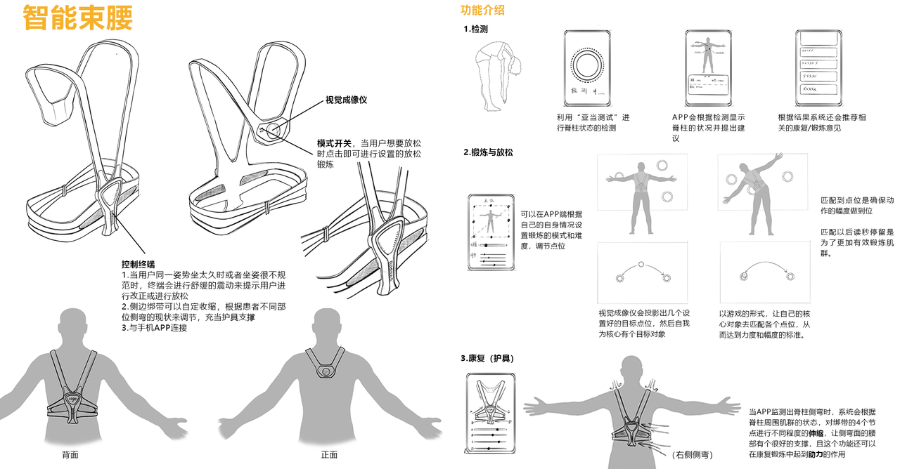

> 工业设计示意图

##### <del>工具/设计软件</del>

- <del>犀牛、3DMax</del>

##### <del>专业知识</del>

- <del>绘图（草绘）</del>

#### <del>（产品）结构设计</del>

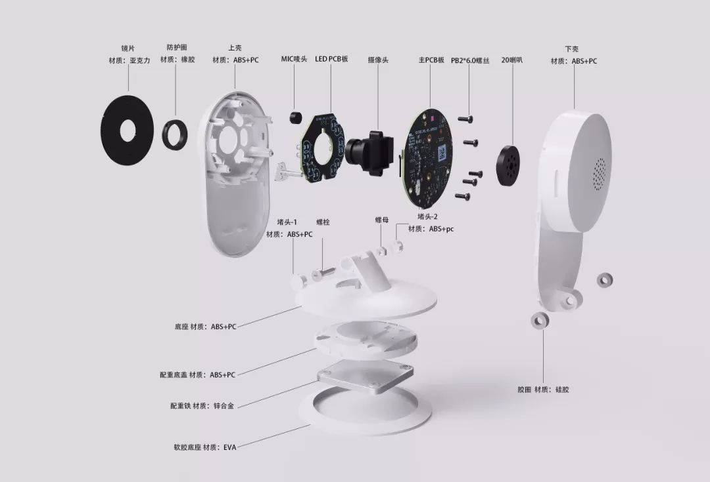

> （产品）结构设计示意图

##### <del>工具/设计软件</del>

- <del>Creo</del>

##### <del>专业知识</del>

-

#### <del>嵌入式硬件设计——PCB 设计</del>

##### <del>工具/设计软件</del>

##### <del>专业知识</del>

#### <del>嵌入式软件编程</del>

##### <del>工具/编程软件</del>

> 不同的主控芯片有推荐使用不同的编程软件

- <del>Keil</del>
- <del>Cube32</del>
- <del>VScode</del>
- <del>……</del>

##### <del>专业知识</del>

- <strong>嵌入式平台</strong>

> [嵌入式设备里，SOC 与 MCU 的区别是什么? - 知乎](https://www.zhihu.com/question/312379687)

- <del>MCU：微控制器</del>
- <del>MPU：微处理器</del>
- <del>SOC：片上系统</del>
- <strong>嵌入式系统</strong>

  - <del>Linux</del>
  - <del>RTOS</del>
  - <del>ROS</del>

#### <del>控制算法</del>

##### <del>工具/设计软件</del>

- <del>matlab：控制仿真、运动解算</del>

##### <del>专业知识</del>

- <del>自动控制原理</del>
- <del>运动学正逆解</del>
- <del>路径规划</del>
- <del>……</del>

#### <del>上位机软件</del>

##### <del>工具/设计软件</del>

##### <del>专业知识</del>

# <del>12-8</del>

## <del>罗永浩的创业课</del>

### <del>什么人适合创业、什么人不适合创业</del>

### <del>如何选择创业方向</del>

<strong>创业的方向：</strong>

> 选择比努力重要得多

1. <strong>革命性创新</strong><del>：飞机之于汽车、真空高铁、火箭可回收技术、光刻机</del>
2. <strong>发现蓝海</strong>

- <del>大蓝海：互联网线上购物、共享单车【发现大蓝海，需要敏锐的观察力】</del>
- <del>小蓝海：卧安、云鲸【几十亿、上百亿的公司】</del>

> 蓝海需要群众基础：中国人对“上火”的概念是有基础的

1. <strong>正在发展但可能供应不足的领域</strong><del>：机械臂</del>
2. <strong>为了实现自己的梦想</strong>

> 【如果选择单独由这种原因而选择的方向是最糟糕的】

## <del>ROS 操作系统</del>

### <del>ROS 简介</del>

- <del>涉及的语言：C++、Python、Linux</del>
- <del>操作系统：Windows、Linux、Ros</del><strong>【ROS2 对 Linux 支持更好】</strong>
- <del>为什么要操作系统：避免造机器人时，不要重新造轮子（站在巨人肩膀上）</del>

### <del>ROS1 和 ROS2</del>

- <del>ROS1 更多是支持单个机器人</del>
- <del>ROS2</del>

  - <del>多机器人系统</del>
  - <del>跨平台</del>
  - <del>实时性</del>
  - <del>网络连接</del>
  - <del>产品化</del>
  - <del>项目管理</del>
  - <del>DDS：分布式实时通讯</del>
  - <del>ROS1 中由 Master 统一管理，ROS2 是分布式的更稳定</del>

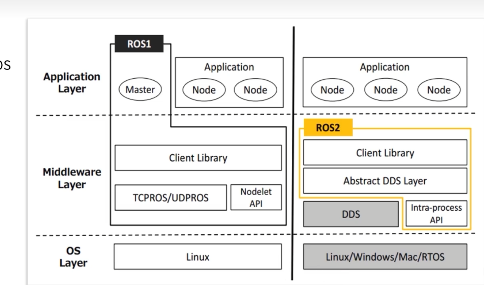

### <del>How to install ROS2</del>

<del>ROS2 更适合部署在 Linux 系统上</del>

<del>Linux->Ubuntu</del>

- <del>虚拟机 VMware</del>

# <del>12-9</del>

## <del>论文阅读笔记：Generalized-ICP</del>

- <del>combine：组合</del>
- <del>probabilistic：概率性的</del>
- <del>probabilistic techniques：概率论</del>
- <del>is shown to outperform both standard ICP and point-to-plane</del>

  - <del>显示优于 ICP 和点对面</del>
- <del>outlier terms：离群项、离群点</del>
- <del>ncrease robustness：增加鲁棒性</del>
- <del>A striking illustration of this is the fact that sth</del>

  - <del>这个事实的一个显然的例证是……</del>
- <del>scan-matching：匹配、扫描匹配、配准</del>
- <del>variations：变体</del>
- <del>the implicit assumption of full overlap of the shapes</del>

  - <del>形状完全重叠的假设</del>
- <del>cross-correlation：互相关</del>
- <del>non-linear optimization techniques：非线性优化技术【对非线性函数求极值的方法】</del>
- <del>wider basin of convergence：宽收敛域</del>
- <del>MLE（Maximum Likelihood Estimate）：极大似然估计</del>
- <del>It is unique in that sth</del>

  - <del>独特之处在于【技术上的创新性】</del>
- <del>euclidean distance：欧式距离</del>
- <del>MAP（Maximum a posteriori estimation）：最大后验概率估计</del>
- <del>In contrast to：相比之下</del>
- <del>are some what orthogonal to our technique：在某种程度上</del>
- <del>independent Gaussians：独立高斯分布</del>
- <del>distribution：分布</del>
- <del>Normal distribution \ Gaussian distribution：正态分布、常态分布、也叫高斯分布</del>
-

## <del>参数估计</del>

### <del>最大似然估计（MLE）和最大后验概率估计（MAP）</del>

<del>详解最大似然估计(MLE)、最大后验概率估计(MAP)，以及贝叶斯公式的理解_nebulaf91 的博客-CSDN 博客_最大似然概率</del>

<del>与人谈判遇到的麻烦人</del>

- <del>优柔寡断：谈好了，第二天又反悔</del>
-

## <del>罗永浩的创业课</del>

- <del>什么时候困难没有了，机会也就没有了</del>

## <strong>情绪 ABC 模型（合理情绪疗法）</strong>

- <strong>为何物：</strong>

  - <del>美国临床</del><del>心理学</del><del>家埃尔比特·艾利斯在 20 世纪 50 年代提出。他认为决定人情绪的</del><del>不是事物本身</del><del>，而是受对事物</del><del>看法</del><del>的影响。</del>
  - <del>A-Antecedent：诱发的行为和事件</del>
  - <del>B-Believe：信念和观点</del>
  - <del>C-Consequence：事件造成的情绪结果</del>
- <strong>有何用：</strong>

  - <del>用这套模型管理好我们的情绪，很多时候可以</del><strong>避免不必要的麻烦</strong><del>。</del>
  - <del>情绪 ABC 理论指出，我们可以通过调整和改变我们对事物的认知和看法，</del><strong>改善和管理我们的情绪。</strong>
  - <del>这套模型对我们生活方方面面的影响非常巨大。</del>
- <strong>何时使用：</strong>

  - <del>当你被事情影响，产生负面情绪，可以用此模型觉察下，是否信念出现错误。</del>
  - <del>也就是，当你情绪不好的时候，不妨问问自己，为什么这么不开心，是不是自己把有些事情想得太严重了，或是会错了意。换个想法，就能换个心情！</del>
- <strong>具体介绍如下：</strong>
- <strong>模型解析：</strong>

  - <del>通常人们会认为诱发事件 A 直接导致了人的情绪和行为结果 C，发生了什么事就引起了什么情绪体验（</del><del>如：很多时候很多人会认为是因为这个事情，所以我很生气。</del><del>）。然而，你有没有发现同样一件事，对不同的人，会引起不同的情绪体验。</del>
  - <del>改变我们的看法的原因不是事情本身发生了什么，而是我们对事件的看法影响了我们的情绪。所以说，不是某件事导致某种结果，而且中间 B 的差别。</del>
  - <strong>换句话说，</strong><del>我们悲伤、快乐、内疚、愤怒、焦虑等等一切感受，都是由我们对问题的思考所决定的。这中间的思考方式 B，才是我们一切情绪反应和结果的主要决定因素。</del>
  - <del>合理的观念会得到</del><strong>健康</strong><del>的情绪，不合理的观念导致负向的，不稳定的情绪。</del>
- <strong>不合理的信念有哪些？</strong>

  - <del>常见的三种不合理信念，容易引起负面情绪：</del>

    - <del>1、绝对化要求</del>

<del>它是指人们常常以自己的意愿为出发点，认为某事物必定发生或不发生的想法。</del>

<del>例如：“我必须获得成功”、 “一定不能出错”。</del>

```
- <del>2、过分概括化</del>
```

<del>以某一件或某几件事来评价自身或他人的整体价值。</del>

<del>例如一次失败的经历就否定自己一无是处，“我连这么简单的事情都做不好，我太没用了。”</del>

```
- <del>3、糟糕至极</del>
```

<del>认为如果一件不好的事发生了，将是非常可怕、非常糟糕，甚至是一场灾难。</del>

<del>例如“考试失败，工作不顺，我的人生已经失去了意义”。</del>

- <strong>思考启示：</strong>

  - <del>毛主席曾说：感觉只解决现象问题，理论才解决本质问题。</del>
  - <del>我们不能让主观感觉控制自己的情绪，我们要学会正确的思考，看待问题要理性，不偏执、固执。找到有效的思考方式，才能从根本上解决问题。</del>
  - <del>合理的信念引起人们对事物适当、适度的情绪和行为，而不合理的信念则相反，会导致不当的情绪和行为。当人们坚持某些不合理的信念，长期处于不良的情绪状态的时候，最终导致情绪障碍产生。</del>
- <strong>运用步骤：</strong>

  - <del>运用 ABC 理论的五个步骤；</del>

<del>步骤一；找寻 A 即事件本身（找到导致你负面情绪的事件）</del>

<del>步骤二；描述 C 即情绪状态（是绝望还是伤心）</del>

<del>步骤三；找到产生 C（情绪状态）的原因 B（视角，看法）</del>

<del>步骤四；自我反驳，对于事件本身（A）的看法视角（B）进行反驳</del>

<del>例；工作不力被领导责骂，觉得自己这辈子都做不好工作了</del>

<del>反驳；虽然这次工作没有做好，但这不代表以后都做不好工作，人是会成长的，找到失败原因，下次努力便是。</del>

<del>步骤五；树立新信念（采取新的看法和视角）</del>

- <strong>如何调节：</strong>

  - <del>1. 正确看待评判和指责</del>

    - <del>在接受批评和指责的时候难以客观对待，接受不了自己不好的一面。但谁都有出错的时候，要学会区分批评的成分，很多的批评并不是针对个人，而是针对事情没有处理好，所以提出异议。</del>

<del>被批评的时候，会感到自责和委屈，陷入到一种负面的情绪中。但最终目的是为了避免重复犯同样的错误，但只是伤心难过，并不解决问题。</del>

<del>对于管理者而言，批评别人的时候也不能掺杂太多情绪，要明确指责的意图和对别人的期望。</del>

- <del>2. 接受自己的坏情绪，寻找合适的排解方式【承认问题才能去解决问题】</del>

  - <del>人都有低落的时候，关键在于不能让它控制你的行为，无限蔓延。在职场中，时刻保持冷静的心态是很重要的。可以通过合理的方式排遣坏情绪，比如出去透透气，喝点饮料，或者找个熟人吐吐槽。</del>
- <del>3. 学会辩证的看问题</del>

  - <del>任何一件事都有好坏两面，在看到不好一面的同时，要看到好的一面。比如我们不小心打破了一个杯子，要想还好没有扎破手。我们被别人拒绝了，还好，人家没有浪费大家的时间，还可以再找其他机会。</del>
  -
- <strong>模型案例：</strong>

  - <del>比如：A 说：我不想上班，不想打工，打工就是被老板剥削，就是被当成工具人。</del>

<del>但如果你换一个 B（思维），不要觉得打工就是剥削。古话曾说：</del><strong>“六经注我”</strong><del>，借用一下说法就是，工作里能接触到的一切资源为我所用；沉淀我的能力，优化我的履历；布局我的未来；事儿真砸了也是花老板的钱。这样一想，是不是被剥削的就是老板了？那工作的状态是不是就不一样了。</del>

# 10-10

- <del>中央吸尘器、全屋吸尘器——能不能探索一下除了“吸”以外的方案？？比如利用空气动力学</del>
- <del>如何注册一个虚拟账户：</del><del>OpenAI ChatGPT 注册试用全攻略_IT 教程精选的博客-CSDN 博客_chatgpt 怎么用</del>
- <del>量子纠缠：当我们看见猫 A 时，我们就获得了一个信息：这个猫活着（（这个信息就是一份能量，猫 A 自身的能量就已经传递给我们了，猫的生死产生了坍缩）。如果此时在无穷远的一个地方有另一只猫 B，猫 B 与猫 A 处于量子纠缠态，如果猫 A 坍缩，猫 B 必然会坍缩，而且坍缩方向与猫 A 肯定是一致的，此时猫 B 产生了一个确定的新信息：我活着（猫 B 或者）；两只猫的信息能就是守恒的。</del>

<del>由于现有技术无法控制猫 A 活着还是死去，所以量子纠缠无法传递任何信息；</del><strong>如果要想给观察猫 B 的人传递额外的信息，就要想办法将”某种能量”传递进猫 A 内部，而不是让猫 A 把信息能传递给我们</strong>

<strong>信息能</strong>

## <del>Generalized-ICP</del>

- <del>一个具有对称性的模型更加稳健，因为几种不同的情况都能导出同一个结果。</del>

<del> </del>
$$
f=x^2
$$

<del>是一个典型的对称模型</del>

$$
f=x^2\rightarrow f=(x)^2=(-x)^2
$$

# <del>12-11</del>

## <del>机器人赛道</del>

### <del>工业机器人赛道</del>

1. <strong>机器人赛道火热的主要原因\现实背景</strong>

- <del>全球人口红利消失。工厂招人困难，出现用工荒。</del>
- <del>自动化成本降低。人工成本增加与自动化成本降低达到交叉拐点，中国的这个拐点大致出现在 2014 年，沿海地区制造业开始大量普及机器人自动化。</del>
- <del>机器人需求发生变化，从标准自动化转变为</del><strong>柔性自动化制造</strong><del>。机器人正在向智能机器人进化。</del>
- <del>中国是全球机器人、自动化以及视觉、工业软件最大的市场之一。</del>

1. <strong>智慧工厂三部曲/工业机器人的演化</strong>

- <del>传统自动化工厂：一条产线只能生产一种产品</del>
- <del>柔性自动化：小批量多品种</del>
- <del>数字化工厂：</del><del>生产制造全过程智能化、数字化、全自动化、质量可追溯、设备状态可监控甚至可实现预测性维护。</del>

<del>柔性自动化向数字化工厂跃迁的关键是软件、视觉两大核心。</del>

1. <strong>投融资</strong>

- <del>2022 年截止到 9 月 1 日，总融资规模为 487.8 亿元</del>
- <del>投资细分方向包括搬运机器人、焊接机器人、喷涂机器人等，其中</del><strong>搬运机器人</strong><del>方向备受资本青睐。投资比例如下所示：</del>

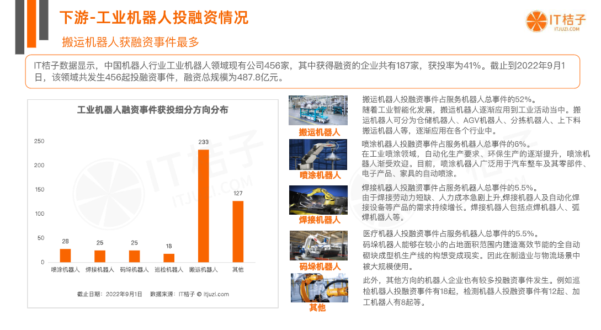

### <del>服务机器人赛道</del>

1. <strong>服务机器人行业发展的现实背景</strong>

- <del>成本。2012 年激光雷达成本约 1.8 万人民币，现在 300~400 人民币。服务机器人成本的急剧下降，低于服务行业人工成本之后，落地成为可能。</del>
- <del>市场教育。机器人的使用逐渐被大众接受。</del>
- <del>算力提升。机器人视觉、机械学习、云等依赖于海量数据计算，算力卡变小，更多算法得以在设备上应用</del>

<del>补充：</del>

- <del>中国商用级别机器人产业链已相对成熟。对进口零部件依赖逐步降低，电机早已实现国产化，斜波减速机、激光雷达也已经国产化。消费商用级芯片没受太大影响，特定芯片仍需依赖进口。但一些领域产业链还不成熟，比如斜波减速机主要是绿地和来福。</del>
- <del>大环境对企业和行业影响巨大，比如酒店、旅游行业。企业的本质是应对。最灵活的团队，凸显壁垒，以更轻的方式去做业务，比如开拓国内更多应用场景、海外市场拓展。企业的本质在于人效、抗风险能力、回款，自身的存活能力更为重要。</del>

1. <strong>服务机器人的演化</strong>

- <del>第一代应用于博物馆等场景的讲解引导</del>
- <del>第二代「底盘 + 行业应用」的 2D 机器人</del>
- <del>未来「底盘 + 机械臂 + 视觉 + 行业应用」的 3D 机器人 </del>

1. <strong>服务机器人的方向</strong>

- <del>B 端</del>

  - <del>清洁市场</del>
  - <del>整理市场</del>
- <del>C 端</del>

  - <del>清洁市场</del>
  - <del>整理市场</del>

> 2D 清洁和 3D 清洁：2D 清洁——连续场景、连续对象；3D 清洁——离散场景、连续对象<br/>2D 整理和 3D 整理：2D 整理——连续场景、离散对象；3D 整理——离散场景、离散对象

<del>技术难度排序：</del>

<del>B 端 <C 端</del>

<del>清洁 < 整理</del>

<del>2D<3D</del>

<del>推论，技术难度由简到难：</del>

1. <del>B 端清洁（尊重历史）</del>
2. <del>C 端清洁；B 端整理；</del>
3. <del>C 端整理（求其上者其终？ OR 求其上者得毁灭？）</del>
4. <strong>投融资</strong>

- <del>2022 年截止到 9 月 1 日，总融资规模为 966 亿元</del>
- <del>投资细分方向包括扫地机器人、教育机器人、re 特种机器人、医疗机器人等，其中</del><strong>医疗机器人</strong><del>方向备受资本青睐。投资比例如下所示：</del>

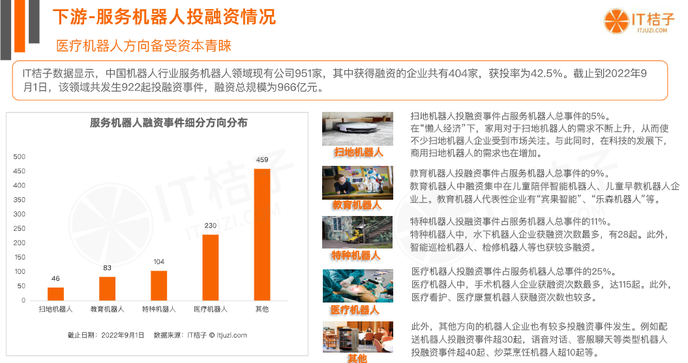

- <del>独角兽企业：恩灵机器人、追觅科技、擎朗</del>

> 家居整理机器人方向，尚没有典型的投资事件发生，出现这种现象的原因较大概率是因为技术不成熟，其次是对该方向的探索太少。

- <del>上市企业：九号（个人短交通）、安克创新（智能产品）、石头科技（扫地机器人）、科沃斯机器人（家庭服务机器人）、微创医疗机器人（手术机器人）</del>

### <del>机器人支持技术</del>

1. <del>机器视觉</del>

- <del>小部分高精度相机镜头以及高性能处理器还是比较依赖于国外产品</del>
- <strong>国产替代</strong><del>是必然的趋势，并且愈演愈烈。国内品牌出海也是必然的趋势。</del>

1. <del>电机</del>

- <del>对进口零部件依赖逐步降低，电机早已实现国产化，斜波减速机、激光雷达也已经国产化。消费商用级芯片没受太大影响，特定芯片仍需依赖进口。但一些领域产业链还不成熟，比如斜波减速机主要是</del><strong>绿地和来福。</strong>

1. <del>控制系统\操作系统</del>

- <del>机器人底层环节相对薄弱。控制系统是其中之一</del>
- <del>机器人底层是非常庞杂的体系，涉及成本商业的考量，国有替代不是很容易</del>

1. <del>芯片</del>

- <del>几个关键芯片受国外影响较大，例如主从控制机器人的控制器通讯协议和芯片。补足底层短板需要各个层级力量的共同努力</del>


# 第三周

> 12 月 12 日-12 月 18 日

# <del>12-12</del>

# <del>12-13</del>

## <del>楼宇服务机器人调研</del>

### <del>市场现状</del>

#### <del>相关产品</del>

##### <del>智能环卫解决方案</del>

- <del>厂商：</del><del>坎德拉(深圳)科技创新有限公司-官网</del>
- <del>产品：阳光 S200 多功能清扫机器人；</del><del>坎德拉-三维产品宣传片_哔哩哔哩_bilibili</del>


- <del>应用场景：办公楼、公园、街道、社区（小区）</del>
- <del>产品功能特点：</del><strong>自主倾倒垃圾</strong>


#### <del>相关专利</del>

### <del>核心功能</del>

#### <del>机器人本体</del>

- <strong>自主导航：</strong><del>感知（SLAM）、路径规划、自主避障</del>
- <strong>智能呼梯：</strong><del>智能识别和点按（无外设、全自主）；电梯辅助按钮（硬件外设辅助）；电梯物联网（模拟按钮微改造、传统电梯-> 智能化电梯）</del>
- <strong>用户垃圾智能监测：</strong><del>垃圾收纳桶底部压力传感器；垃圾收纳桶满载监测</del>
- <strong>远程通讯：</strong><del>楼宇定位、用户远程传呼机器人</del>
- <strong>垃圾立体转运：</strong><del>自动换桶；自主倾倒</del>
- <strong>自主开门：</strong><del>人工辅助；机械推门；单元门物联网；</del>

#### <del>辅助产品</del>

- <del>电梯辅助按钮</del>
- <del>机器人下楼梯辅助板（铺一块好看的板子）</del>
- <del>智能垃圾收纳桶（垃圾分类；底部压力传感器；垃圾桶满载监测）</del>
- <del>垃圾站智能垃圾分类桶（机器人识别不同类别的垃圾，对号入桶）</del>

### <del>关键指标</del>

- <del>垃圾桶直接更换，不倾倒，避免味道扩散</del>
- <del>自动跨门槛</del>

# <del>12-17</del>

- <del>市场部调研垃圾处理全流程</del>

# <del>12-18</del>

## <del>社区服务机器人调研</del>

### <del>相关机器人厂商</del>

- <strong>国辰社区服务机器人</strong>

  - <del>厂商：</del><del>智能机器人_巡检机器人_视觉检测设备_服务机器人_重载 agv 小车_杭州国辰机器人科技有限公司</del>
  - <del>功能：社区服务导引、信息查询导览，路径指引工作、信息查询发布 、安全监控 、一键客服，和谐人机交互等功能</del>
  - <del>技术领域：机器人自主导航、机器人地盘控制、小区安防</del>
- <strong>阿泰因</strong>

  - <del>厂商：</del><del>阿泰因</del>
  - <del>功能：司法服务机器人，社区矫正、司法援助、司法考试</del>
  - <del>技术领域：人机交互（屏幕）</del>
- <strong>高仙：楼宇配送机器人</strong>

  - <del>厂商：</del><del>上海高仙自动化科技发展有限公司(gs-robot)</del>
  - <del>功能：广泛适用于医院、酒店、高端住宅、甲级写字楼、餐饮店等场景，完成病房送药、客房配送、餐饮送餐、外卖/快递送货上楼</del>
  - <del>技术领域：自主导航、自主乘坐电梯（配合智能电梯）、自主充电、越障能力（20-25mm)、自动拨打电话</del>

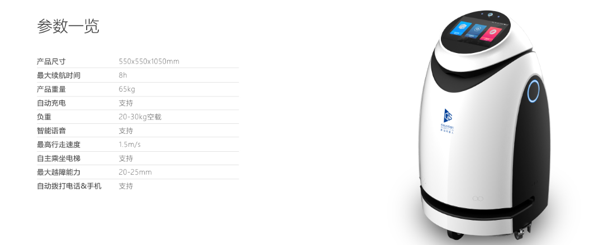

- <strong>极光一号</strong>

  - <del>厂商：</del><del>麦岩智能 MAXROCK.ROBOT | 未来社区共创者 专注打造未来社区智能服务机器人</del>
  - <del>功能：地面除尘、湿拖、扫吸、安防、香薰</del>
- <strong>垃圾转运机器人：</strong><del>垃圾转运机器人今深圳“上岗”:一次可倒 300 公斤垃圾-媒体宣传-深圳市城市管理和综合执法局网站</del>

  - <del>厂商：</del><del>浙江迈睿机器人有限公司</del>

### <del>发展趋势调研</del>

- <del>“上岗”社区的服务型机器人，何时出现百亿独角兽？</del>

  - <del>在劳动力逐渐短缺的趋势下，</del><strong>社区清洁</strong><del>成为了社区服务中一大痛点</del>
  - <strong>社区清洁-> 社区清运</strong>
- <del>物业也向 AI 要“革命” 社区机器人前景如何? | 雷峰网</del>

  - <del>物业公司也开始与智能时代接轨：碧桂园</del>
  - <del>物业领域偏向于重度垂直场景，深耕多年之后已形成厚厚的行业墙，一般大型科技企业很难切入进这个市场，导致物业行业与前沿科技的结合出现了一定程度上滞后或脱节。对于头部物业公司而言，寻找一条与科技结合的路或许是降本增效最快的捷径。</del>
  - <del>在针对社区场景的工业设计与多项应用上，雷锋网注意到，目前以碧桂园服务为代表的头部物业厂商已经提出构建丰富的社区机器人矩阵，比如将推出</del><strong>楼梯清洁机器人</strong><del>、室外扫地机器人、室内洗地清洁机器人、巡逻机器人、杂草清除机器人、</del><strong>垃圾桶清运机械臂</strong><del>等一整套机器人队伍，比传统意义上的单点应用服务更加完善</del>

> 噱头很多，落地很少（或者是很难找得到）

### <del>服务机器人龙头企业</del>

1. <strong>云迹科技：</strong><del>云迹科技 - 机器人 让人类更幸福</del>
2. <strong>高仙机器人：</strong><del>上海高仙自动化科技发展有限公司(gs-robot)</del>
3. <strong>碧桂园（应用端）</strong>

### <del>2022 社区服务机器人评述</del>

#### <del>功能特点\缺点</del>

1. <del>价格太高：定价在 8 万元甚至 10 万元以上的产品居多，对于一些中小型社区来说不够友好（卖给小区 toB）</del>
2. <del>功能复杂且不够智能：将清洁、安防、快递整合在一起，但又会因此在功能上受到限制，表现不够智能；</del>
3. <del>缺乏设计感：和面向 C 端销售的产品不同，B 端产品几乎都是采用成本较低的模具设计，外观并没有融入对应的场景当中</del>

#### <del>发展趋势</del>

1. <strong>简单重复性劳动更容易被替代：</strong><del>牛津大学曾对 2033 年各个行业被替代的概率做过一个预测。提到</del><strong>相对基础性、重复性工作类型被智能科技替代率在 65%-接近 100% 之间</strong><del>，保安和清洁工被替代率在 66%。【归根结底是因为技术发展的阶段性问题：“一定会有，但不一定是现在”】</del>
2. <strong>人力成本增加</strong><del>：我国 60 岁以上人口占比已达到 18.7%，国民价值婚育观念改变、人力成本快速上涨等问题都在要求加快“机器换人”速度</del>
3. <strong>物业行业的革新：</strong><del>物业也向 AI 要“革命” 社区机器人前景如何? | 雷峰网</del><del>；</del>
4. <del>技术发展：IoT、云计算、边缘计算</del>

### <del>为什么是我们</del>

1. <strong>深度挖掘的用户需求：</strong><del>社区每天的垃圾清理需求确实不容易被看见，因为这个需求处于</del><strong>C 端和 B 端的交界处【</strong><del>这样的需求就一定很难被发现吗？有没有其他案例】</del>
2. <strong>创新商业模式：</strong><del>机器人 + 共享经济（B 端平台、C 端付费）</del>
3. <strong>松山湖机器人科创体系：</strong><del>机器人是体系的根</del>
4. <strong>产品空白：</strong><del>市面上没有能完成此类需求的社区服务机器人</del>
5. <strong>行业蓝海：</strong><del>社区服务机器人是一片蓝海，且随着人工智能技术、机器人控制技术的飞速进步，人力成本的不断增长，智慧城市、智慧社区行业发展前景巨大</del>

## <del>什么是“媚俗”</del>

> [第 19 讲，一分钟了解艺术圈术语：媚俗（Kitsch）](https://zhuanlan.zhihu.com/p/66641678)

- <del>kitsch 在德语中是垃圾的意思，是用来形容流行和商业文化中特别廉价、粗俗和美好可爱的形式。“媚俗”一词起源于 19 世纪，在美学倾向上被用于描述一些夸张的感情表达和通俗剧，用来批评低级趣味（poor taste）的艺术，或者毫无创新的抄袭临摹“高级艺术”。</del><strong>媚俗艺术有三个特点</strong><del>：</del><strong>一描绘了一个美丽或令人愉悦的主题</strong><del>，</del><strong>二所描绘的主题是即时且容易识别的</strong><del>；</del><strong>三它并没有实质上丰富我们与所描绘的主题相关的联想。</strong>
-
# 第四周

> 12 月 19 日-12 月 25 日

# <del>12-19</del>

# <del>12-20</del>

# <del>12-21</del>

# <del>12-22</del>

## <del>Matlab 实现“参数名称 + 值”传递——基于 InputParser & Varargin</del>

### <del>可变长度输入参数列表：Varagin</del>

> [可变长度输入参数列表 - MATLAB - MathWorks 中国](https://ww2.mathworks.cn/help/matlab/ref/varargin.html)

- <del>Varargin 本质是一个可变长度的元胞数组</del>

<strong>参考示例</strong>

### <del>输入解析器：inuptParser</del>

> [在输入解析器模式中添加可选的名称-值对组参数 - MATLAB addParameter - MathWorks 中国](https://ww2.mathworks.cn/help/matlab/ref/inputparser.addparameter.html)

- <del>输入解析器用于从一组</del><del>元胞数组</del><del>中解析多组</del><del>参数名称</del><del>和</del><del>参数值</del>
- <strong>使用流程</strong>

  - <del>Step1：使用</del><del>p=inputParser</del><del>定义一个输入解析器</del>
  - <del>Step2：使用</del><del>addParameter</del><del>添加名称-值对组；与使用 </del><del>addRequired</del><del> 和 </del><del>addOptional</del><del> 函数添加的位置输入参数不同，使用 </del><del>addParameter</del><del> 添加的每个参数都对应两个输入参数：一个对应名称，一个对应值</del>
  - <del>Step3：配合</del><del>varargin</del><del>，将参数名称和值传递给</del><del>parse</del>
  - <del>Step4：使用</del><del>Results</del><del>方法调出结果</del>
- <strong>参考示例</strong>

```matlab
<del>varargin={’myParam',100};        % 输入的元胞数组</del>

<del>P=inputParser;                   % 定义一个输入解析器</del>
<del>p.addParameter('myParam',100);   % 在输入解析器模式中添加可选的名称-值对组参数</del>
<del>p.parse(varargin{:});            % 将参数名称和值传递给parse</del>
<del>p.Results.paramName;             % 输出参数名称和值</del>
```

## <del>点云配准</del>

- <del>3DMatch 数据集</del>

# 12-23

<del>博客目录与概览_von Neumann 的博客-CSDN 博客</del>

## <del>数学距离</del>

1. <strong>切比雪夫距离</strong>

<del>切比雪夫距离（Chebyshev Distance）为 L ∞ L\inftyL∞ 度量，是向量空间中的一种度量，二个点之间的距离定义是其各坐标数值差绝对值的最大值。以数学的观点来看，切比雪夫距离是由一致范数（或称为上确界范数）所衍生的度量，也是超凸度量的一种：</del>

$$
D(x,y)=\max(∣x_i−y_i∣)
$$

<del>国际象棋棋盘上二个位置间的切比雪夫距离是指王要从一个位子移至另一个位子需要走的步数。由于王可以往斜前或斜后方向移动一格，因此可以较有效率的到达目的的格子。下图是棋盘上所有位置距王位置的切比雪夫距离。</del>

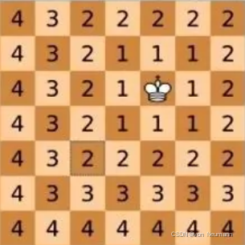

## <del>ICP 算法 Q&A</del>

<strong>Q：ICP 迭代中使用 SVD 分解求 RT 矩阵的数学原理是什么？</strong>

<del>A：</del><del>blog.csdn.net</del>

<strong>Q：ICP 算法是否允许两个点云的数量不一致，为什么？</strong>

<del>A：允许，基于 Kdtree 的最近点查找会统一点对数量。如果 A.count > B.count(tree)，A 中的部分点会对应 B 中的同一个点；如果 A.count < B.count(tree)，A 中的部分点没有任何对应。</del>

<strong>Q：为加快迭代速度，通常会对点云进行采样，什么样的采样方式最合适，为什么？</strong>

> [常用三维点云采样方法总结](https://zhuanlan.zhihu.com/p/503073511)

<del>A：采样方式有如下几种：1. 随机下采样；2.体素下采样；3.均匀采样；4.几何采样</del>

1. <strong>随机下采样</strong><del>：算法最简单；但由于破坏了点云的微观结构，存在明显的采样误差</del>
2. <strong>体素下采样</strong><del>：保持了点云形状特征基本不变；不同尺度的点云，需要使用不同尺度的体素，</del><strong>需要用户设置</strong>
3. <strong>均匀采样</strong><del>：基本原理类似体素下采样，精度更高，但速度较慢</del>

> 不同的采样方式适应不同的场景，在研究 ICP 时，研究采样方式更像是一种工程作业，而不是学术研究<br/>学术研究要有重点

- <del>ICP 算法中一个有效的优化策略：初始质心重合</del>

```matlab
<del>    if iter == 1       % 优化：初始质心重合</del>
<del>        model_center=mean(model);                        % model集的质心点</del>
<del>        scene_center=mean(scene);                        % scene集的质心点</del>
<del>        T = model_center' - scene_center';</del>
<del>        scene = (scene' +T)';</del>
<del>    end</del>
```

- <del>重叠率 overlap rate 的定义：scene 中能在 model 中找到正确对应的点 </del>
  $$
  Sc_r
  $$

  <del>占 scene 总点数 </del>
  $$
  Sc_n
  $$

  <del>的比率，即</del>

$$
O=\frac{Sc_{r}}{Sc_{n}}
$$

> 这些都是工程，不用写在论文中

- <del>在使用重叠率约束时：使用 floor 向下取整，宁可丢弃某些正确对应的点，也要剔除所有的外点，在配准误差的体现上更加准确</del>

```matlab
<del>    if overlaprate < 1</del>
<del>        [d,idx] = sort(d);</del>
<del>        idx = idx(1:floor(overlaprate*num_points)); % 使用floor向下取整</del>
<del>        d = d(1:floor(overlaprate*num_points));     % 根据overlaprate去除了部分d</del>
<del>        scene_idx = scene_idx(idx);</del>
<del>        model_idx = model_idx(idx);</del>
<del>    end</del>
```

## <del>产品经理——产品决策</del>

<del>推荐阅读：《如何做出正确决定》</del>

# <del>12-24</del>

<strong>什么才是点云配准中的学术问题？</strong>

1. <del>配准迭代方法，损失函数的设计方法</del>
2. <del>点云下采样方法</del>
3. <del>迭代停止条件也是一个值得研究的话题：如何实现无阈值的迭代停止</del>

<del>上述这些问题都是一个科研课题，在研究其中一个时，不要太在意其他问题，使用最简单最常用的即可。进行对比实验室也要保证控制变量。</del>

<del>科研的关键词是“专注一点”，工程的关键词是“解决问题”</del>

<del>不要在做科研时，使用组合策略，只专注一点！</del>

<strong>学术研究流程：</strong>

- <del>研究/复现当前最先进的点云配准方法</del>
- <del>提升配准的快速性和鲁棒性</del>
- <del>分析自己算法的数学原理，从工程到数学</del>
- <del>对比实验</del>
- <del>消融实验</del>
- <del>如何优化自己的编程体验：完成功能的时候不要太在意细节，而是使用版本来更新优化代码</del>

## <del>Matlab</del>

### <del>min，max 函数</del>

- <del>按列取最大/最小</del>

```matlab
<del>A = [1,2,3,4];</del>
<del>min(A);    </del>
<del>B = [1,2,3;</del>
<del>     3,4,5;</del>
<del>     5,6,7]; </del>
<del>min(B);      % 按列取最小：[1,2,3];</del>
<del>min(B,[],2)  % 按行取最小：[1,3,5];</del>
```

## <del>如何生成一个旋转矩阵？</del>

- <del>作为一个线性映射（变换矩阵），正交矩阵保持距离不变，所以它是一个保距映射，具体例子为旋转与镜射。 行列式值为 +1 的正交矩阵，称为</del><strong>特殊正交矩阵</strong><del>，它是一个旋转矩阵。</del>

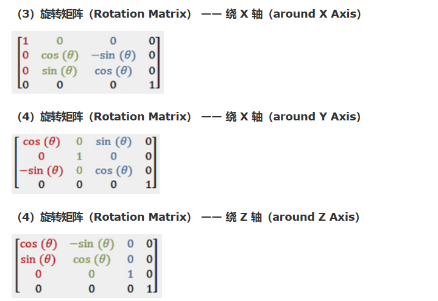

- <strong>示例代码</strong>

```matlab
<del>function R=creatR(x_theta,y_theta,z_theta)</del>

<del>R_x = [1,0,0;</del>
<del>       0,cos(x_theta),-sin(x_theta);</del>
<del>       0,sin(x_theta),cos(x_theta)];</del>
<del>R_y = [cos(y_theta),0,sin(y_theta);</del>
<del>       0,1,0;</del>
<del>       -sin(y_theta),0,cos(y_theta)];</del>
<del>R_z = [cos(z_theta),-sin(z_theta),0;</del>
<del>       sin(z_theta),cos(z_theta),0;</del>
<del>       0,0,1];</del>

<del>R = R_x*R_y*R_z;</del>

<del>end</del>
```

- <del>matlab 输出显示</del>

  - <del>fprintf('点云重叠率设置：%d\n',num2str(overlap_set));</del>
- <del>m</del>

# <del>12-25</del>

- <del>多接口拓展坞：可变接头（接头类型 + 接头数量）</del>
- <del>一个人如果对一件事有了倾向性（偏爱），即使证明这件事的事实有多么苍白也能让他坚信不疑；而如果他们本就排斥（厌恶）一件事，尽管理由有多么缜密也无法感动他的心</del>

<del>人心定理：爱恨是有惯性的</del>
# 第五周

> 12 月 26 日-12 月 31 日

# <del>12-26</del>

# <del>12-27</del>

# <del>12-28</del>

# <del>12-29</del>

# <del>12-30</del>

- <del>快捷键网：</del><del>快捷键网</del>
- <del>换了项目的关注重点：垃圾投放、收取</del>
- <del>PlanB</del>
- <del>公司的角度、产品的角度</del>
- <del>产品经理-> 往前想</del>
- <del>情绪地图：情绪低点</del>

<del>所以近期的事务安排就是：</del>

1. <del>完成情绪地图的头脑风暴，找到用户的情绪低点</del>
2. <del>讨论解决方案</del>
3. <del>制定项目进展甘特图</del>
4. <del>开始实际制作</del>

# <del>12-31</del>

- <del>看时间的朋友</del>

## <del>Zotero</del>

- <del>Zotero 翻译插件：</del><del>[https://github.com/windingwind/zotero-pdf-translate/releases](https://github.com/windingwind/zotero-pdf-translate/releases)</del>
- <del>ZoteroSCIHub 订阅方法：</del><del>Zotero 搭配 Sci-Hub，真香！</del><del>； </del><del>https://sci-hub.se/</del>
- <del>Zotero 中文文献检索方法：</del><del>Zotero 教程—中文文献识别</del>
- <del>not converged：不收敛</del>
- <del>每天晚上写半句话，第二天早上起来把这半句话补上，然后紧接着开始新的工作</del>


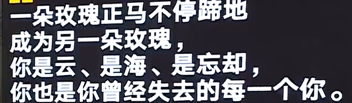

<del>一朵玫瑰正在马不停蹄地成为另一朵玫瑰，你是云、是海、是忘却，你也是你曾经失去的每一个你</del>

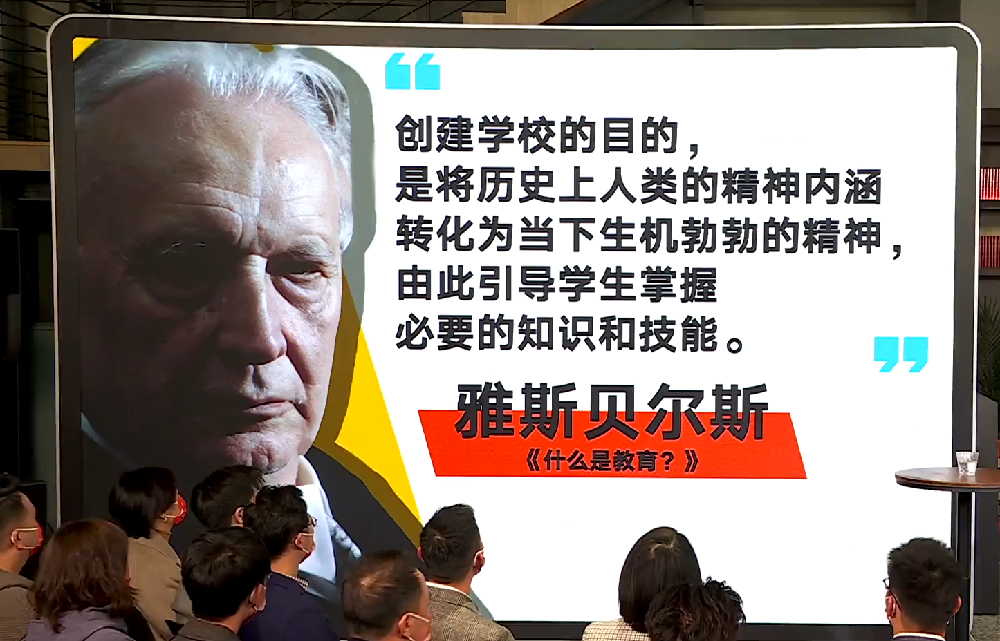

- <del>现代社会有一个趋势，就是附近的消失</del>
- <del>附近就是星辰大海</del>

## GICP 复现

- <del>无约束优化之单纯形法（Nelder-Mead Algorithm）= 无导数法 = min、max 法</del>
- <del>TolFun 和 TolX：终止容差和端接容差</del>
- <del>四元数：a + bi+ cj + dk</del>

<del>四元数，是简单的</del><del>超复数</del><del>。 </del><del>复数</del><del>是由</del><del>实数</del><del>加上</del><del>虚数单位</del><del> i 组成，其中 i²= -1。 相似地，四元数都是由实数加上三个虚数单位 i、j 和 k 组成，而且它们有如下的关系： i² = j² = k² = -1， iº = jº = kº = 1 , 每个四元数都是 1、i、j 和 k 的线性组合，即是四元数一般可表示为 a + bi+ cj + dk，其中 a、b、c 、d 是实数。</del>

<del>对于 i、j 和 k 本身的几何意义可以理解为一种旋转，其中 i 旋转代表 Z 轴与 Y 轴相交平面中 Z 轴正向向 Y 轴正向的旋转，j 旋转代表 X 轴与 Z 轴相交平面中 X 轴正向向 Z 轴正向的旋转，k 旋转代表 Y 轴与 X 轴相交平面中 Y 轴正向向 X 轴正向的旋转，-i、-j、-k 分别代表 i、j、k 旋转的反向旋转</del>

### <strong>GICP 最小化函数推倒（正态分布）</strong>

> 正态分布函数：正态分布(从 1 维到 n 维) - _yanghh - 博客园

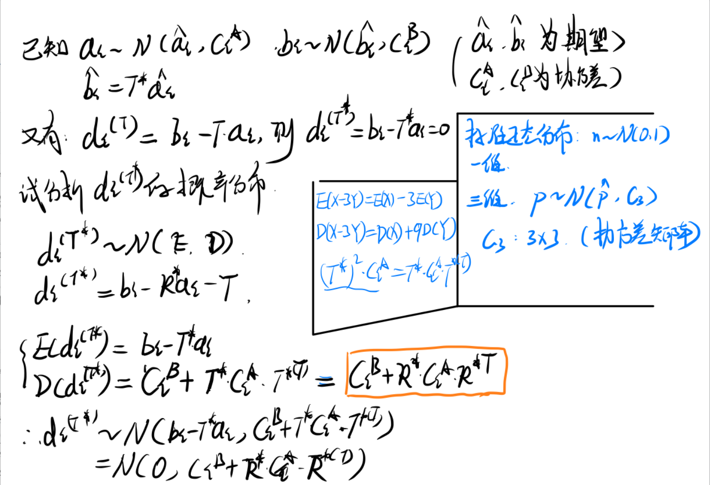
